# Background

We have no __permission__ to attach the `lldb` to any other iOS Apps on the __M1 Mac__, when `SIP` is enabled. But it couldn’t launch the iOS Apps if `SIP` is disabled. It seems that `fairplayd` has a check for the system boot policy security mode and refuses to decrypt the iOS App macho when `SIP` is disabled.

So the question is __how to debug__.

# TL;DR

- Disable `SIP` to get the task ports for system processes

- Get the decrypted iOS App from jailbroken device with tools (such as [bagbak](https://github.com/ChiChou/bagbak), [flexdecrypt](https://github.com/JohnCoates/flexdecrypt), ...) 
- Resign (__free iOS Developer account__)
- Patch `amfid` process to bypass signature check
- Patch `UIKitSystem` process to display the iOS UI as normal
- `posix_spawn` the iOS App macho with the `suspend` attribute
- Attach my debugger

# About re-sign

It is said that only the decrypted IPA resigned with `Enrolled Apple Developer certificate ($99 per year)` is permitted to install and run. The key operation is adding the M1 Mac device's __UDID__ to the developer’s __device list__.

However, I am a free developer now and I don’t have the necessary certificate, so I have to patch the certificate checking code. 

Next, I will talk about how I found the patch point and make it run normally.

# Try to launch directly

- `open /path/to/iOSApp.app`

  I got the error: __The application cannot be opened because it has an incorrect executable format.__

  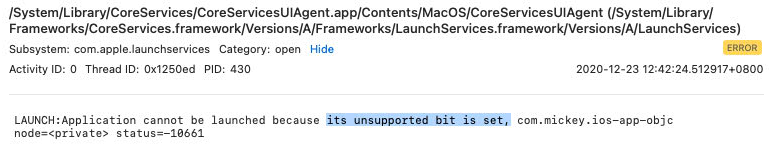

- Directly execute the macho `/path/to/iOSApp.app/iOSApp`

  I got the crash:

  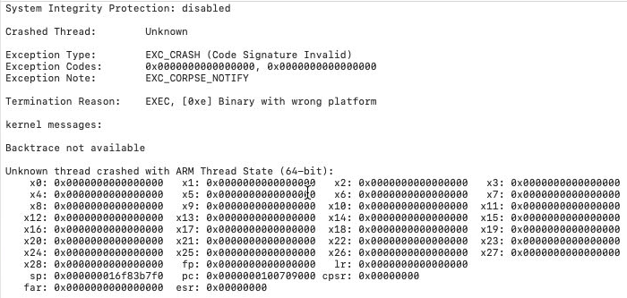

  Note the Termination Reason: __Binary with wrong platform__.

# posix_spawn internal

From the previous termination reason, I just wonder why it can launch the iOS App macho normally without the __wrong platform error__, when we open it normally. Maybe it has some special spawn attributes for the iOS platform macho?

To prove my guess, I looked up for the `posix_spawn` implementation from the latest `XNU` source code. And the answer is yes, there are some new `posix_spawn_attributes` in the function. In order to make use of these attributes,  I made a differece of the spawn related functions inside the module `libsystem_kernel.dylib` :

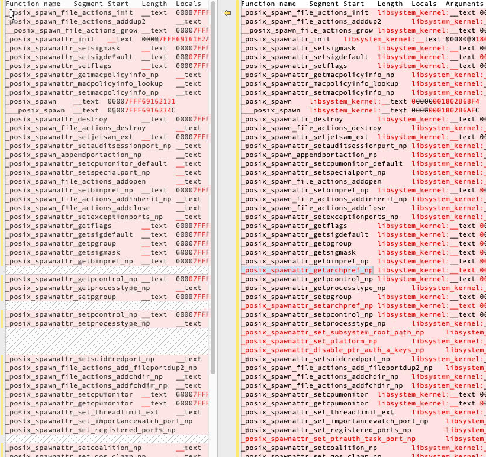

I got 8 new interfaces:

```
_posix_spawnattr_getarchpref_np
_posix_spawnattr_setarchpref_np
_posix_spawnattr_set_subsystem_root_path_np
_posix_spawnattr_set_platform_np
_posix_spawnattr_disable_ptr_auth_a_keys_np
_posix_spawnattr_set_ptrauth_task_port_np
_posix_spawnattr_setnosmt_np
_posix_spawnattr_set_csm_np
```

and the data structure changes:

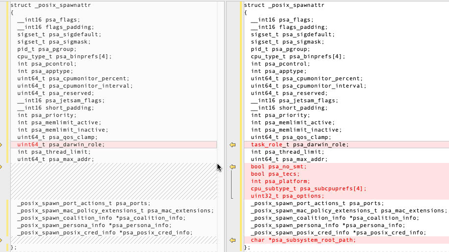

# Debug and reverse xpcproxy

How the system uses these `posix_spawn_attributes` to spawn an iOS App macho?

Through monitoring, I found the iOS App launching process is as follow:

1. `launchd (pid=1)` process spawned a subprocess `xpcproxy`, with a `application-identifier` as its command line parameter

2. Then the `xpcproxy` process called `posix_spawn` with attribute `POSIX_SPAWN_SETEXEC`

3. Finally the `xpcproxy` process turned into the iOS App process

Next, I need to debug and reverse the `xpcproxy` :

1. Set breakpoints on the function  `posix_spawn_file_actions_init` and `posix_spawnattr_init`
2. When the breakpoints hit, set watchpoints for the parameter `posix_spawn_file_actions_t` and `posix_spawnattr_t` to see how they are initialized.
3. When the watchpoints hit, reverse the target function according to the call stack trace.

The following code is the result of reversing:

```c
pid_t child_pid;
posix_spawn_file_actions_t action;
posix_spawnattr_t attr;
/* Create an action object, debug and reverse from xpcproxy*/
posix_spawn_file_actions_init(&action);
posix_spawn_file_actions_addopen(&action, 0, "/dev/null", 0x20000, 0x1B6);
posix_spawn_file_actions_addopen(&action, 1, "/dev/null", 0x20002, 0x1B6);
posix_spawn_file_actions_addopen(&action, 2, "/dev/null", 0x20002, 0x1B6);
/* Create an attributes object*/
posix_spawnattr_init(&attr);
posix_spawnattr_setflags(&attr, 0x4202); // the original is 0x42c2, with POSIX_SPAWN_SETEXEC|POSIX_SPAWN_START_SUSPENDED
posix_spawnattr_setcpumonitor(&attr, 0xfe, 0);
posix_spawnattr_setjetsam_ext(&attr, 0xc, 0x3, 0x4000, 0x4000);
posix_spawnattr_disable_ptr_auth_a_keys_np(&attr);
responsibility_spawnattrs_setdisclaim(&attr, 1);
//posix_spawnattr_set_subsystem_root_path_np(&attr, "/System/iOSSupport/");
posix_spawnattr_set_platform_np(&attr, 2); // #define PLATFORM_IOS 2
char *envir[] = {
    //"CFFIXED_USER_HOME=~/Library/Containers/UUID/Data",
    "COMMAND_MODE=unix2003",
    //"HOME=~/Library/Containers/UUID/Data",
    "LOGNAME=mickey",
    "MallocSpaceEfficient=1",
    "PATH=/usr/bin:/bin:/usr/sbin:/sbin",
    "SHELL=/bin/bash",
    //"SSH_AUTH_SOCK=/private/tmp/com.apple.launchd.RANDOM/Listeners",
    //"TMPDIR=/Users/mickey/Library/Containers/UUID/Data/tmp",
    "USER=mickey",
    "XPC_FLAGS=1",
    //"XPC_SERVICE_NAME=application.com.xxxapp.iOS",
    //"_DYLD_CLOSURE_HOME=/Users/mickey/Library/Containers/UUID/Data",
    //"__CFBundleIdentifier=com.xxxapp.iOS",
    "__CF_USER_TEXT_ENCODING=0x1F5:0x0:0x0", 0
};
posix_spawn(&child_pid, argv[0], &action, &attr, &argv[0], envir);
posix_spawnattr_destroy(&attr);
posix_spawn_file_actions_destroy(&action);
printf("PID of child: %d\n", child_pid);
```

# Patch to bypass signature check

I compiled and ran the reversed code to launch the decrypted iOS App, I got the error:

`posix_spawn: Bad executable (or shared library)`

The signature was broken due to decryption, then I resigned it with command:

```bash
# XXX is the app name and main executable name
codesign -d --entitlements :- /path/to/XXX.app 1>XXX.ent.plist
codesign -f -s "Your free developer certificate" --timestamp=none /path/to/XXX.app/Frameworks/*
codesign -f -s "Your free developer certificate" --entitlements XXX.ent.plist --timestamp=none /path/to/XXX.app
```

Launch again, no __wrong platform error__ this time, but I got the crash log like this:

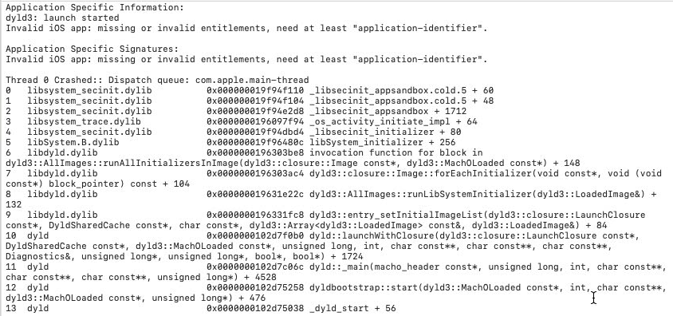

This is because the sandbox failed to initialize. My first solution was simply to patch the function `_libsecinit_appsandbox` to return directly, then __the iOS App can run without sandbox restriction__. But I hope the iOS App could run inside the sandbox. So I tried to find out why the function `_libsecinit_appsandbox` fails to initialize. The function talks to the `secinitd` process by xpc pipe `com.apple.secinitd`. In the `secinitd` process, the API call `xpc_copy_entitlement_for_token` return __NULL__, and the parameter `token` is fetched from API `xpc_connection_get_audit_token`. While inspecting this thread, I found another thread from the console log, which seems closer to the root cause:

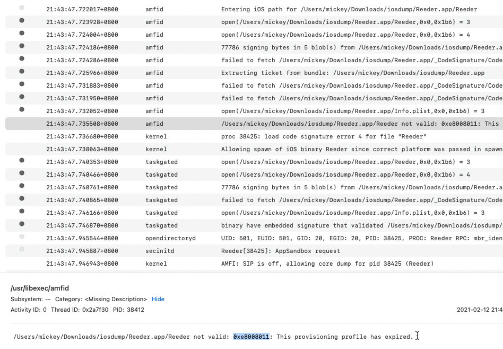

Then I inspected and debugged the `amfid` process :

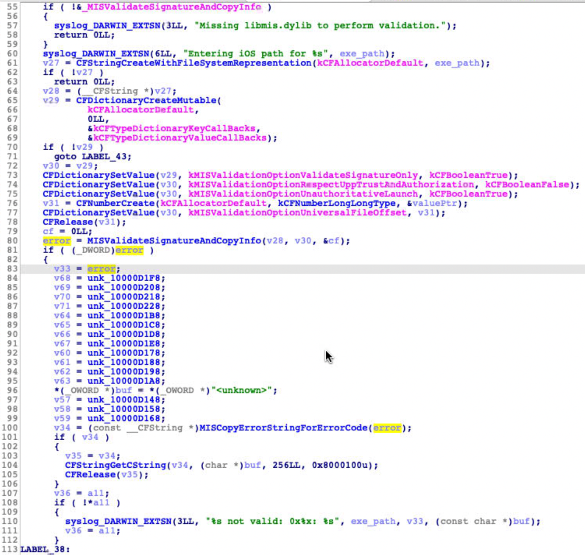

The key point is the function `MISValidateSignatureAndCopyInfo` , implemented in the `libmis.dylib` , returned an error. Through debugging, my attention turned to a callback of the function:

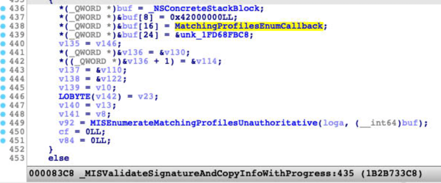

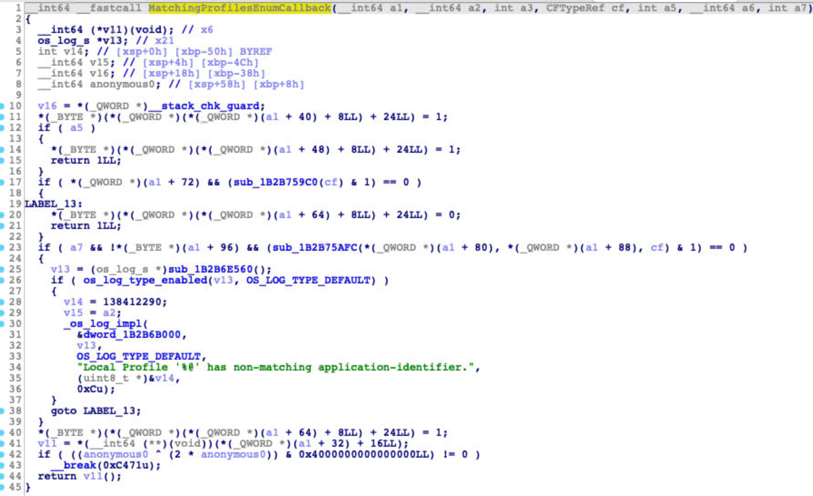

I just patched the callback function at line `12`, to let it jump to line `40` directly. The patch is work and the sandbox could be initialized as usual.

# Patch to show iOS UI

Now, I can launch the iOS App macho directly. But It has `no Window (UI)`.

And I found a error from the console log:

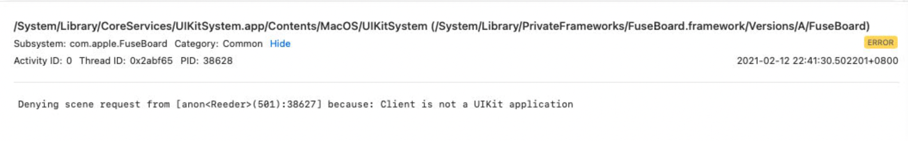

Then I inspected and debugged the `UIKitSystem`:

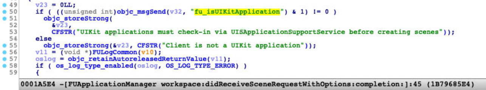

Finally I got the key function:

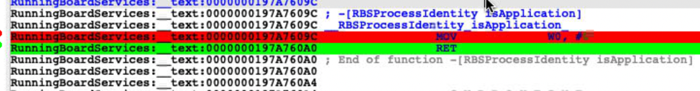

Just patch it to return `true(1)`

# Debug it

Through the effort before, I can run any decrypted iOS Apps on M1 Mac (`SIP` disabled). Even I am just a free developer :)

Next, I can debug the iOS App with `lldb` as usual. 

But I prefer the `IDA Pro` for debugging and strongly recommend it for you.

- `sudo /Applications/Xcode.app/Contents/SharedFrameworks/LLDB.framework/Versions/A/Resources/debugserver 127.0.0.1:23946` 

- Select `Remote iOS Debugger` from IDA Pro

- Debugger -> Debuggser Options -> Set specific options -> Uncheck `Launch debugserver automatically`

  Because you just launched it manually

  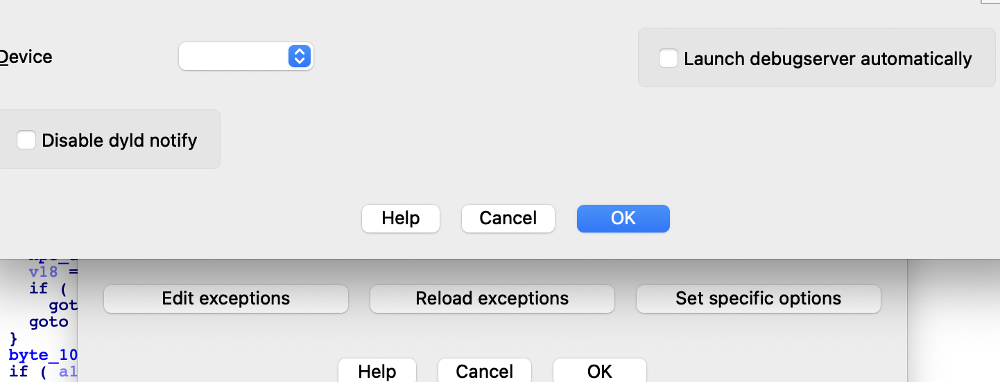

- Debugger -> Process options

  Set the hostname to `127.0.0.1`, and the port default is `23946`

- Launch or Attach
- Enjoy your debugging

