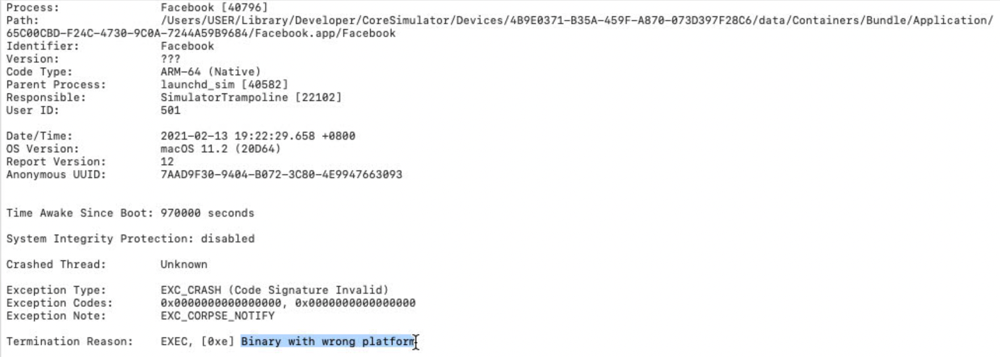
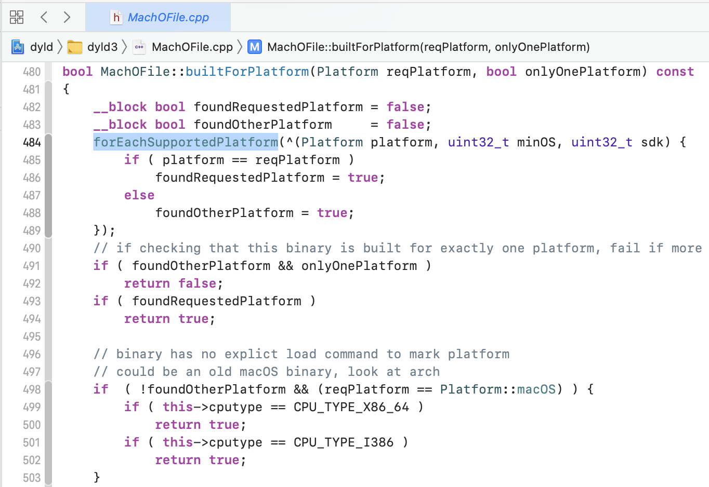
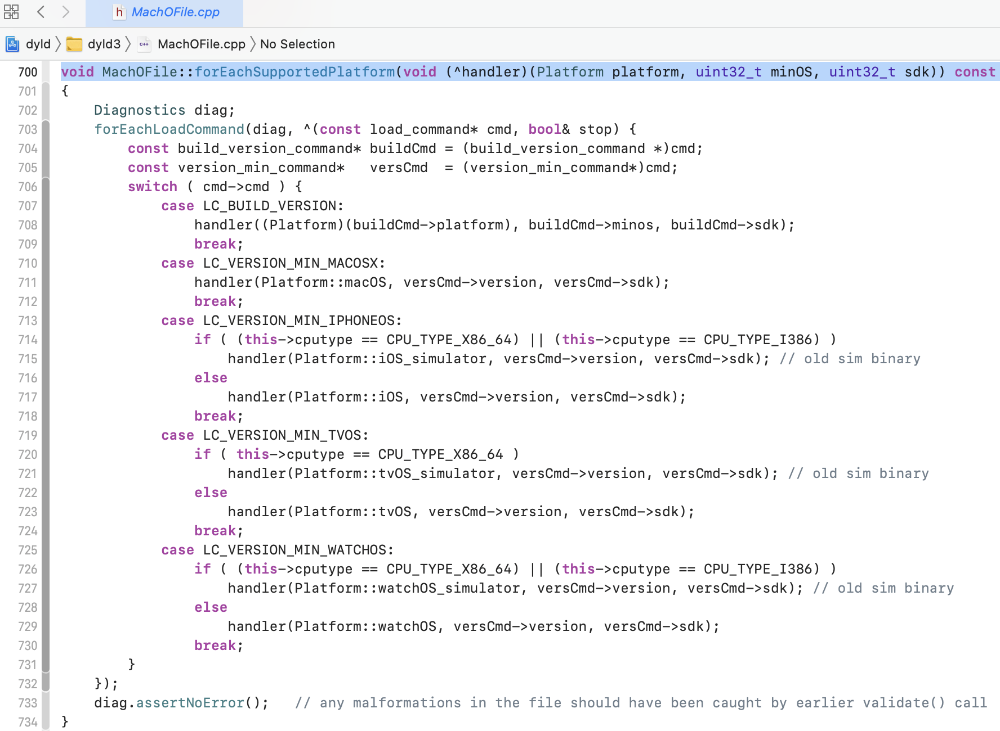
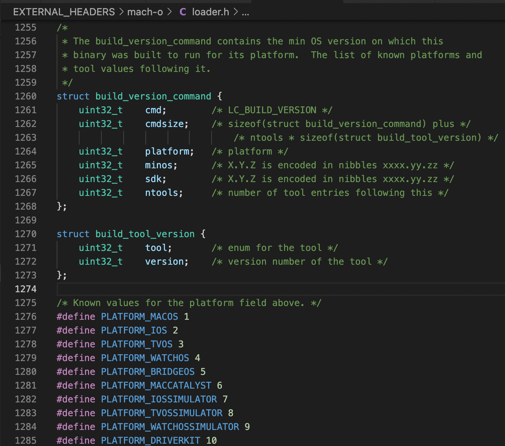

Besides the method in my [last blog](https://jhftss.github.io/Debug-any-iOS-Apps-on-M1-Mac/), I keep trying other methods to run the decrypted iOS App. Then I thought of the __Xcode Simulator__, which had no possibility to run the real iOS Apps before, due to the `x86_64` platform restriction. But now, the __Simulator from M1 Mac__ is also the `arm64` architecture. Is it possible to run the decrypted iOS App in the simulator now ?

__Of course, Yes Now !!!__

# TL;DR

I wrote a [tool](https://gist.github.com/jhftss/729aea25511439dc34f0fdfa158be9b6) to patch a macho file from iOS platform to Simulator platform.

- Patch all the machos (include `frameworks`, `dylibs`) within the iOS App by my [tool](https://gist.github.com/jhftss/729aea25511439dc34f0fdfa158be9b6) 

- `ad-hoc` code signing (__free developer__)

  `codesign -f -s - /path/to/macho`

- Drag the iOS App to iOS Simulator, click to launch

Next I will talk about how to find the patch points.

# Try to launch

Drag the decrypted iOS App into the iOS Simulator, and click to launch. 

I got the crash :

Note the Termination Reason: __Binary with wrong platform__.

__Question__: How does the OS distinguish the `arm64` machos from different platforms ?

# DYLD Platform

I found the answer from the [dyld source code](https://opensource.apple.com/source/dyld/dyld-832.7.3/)

We can see there are at least 2 kinds of load commands that can be used to mark platform:

- `LC_BUILD_VERSION`

  

- `LC_VERSION_MIN_XXX`

# Patch it

From my test, it seems that the load command `LC_ENCRYPTION_INFO[_64]` is also marked as `PLATFORM_IOS`. So I have to patch 3 kinds of load commands to mark the macho as `PLATFORM_IOSSIMULATOR`:

- Remove the load command  `LC_ENCRYPTION_INFO[_64]` 
- Remove the load command `LC_VERSION_MIN_XXX`
- Patch the platform to `7 (PLATFORM_IOSSIMULATOR)` in the command `LC_BUILD_VERSION`

# Signature 

From my test, I can directly launch the iOS App from the Simulator after the patch, if `SIP` is disabled. And I have to re-sign it with `ad-hoc`  (__free developer__) if `SIP` is enabled.

# Known issues

Through the effort before, I can launch the iOS App from __Xcode Simulator__ successfully.

But there are some known issues for some specific Apps:

- Some iOS App Extensions process crash
- Crash due to lack of sandbox entitlements
- Maybe other issues for specific App

# Other tests

I have tried to patch to `PLATFORM_MACOS` directly:

- There is no problem for iOS command line program, and it is useful when you need to run iOS command line program on the M1 Mac.
- For iOS UI Application, we need to use environment variable `DYLD_FORCE_PLATFORM=2` to help us load `UIKit.framework` from `/System/iOSSupport` directory.

Next are the test results for `arm64` macho loading :

- `Arm64` executable process can load `arm64e` dylib directly.

- `Arm64e` executable process __cannot__ load `arm64` dylib.

  Patch `cpu subtype` to `0x80000002` can bypass the platform check to load it successfully.

- __macOS__ process __cannot__ load __iOS__ platform dylib, error: **mach-o, but not built for platform macOS**

  Just patch the load_command `0x25=LC_VERSION_MIN_IPHONEOS` to `0x24=LC_VERSION_MIN_MACOSX`

