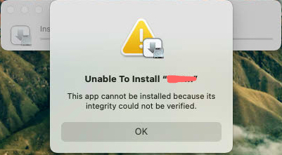
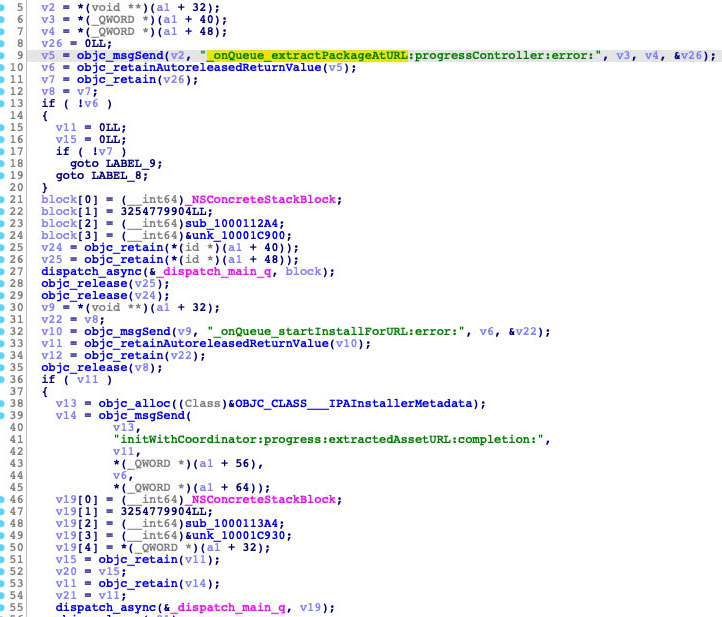
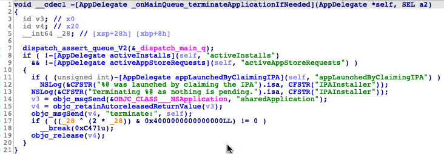
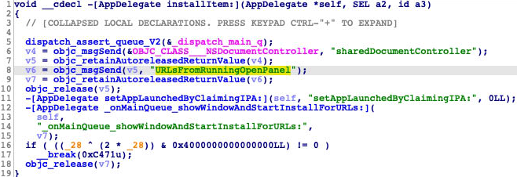
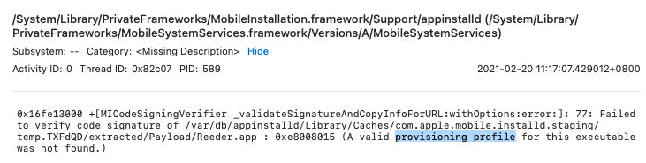
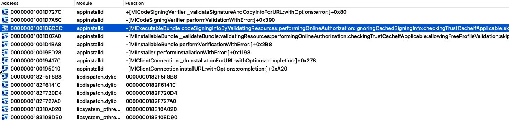

As mentioned in my [last blog](https://jhftss.github.io/Debug-any-iOS-Apps-on-M1-Mac/), I can launch any decrypted iOS App on M1 Mac with __free developer certificate__. Here, I will try to install the decrypted IPA dircectly without re-signing.

# Install directly

# iOS App Installer

`/System/Library/CoreServices/Applications/iOS App Installer.app` is the default open method for `IPA` file. It is responsible for the decompression, invoking the installation and displaying the installing progress dialog.

Directly launch the app, it will exit quickly.

The function above will be called when application did finish launching, it will check if there is any active installation pending, and exit the program if none.

In order to debug the program with `IDA Pro`, I need to know how the target ipa file path is passed to the program. Because `IDA Pro` is hard to attach to the program __immediately when launching__.

The delegate function will be called automatically if we open an `IPA` file. But how to pass the `IPA` file path `URL` when I launched the program directly from `IDA Pro` ?

Luckily, I found there is another way to open the `IPA` :

The function has no caller. I just call it by an `IDC` script function `dbg_appcall`, and then an open file dialog poped up.

Through debugging, I found the real installation work is performed by `appinstalld` process. 

# appinstalld

Then I found a hint from the console log:

Set a breakpoint at the function `+[MICodeSigningVerifier _validateSignatureAndCopyInfoForURL:withOptions:error:]`, I got the call stack :

From the call stack, I noted the return type of function `-[MIInstallableBundle performVerificationWithError:]` is `bool`.

I just path it to always return `true`. And it works !

# Benefit

If `amfid`  process is patched with the method from my [last blog](https://jhftss.github.io/Debug-any-iOS-Apps-on-M1-Mac/), and the `IPA` file is re-signed with __free developer certificate__ before installing, the iOS Application could be launched as usual after the installation. Don't need the help of the command line program I wrote before. And don’t need to patch the `UIKitSystem` process, all is normal now.