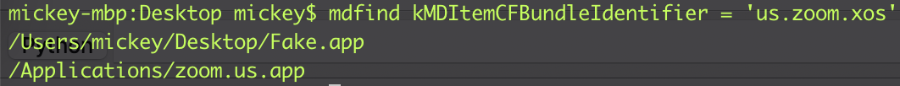

My team and I posted the details of the brand new Mac Malware `XCSSET` last year [[1]](https://www.trendmicro.com/en_us/research/20/h/xcsset-mac-malware--infects-xcode-projects--uses-0-days.html) [[2]](https://www.trendmicro.com/en_us/research/20/i/xcsset-update-browser-debug-modes-inactive-ransomware.html), and disclosed the interesting 0 day tricks used inside. All the `XCSSET` payload modules were reviewed carefully. However, I was a newbie for hunting macOS vulnerability and I didn’t realize the TCC bypass is a vulnerability at that time until Jamf posted their [new blog](https://www.jamf.com/blog/zero-day-tcc-bypass-discovered-in-xcsset-malware/) and detailed the 3rd 0 day used by `XCSSET`.

Then I did some research on the TCC framework, and here is the partial result.

# TCC bypass used by XCSSET

The details can be read from the [Jamf blog](https://www.jamf.com/blog/zero-day-tcc-bypass-discovered-in-xcsset-malware/). Here is a simple summary :

In the payload module `screen_sim.applescript`, the malware looks up the applications that already have the `Screen Recording` permission, and then put its malicious application into the  __“Contents/MacOS”__ folder. All is done, it is just parasitic in the legitimate application to get the permission.

# The new bypass idea

During the research of the TCC framework, I know that the TCC configuration data are stored in the sqlite3 database `/Library/Application Support/com.apple.TCC/TCC.db`, and the table for permission access is like this :

The column `client_type` is used to indicate the `client` column. `0` is for the `bundle`, `1` is for the `executable_path`. The `XCSSET` malware is parasitic from the view of the bundle executable path, so how about the view of the bundle identifier, can I fake the bundle identifier as the legitimate application ?

Then I do a quick test, and the answer is yes ! 😎

- Install `Zoom.app`, and grant `Screen Recording` permission to it.
- Build a common `Fake.app` with the screen capture function.
- Change the `CFBundleIdentifier` field to `us.zoom.xos` in the `Info.plist` of `Fake.app`.
- Run the `Fake.app`, no user prompt while the screen capture is working.

Next, I will discuss how it works and how apple fixes it.

# tccd internals

#### About tccd

tccd is a daemon process handling XPC requests with TCC message, its core logic is in the `handle` function to dispatch all kinds of TCC requests, including the operations to modify and query database. Of course, all the TCC request clients must have the necessary `entitlements`, such as `com.apple.private.tcc.manager`.

For example, when we grant the `Screen Recording` permission to `Zoom.app` in the `System Preferences`, the process `com.apple.preference.security.remoteservice` will send a XPC message like this :

Note the `client` is the bundle identifier `us.zoom.xos`, and the `granted` is true.

Then open the `Fake.app`, the process `universalAccessAuthWarn` will send a message :

Note that the `granted` is false, because this is an permission authentication operation.

#### The issue

The key point of this issue is in the function `-[TCCDAccessIdentity initWithMessage:]` and its caller function `-[TCCDServer recordFromMessage:accessIdentity:error:]` .

From the pseudocode above, we can see: `self->_path = [self->_bundle executablePath]` and `self->_bundle = [[self class] bundleForAppWithBundleIdentifier: self->_identifier]`. Therefore, `self->_path` is determined by `self->_identifier`, which could be faked.

Actually, there are 2 applications sharing the same identifier :

However, the API call `[LSApplicationProxy applicationProxyForIdentifier:@"us.zoom.xos"]`  used here will only return the `NSBundle </Applications/zoom.us.app>` :

#### One more issue

Theoretically, there is a `csreq` check to defeat the bundle identifier reusing attack. It should check the code signing requirement blob of the specified binary, details can be seen [here](https://stackoverflow.com/questions/52706542/how-to-get-csreq-of-macos-application-on-command-line/57259004#57259004).

However, as you can see from the first figure, the `csreq` column is __NULL__. This is because the `code_requirement` field of the XPC message is `null-object`, and then the function  `-[TCCDServer recordFromMessage:accessIdentity:error:]` return a record item without the code signing requirement.

# Apple Fix

Let’s check the key function first :

The fix is adding a new field `bundle_url` for the XPC request message. 

Request message for granting the permission :

Request message for checking the permission :

And in the function `-[TCCDServer recordFromMessage:accessIdentity:error:]` , if the `code_requirement` is `null-object`, it will call `-[TCCDAccessIdentity designatedRequirementData]` to get the default code signing requirement blob of the target binary.

# Conclusion

- Thinking about the existing vulnerabilities from another angle, there may be new gains. 😃
- Note that one bundle identifier could be mapped with many applications. So we shouldn’t use it to check for a specific application. Here tccd is the bad example, and I think the bundle identifier reusing attack could be applied to other scenarios. 🤔

# Timeline

Apple fixed the issue in the macOS Big Sur `11.5 (20G71)`, which was released on __2021-07-21__.

# Tips for the tccd debugging

If you debug the system tccd process on the local machine, it is easy to hang the operating system and you have to reboot your machine. This is because if the tccd process is interrupted into the debugger for a long time, then some processes related to UI will fail to get the XPC response from the system tccd process, and finally you cannot play your debugger again.

There are 2 ways for you :

- If you like lldb debugger, then just ssh to the target machine, and launch lldb in the ssh shell.
- If you prefer the IDA debugger, then just run the binary `mac_server64` in the target machine, and use IDA Pro to connect remotely.