Last year, I used the __BinDiff__ plugin normally inside the __IDA Pro__, but I got a crash due to the plugin issue. Then a dialog prompted and I choosed to __Let IDA Continue__, then I got another weird crash. Yes, 2 different issues from BinDiff plugin & IDA Pro, just triggered by a bindiff file. Driven by my curiosity, I tried to find the root cause and got this CVE [here](https://cve.mitre.org/cgi-bin/cvename.cgi?name=CVE-2021-22545) :

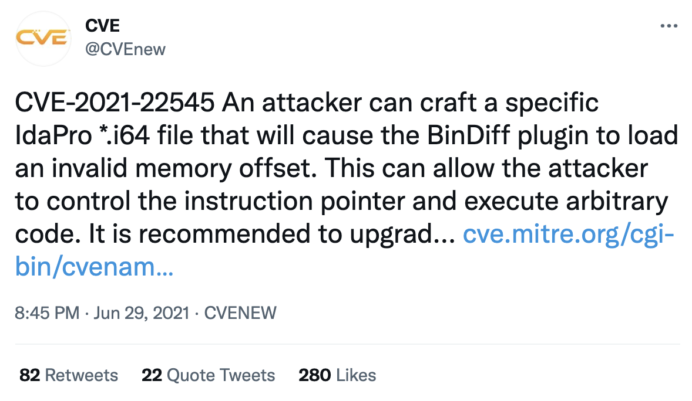

And the acknowledgment from [BinDiff release notes](https://www.zynamics.com/bindiff/manual/index.html#nyyyy7) :

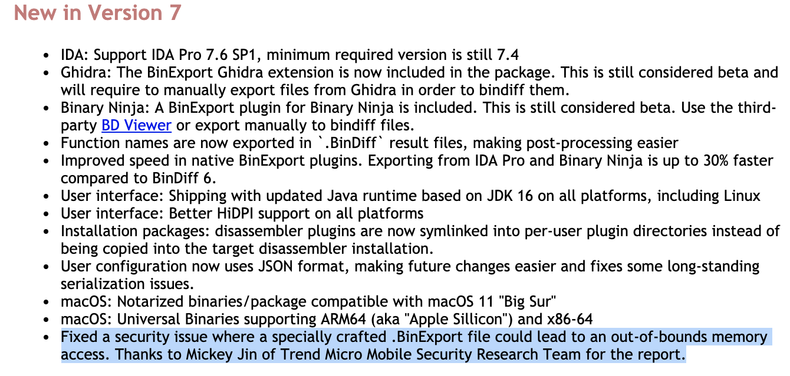

# First issue from BinDiff: OOB Read

### Reproduce the first crash

Open one `i64` file with the `IDA7.5` (tested with `sp3`), then press `ctrl+6` to open the bindiff plugin, then click the `Load Results` button and select the bindiff file which leads to crash. Then a dialog prompts:

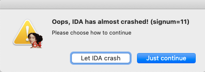

If I choose `Let IDA crash`, I will get a crash log like this:

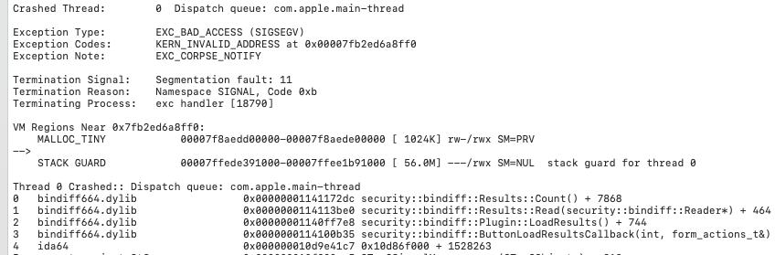

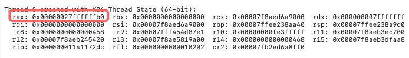

### Root Cause

The crash point is at line `1421` of the function `security::bindiff::Results::Count()`:

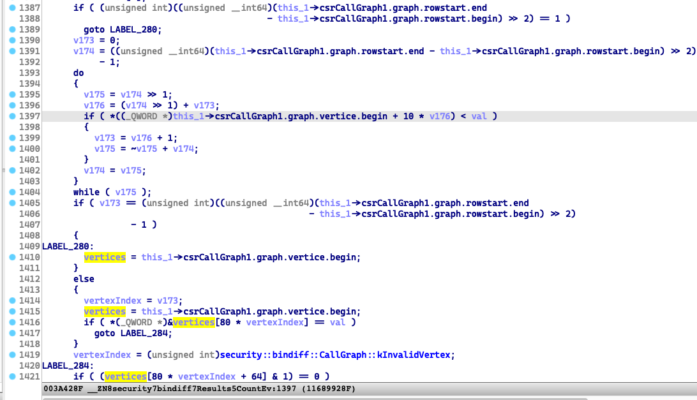

We can see the global const variable `security::bindiff::CallGraph::kInvalidVertex = 0x7FFFFFFF`

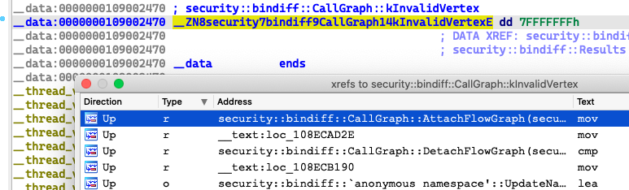

`0x7FFFFFFF*80=0x27ffffffb0=rax` is the invalid offset, which results to the OOB Read.

### Further Research

Actually, the hardcoded offset seems hard to exploit, but the size of the overflowed buffer is an attacker controllable variable. And this could make the issue exploitable.

The type of the overflowed buffer `vertices` is `std::vector<security::bindiff::CallGraph::VertexInfo>`, and here is the constructor function:

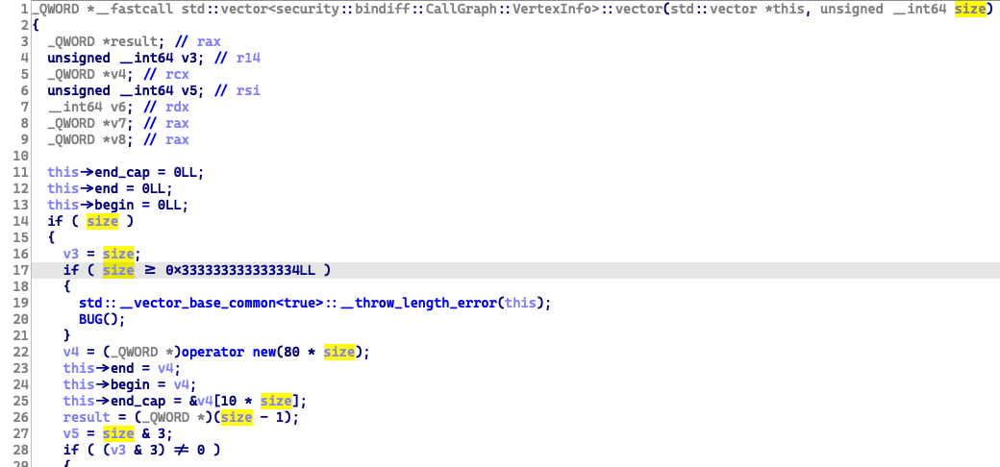

And we can see the limitation for the vector size is `0x333333333333334LL`, the final memory size limitation is `0x333333333333334LL * 80`.

Through debugging, I found the size is `0x468` in this case. It is the number of the vertices, fetched from a BinExport file:

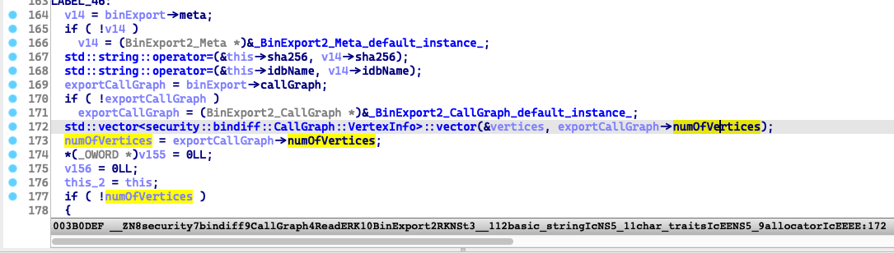

# Second issue from IDA Pro: IDAFormDialog Object UAF on the stack

### Reproduce the second crash

Do the same operations as described before, and when it prompts, choose the button __Just continue__. Then we will get another weird crash :

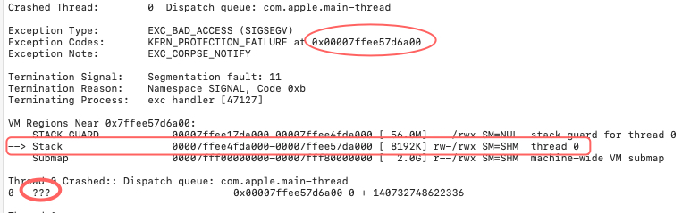

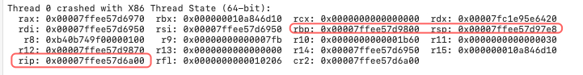

__The `RIP` register value indicated that it was trying to execute code on the stack, and then crashed because the stack is not executable.__

### Root Cause

- Press `ctrl+6` will construct a new `IDAFormDialog` object for the plugin, and it is a C++ object on the stack.

  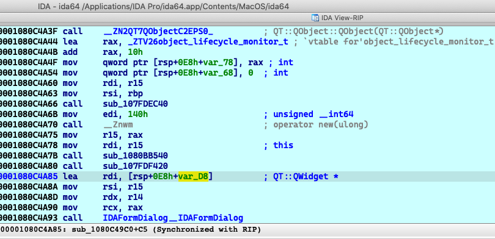

- During the phase of  the plugin loading data, the plugin bug will generate a segment fault exception (`SIGNAL Number 11`), which could crash the process.

- Then the exception will be handled by the `signal-handling` function in the `ida64` module:

  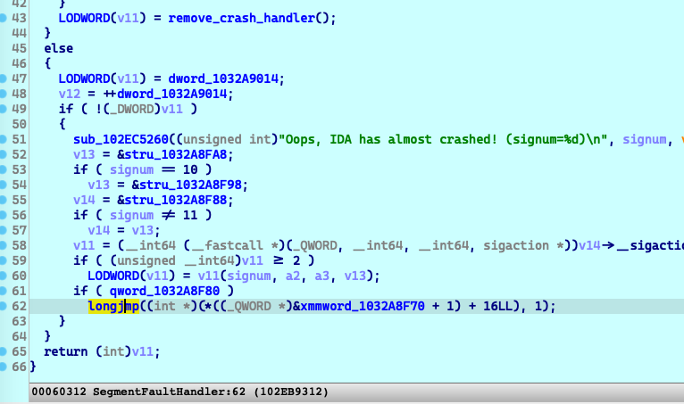

- If the user click `Just continue` rather than `Let IDA crash`, It will call `longjmp` at line `62`.

  The jump target is in the program’s main function:

  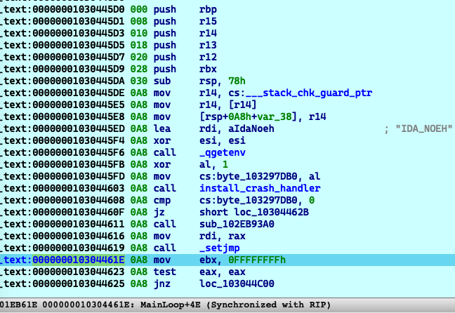

  __At this time, notice that the stack pointer register `RSP` had be switched to the stack frame of the MainLoop function. Which means the old stack objects, like the `IDAFormDialog` had been freed.__

- Then the stack object had been overwritten too many times by calling some child functions, and __its virtual functions table has been changed to the stack!!!__

  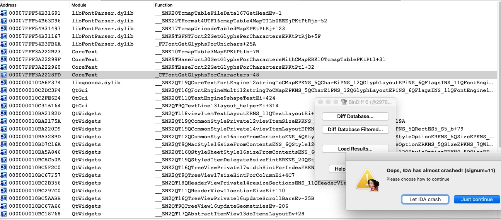

- Finally, `QT::QListData::dispose` will call the function `QT::QMetaObject::cast` with the  `IDAFormDialog` object as the parameter. The execution flow has been transfered to the stack memory.

  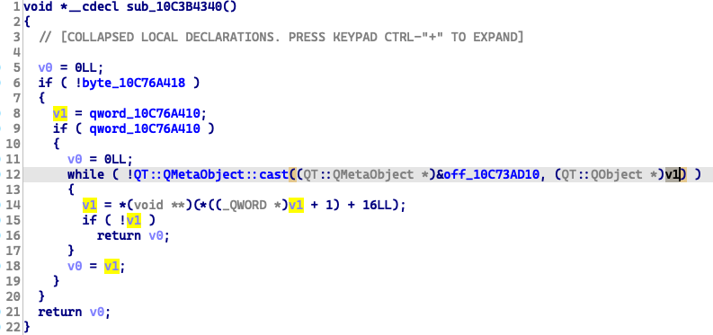

# Conclusion

I am familiar with the exception dispatching flow for the `SEH` on the Windows system.

```c++
void test() {
	__try {
		// do something on the stack
		*(int *)0 = 0;
	}
	__finally {
		// free the resources on the stack
	}
}

void main() {
    __try {
        test();
    }
    __except(1) {
        // handle the exception here
    }
}
```

Before the exception handler getting executed, it is our duty to  to tell the system how to destruct and free our stack objects correctly during the __exception stack unwinding__. 

Now in the macOS system, __signal handler__ functions may not help us do this operation. If we want to continue the execution after handling the exception, I think we have to do it manually. Otherwise, the __UAF on the stack__ issue may happen.

