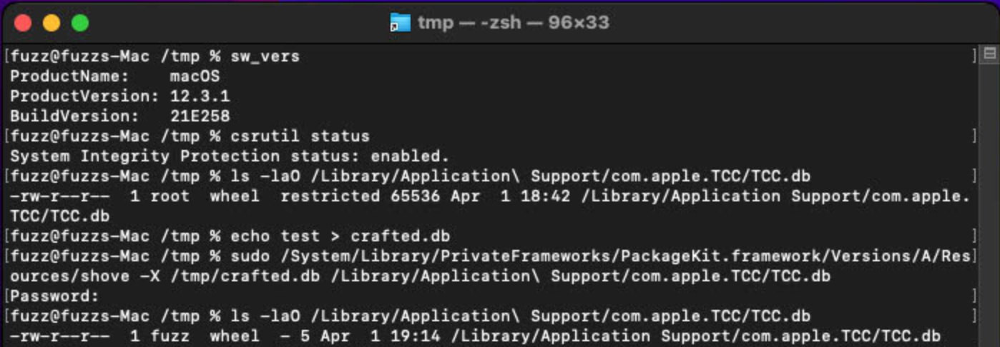
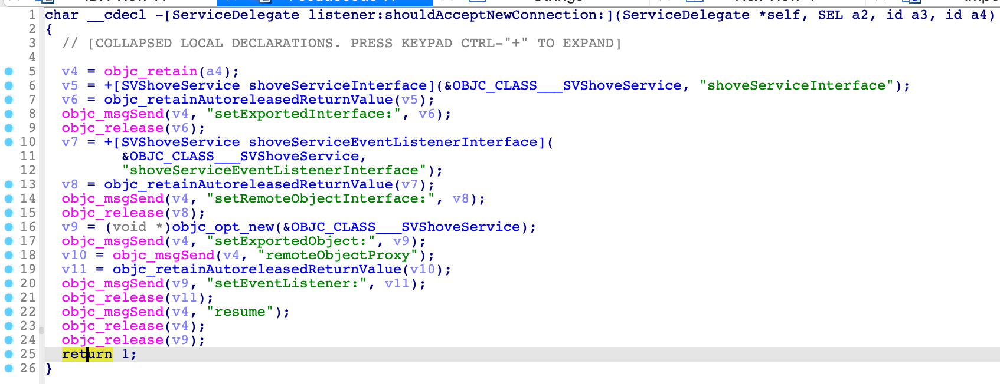
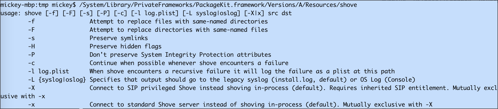
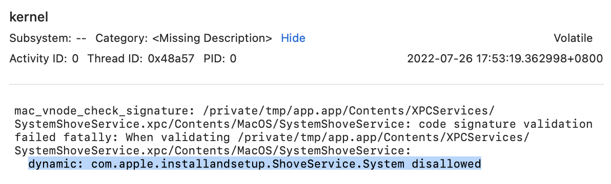
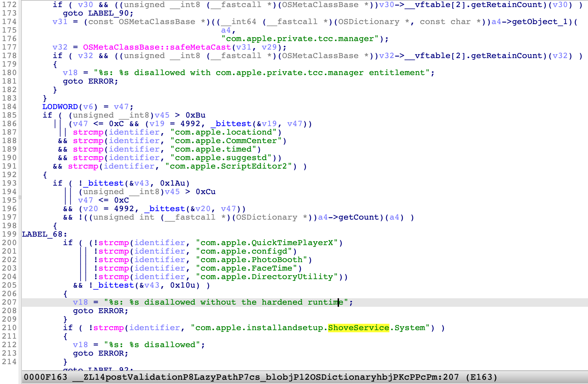
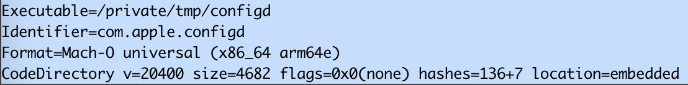
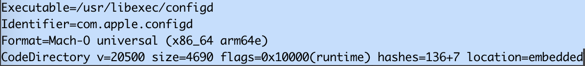
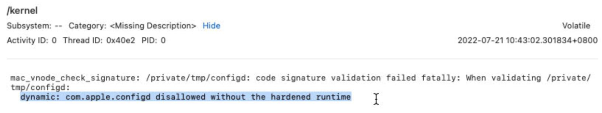

I found some **new attack surfaces** in the macOS **PackageKit.framework**, and successfully disclosed **15+ critical SIP-Bypass** vulnerabilities. Apple has addressed 12 of them [with CVE assigned](https://jhftss.github.io/cvelist/) so far. There are still some reports in the Apple’s processing queue. All of them are interesting logic issues, and of course each has a successful exploit demonstration. 

Here, **CVE-2022-26712** is a very simple one, which was patched in macOS 12.4. However, I found another way to exploit it again, finally Apple addressed it as **CVE-2022-32826** in macOS 12.5.

# PoC in One Line

```shell
sudo /System/Library/PrivateFrameworks/PackageKit.framework/Versions/A/Resources/shove -X /tmp/crafted.db /Library/Application\ Support/com.apple.TCC/TCC.db
```



# Why Critical ?

 [System Integrity Protection (SIP)](https://en.wikipedia.org/wiki/System_Integrity_Protection), aka rootless, is the last line to protect the entire system from malware. There are already some good write-ups about the security feature, so I don’t want to duplicate here. If you are not familiar with it, it is recommended to read the references part at the end of this blog.

Note: **SIP Bypass** always means the **Full TCC Bypass**. With the primitive of SIP Bypass, an attacker could replace the system config database `TCC.db` with a crafted one, to get full control of macOS [**TCC (Transparency, Consent, and Control)**](http://i.blackhat.com/USA21/Wednesday-Handouts/US-21-Regula-20-Plus-Ways-to-Bypass-Your-macOS-Privacy-Mechanisms.pdf).

Moreover, an attacker could get **arbitrary kernel code execution** with the SIP-Bypass primitive. I did find a new way to do this on the **macOS Monterey**, but I couldn’t share the exploit here right now, because it is related to another unpatched 0-day.

# Root Cause

The system XPC service `/System/Library/PrivateFrameworks/ShoveService.framework/Versions/A/XPCServices/SystemShoveService.xpc` has the entitlement **com.apple.rootless.install**, which grants the process permission to bypass SIP restrictions.

The service provides only one method to shove files from one place to another place :

```objc
@interface PKShoveOptions : NSObject
- (void) setSourcePath:(NSURL *) src;
- (void) setDestPath:(NSURL *) dst;
- (void) setOptionFlags:(uint64_t) flags;
@end

@protocol SVShoveServiceProtocol
- (void)shoveWithOptions:(PKShoveOptions *)options completionHandler:(id) reply;
@end
```

However, there is no check for the incoming clients, and any process can fire the XPC request to the service:


Therefore, we can abuse the service to bypass the __SIP__ restriction.

After I implemented my own XPC client to exploit the issue, I found there was already an XPC client in the system:



The option **-X** is used to communicate with the system XPC service.

And the option **-x** is used for the standard XPC service: `/System/Library/PrivateFrameworks/ShoveService.framework/Versions/A/XPCServices/StandardShoveService.xpc`, which has no entitlements.

The system XPC service isn’t running by default, and it will be launched by clients if required.

***If the client is running as root, then the service will also be launched as root. Otherwise the service will run as common user.*** Therefore, root privilege is required to exploit the issue.

# Patch for CVE-2022-26712

1. Remove the framework `/System/Library/PrivateFrameworks/ShoveService.framework`, and of course the XPC service.
2. For the system command `/System/Library/PrivateFrameworks/PackageKit.framework/Versions/A/Resources/shove`, remove the options `[-X|x]`.

# CVE-2022-32826

The patch above seems perfect, but is it enough ?

The old vulnerable XPC service is still signed with the special entitlement **com.apple.rootless.install**. If I can launch the old XPC service from the new OS, then it will be exploitable again, I think.

To prove my concept, I developed a new application from the Xcode template, with an XPC servcie inside the application bundle. Open the built application bundle directory, and replace the built XPC servcie bundle with the old vulnerable **SystemShoveService.xpc**. Finally, my application can launch the old XPC servcie and send malicious XPC requests to it to bypass SIP.

# Patch in the AMFI

Now, it stops the old vulnerable XPC service from launching in the latest OS. 

First, let’s look for some hints from Console log:



Then we will find it in the function `postValidation` from **AppleMobileFileIntegrity.kext** :



It adds a validation item for the specific identifier “com.apple.installandsetup.ShoveService.System” from its signature.

# One More Thing

Note that there are many other application identifiers in the function `postValidation`! Especially the one at line 201: “com.apple.configd”. 

After reading the blog post for **CVE-2021-30970** : [New macOS vulnerability, “powerdir,” could lead to unauthorized user data access](https://www.microsoft.com/security/blog/2022/01/10/new-macos-vulnerability-powerdir-could-lead-to-unauthorized-user-data-access/), I didn’t know how Apple fix it, but I could **reproduce the issue on the patched macOS!**

In short, the system command **/usr/libexec/configd** has a special TCC entitlement: **kTCCServiceSystemPolicySysAdminFiles**, which grants the command permission to change a user’s home directory and forge the user’s database file `TCC.db`. An attacker could inject a malicious dylib into the process to enjoy the special TCC permission. 

However, I found the command was still not signed with [hardened runtime](https://developer.apple.com/documentation/security/hardened_runtime?language=objc) on the patched OS. 



It means the system command was still injectable. **The keypoint is moving the system command to another location and launching it.**

Fail to load the bundle:

`sudo /usr/libexec/configd -d -v -t /tmp/test.bundle`

Load the bundle successfully:

```
cp /usr/libexec/configd /tmp
sudo /tmp/configd -d -v -t /tmp/test.bundle
```

If you are curious about the reason, I will write another blog post to uncover what happens under the hood.


Now in macOS 12.5, Apple patched the **CVE-2021-30970** again with two additional recognitions (No CVE assigned yet) :


1. Signed with [hardened runtime](https://developer.apple.com/documentation/security/hardened_runtime?language=objc):

   

2. Stop the old vulnerable **configd** command from launching in the same function of AMFI.kext:

   


**Last but not the least, in the latest macOS Ventura Beta version, [Launch Constraints](https://theevilbit.github.io/posts/amfi_launch_constraints/) defeats this kind of exploitation effectively.**


# References

https://www.microsoft.com/security/blog/2021/10/28/microsoft-finds-new-macos-vulnerability-shrootless-that-could-bypass-system-integrity-protection/

https://perception-point.io/technical-analysis-of-cve-2022-22583-bypassing-macos-system-integrity-protection/

https://theevilbit.github.io/posts/amfi_launch_constraints/

