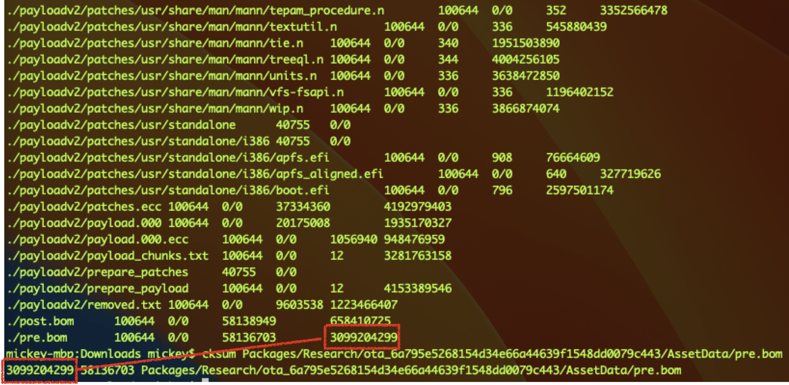
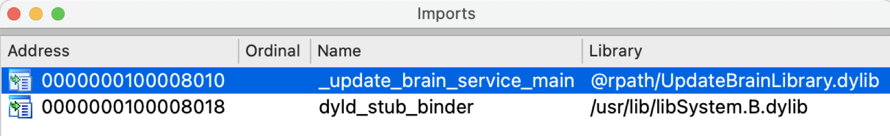

This blog post is written for my talk at [OBTS v6.0](https://objectivebythesea.org/v6/talks.html). 

In this session, I talked about what Apple’s OTA update is and how it works.

I also shared the vulnerabilities during the update process and how I exploited them.

In addition, I discussed how to execute arbitrary kernel code after bypassing the SIP.

# Apple’s OTA Update

In most cases, macOS updates are done through the OTA update process. 

**OTA** is short for **over-the-air**.

From the **System Settings**, we can update the system directly by clicking on the **Update Now** button.


An OTA update is an **incremental update** and is therefore faster and smaller than a **full OS upgrade**. 

It is used for minor version updates, usually every two months. But it is possible to be available in a few weeks if Apple considers there’s an urgent vulnerability in kernel, that’s already being actively exploited, and could not be patched through the **RSR (Rapid Security Response)**.


The OTA update packages are downloaded from the Apple CDN server.


As you can see from [the table](https://www.theiphonewiki.com/wiki/OTA_Updates/Mac/12.6), the OTA packages are customized for the current OS versions.

e.g., in order to update to 12.6, the packages for 12.5 and 12.4 are different. The update process is to apply the patch codes. So different OS versions have different patch codes. In most scenarios, the older the system, the larger the package size.

### OTA Package Contents

After downloading and unzipping the OTA package, we can see the package contents as follows:


The `boot` directory contains something related to the boot process. The real patch code for the incremental update is located in a directory named `payloadv2`. There is a critical file named `payload.bom` that **lists all the items in the OTA package and their check sum values**. The file `payload.bom.signature` is used to verify the integrity of the `payload.bom` file. The files `pre.bom` and `post.bom` list all the items and their check sum values on the system **before and after the update**. The `Info.plist` file provides some basic information about the current OTA package, such as the pre-version, the target version, etc.

In the `payloadv2` folder, there are some important files to be aware of. The new data files in the new system are compressed into a file named `data_payload`. The `ecc_data` folder contains some files related to file permissions. The `links.txt` file lists all hard links for the new system. The `removed.txt` file lists all items that need to be removed from the current system.

# The Update Stages

The general update process could be abstracted into 3 phases.


The first stage is to download and extract the **UpdateBrainService** bundle package. 

The second stage is to download and extract the OTA package.

The third stage is to spawn the **UpdateBrainService** with the OTA package.

### Stage 1

So, where does the system download the **UpdateBrainService** from?

After some research, I found the download URL located in the XML file `/System/Library/AssetsV2/com_apple_MobileAsset_MobileSoftwareUpdate_MacUpdateBrain/com_apple_MobileAsset_MobileSoftwareUpdate_MacUpdateBrain.xml`:


From this file, we can see the base URL and the relative path to build a complete URL. It also contains the version, the release date, the package size, the SHA1 value, and other useful information.


The first stage is as follows:


After fetching the download URL, the process **nsurlsessiond** is responsible for downloading the **UpdateBrainService** to a temporary directory.  At the same time, the **com.apple.StreamingUnzipService** decompresses it to the same temporary location. Next, the **mobileassetd** process moves the decompressed contents to the trusted location, `/System/Library/AssetsV2/com_apple_MobileAsset_MobileSoftwareUpdate_MacUpdateBrain/`. Finally, before the **launchd** process spawns the **UpdateBrainService**, the xpc service bundle will be copied to its staging path.

### Stage 2

The second stage is similar to the first stage:


The differences are the xml path (`/System/Library/AssetsV2/com_apple_MobileAsset_MacSoftwareUpdate/com_apple_MobileAsset_MacSoftwareUpdate.xml`), the download url and the target location (`/System/Library/AssetsV2/com_apple_MobileAsset_MacSoftwareUpdate/`).

### Stage 3

The third stage is the **UpdateBrainService** itself.

The particular xpc service has a number of juicy entitlements:


e.g., the entitlement “**com.apple.rootless.install.heritable**” grants itself and all its child processes permission to modify the SIP-protected locations. Moreover, The entitlements “**com.apple.apfs.revert-to-snapshot**” and “**com.apple.private.apfs.create-sealed-snapshot**” may allow the service to update the SSV-protected contents after a reboot.

One more thing we should note is that it is signed with the flag **library validation**. So we cannot enjoy these entitlements directly by injecting dynamic library into this service.

# Reversing the UpdateBrainService

### com.apple.MobileSoftwareUpdate.UpdateBrainService2

Through simple reverse engineering, I found that it provides a mach service called **com.apple.MobileSoftwareUpdate.UpdateBrainService2** with a protocol called **MSUBrainPrivateNSXPCInterface**.


It accepts all xpc connections from any client directly by returning YES in its delegate method:

```
@protocol MSUBrainPrivateNSXPCInterface
- (void) getListenerEndpoint:(void (^)(NSXPCListenerEndpoint *, NSError *))reply;
- (void) ping:(void (^)(NSDictionary *, NSError *))reply;
- (void) start:(void (^)(NSError *))reply;
@end

BOOL -[MSUBrainServerImpl listener:shouldAcceptNewConnection:](id self, SEL selector, id listener, id connection) {
    //...
    [connection setExportedInterface:[NSXPCInterface interfaceWithProtocol:@protocol(MSUBrainPrivateNSXPCInterface)]];
    [connection setExportedObject:self];
    [connection resume];
    return YES;
}
```

However, during my research,  I realized that the protocol methods in the service are not implemented, so maybe I'll check again in a future release.

### com.apple.MobileSoftwareUpdate.UpdateBrainService

There is another service named **com.apple.MobileSoftwareUpdate.UpdateBrainService**. It is implemented through a low-level XPC API in the C language:


In the xpc handler method, we can see that it dispatches xpc requests through a global array:


If the xpc client has the required entitlement for the corresponding request, the service will call the processing routine function accordingly.

The global dispatch table has 7 elements, each with 3 members: the name of the operation, the required entitlement string, and the address of the actual processing routine function.


# Bypass the Signature Verification (CVE-2022-42791)

### Modifying the package

So can I modify the OTA package before applying the patches?

Let’s recall the second stage of the update that we talked about earlier. We can confirm that the final path of the OTA package (**/System/Library/AssetsV2/com_apple_MobileAsset_MacSoftwareUpdate/**) is protected by SIP. 

However, we will notice that the extracted content is first placed in a temporary location (**/var/folders/zz/zyxvpxvq6csfxvn_n00000y800007k/T/**

**com.apple.nsurlsessiond/CFNetworkDownload_XXXXXX.tmp/[hash].asset**), which is not restricted at all. It is owned by **nsurlsessiond** and can be modified directly by the root user.

Therefore, there is a time window to modify the contents before the **mobileassetd** process moves to the final trusted location. As a result, the content of the OTA package in the trusted location is **not trustworthy and needs to be verified**.


When I try to replace the `payload.bom` file directly, the **mobileassetd** process fails to call a file API due to a permission issue and therefore refuses to move to the final path:


But the truth is that once it passes the check here, it will call the API `rename` to move the package content. So I replaced the target file too early.

But what does a successful log look like?


Fortunately, there is a keyword string (“**Moving file in …**”) that indicates a time window of passing the check. So once that keyword is monitored from the log, I can replace the target file.

So next, here is my second attempt:

- Monitor the logs, replace the target file from the OTA package as soon as the keyword "Moving file" is detected.
- The tampered content was then successfully transferred to the final trusted location!
- However, the **UpdateBrainService** stops preparing the OS update. 

### The OTA Package Validation

**It is the duty of this service to verify the contents of untrustworthy OTA package from a trusted location.** So, how does it validate the OTA Package?

As mentioned earlier, the `payload.bom` file lists all the items and their checksum values in the OTA package:



Here is the function that verifies the package contents:


It opens the file `payload.bom` and reads its contents. Next, the function compares the file digest value specified from the `payload.bom` file with the true digest value on the final path:


If one of the digest values is not equal to the expected value, the function returns false and the verification fails.


But how does it verify the `payload.bom` file itself?

Another function named **verify_package_signature** is responsible for the verification:


First, it opens the `payload.bom` file and calculates its SHA1 value. Then it opens the `payload.bom.signature` file and reads the signature file content. 

Next, it fetches the public key from the system certificate file (`/System/Library/SoftwareUpdateCertificates/iPhoneSoftwareUpdate.pem`), which is protected by SIP and SSV:


Finally, it verifies the signature with the public key, the calculated SHA1 value, and the signature file content, by calling the API **SecKeyVerifySignature** from the **Security.framework**:


### The TOCTOU Issue

So, there is a classic **TOCTOU (Time-Of-Check-Time-Of-Use)** issue inside the validation:


The `payload.bom` file located in the trusted location cannot be modified directly, but we can replace it with a symbolic link before the **mobileassetd** process moves the OTA package. Therefore, the `payload.bom` file can be modified at any time by using the symbolic link.

Next, in the function `verify_package_signature`, it reads the BOM file from a controlled location according to the symbolic link, so we use the original `payload.bom` to pass the check.

Then in the function `verify_package_contents`, it also follows the symbolic link and uses the controlled BOM file to verify all the other items in the OTA package. So at this time, we can fake the `payload.bom` file to fake all the other items in the OTA package.

This was my third attempt, and it worked:

- Copy the original `payload.bom` to a controlled location `/tmp/payload.bom`.
- Monitor the logs, replace the `payload.bom` with a symlink to `/tmp/payload.bom`, as soon as the keyword "**Moving file**" is detected.
- The symlink (`/tmp/payload.bom`) is successfully moved to the final trusted location!
- Fake the BOM file (`/tmp/payload.bom`) after passing the function `verify_package_signature`.
- Now all items in the OTA package can be tampered with!

### Exploit 1 - SIP Bypass

Next, what can we do after bypassing the signature verification?

The first exploit is to bypass the SIP. It is very easy to do that.

The function **ParallelPatchRemoveFiles** reads the `removed.txt` file in the OTA package and removes all items specified in the txt file:


As a result, I could get a primitive to remove arbitrary SIP-protected paths by modifying the txt file.

This exploit **works on all Mac platforms**, including the Intel Macs and Apple Silicon Macs. 

### Exploit 2 - Infect the kernel

But I want to get more! So, can I hijack the new OS kernel?

#### The Challenge - SSV

The challenge to hijacking the OS kernel directly after bypassing the SIP is the [SSV protection]().

**SSV** is short for **Signed System Volume**. It’s a new feature introduced in macOS Big Sur. In case the SIP is bypassed, it still uses an isolated read-only system volume to protect system files.

[Quoted from Apple](https://support.apple.com/en-gb/guide/security/secd698747c9/web):

```
Each SSV hash value is stored in the main file system metadata tree, which is itself hashed. Since each node of the tree recursively verifies the integrity of its children's hashes, the root node's hash value, called a seal, covers every byte of data in the SSV, which means that the cryptographic signature covers the entire system volume.

This advanced system volume technology provides a high level of security against malware and tampering with the operating system.
```

The basic fact is that Apple needs to update the OS kernel file via the OTA update. Therefore, the OTA update process must have the ability to break the SSV protection.

But how is this process accomplished?

macOS system has a hidden update volume (**/System/Volumes/Update/mnt1**), that is a **snapshot** of the current OS. All patches are then applied to that snapshot. If the update process is successful, it will update the seal value and boot the new OS. If the update fails, it will revert to the previous snapshot.

After digging deeper into the **UpdateBrainService**, I have summarized the following key workflows in the OTA update process.

| **Function Name**                    | **Action**                                                   |
| ------------------------------------ | ------------------------------------------------------------ |
| verify_package_[signature\|contents] | Verify the integrity of the OTA package                      |
| prepare_snapshot                     | Prepare a mirror/**snapshot** of the current OS at the volume  **/System/Volumes/Update/mnt1** |
| copy_patched_files                   | Apply the patches from **payloadv2/patches/XXX** (**BXDIFF5** format) to the snapshot |
| copy_archived_files                  | Extract the payloads from **payload.[000-999]** (**AppleArchive** format) to the snapshot. And repair file permissions according to the files **payload.XXX.ecc** (**AppleArchive** format) |
| copy_archived_data_files             | Similar to the above, extract the **data_payload** to the snapshot |
| verify_postbom                       | Verify the checksum values of the new system files in the snapshot against **post.bom** |

#### 1st Attempt

My first attempt was to drop a crafted kernel file **via the payload extraction functions**.

The steps to make a crafted **data_payload** are as follows:

```
mkdir -p /tmp/payload/System/Library/Kernels
mkdir -p /tmp/payload/System/Library/KernelCollections
cp /System/Volumes/Update/mnt1/System/Library/Kernels/kernel /tmp/payload/System/Library/Kernels
cp /System/Volumes/Update/mnt1/System/Library/KernelCollections/BootKernelExtensions.kc /tmp/payload/System/Library/KernelCollections
perl -pi -e 's/Darwin Kernel Version/Hacked By Mickey Jin /g' /tmp/payload/System/Library/Kernels/kernel
perl -pi -e 's/Darwin Kernel Version/Hacked By Mickey Jin /g' /tmp/payload/System/Library/KernelCollections/BootKernelExtensions.kc
aa archive -d /tmp/payload -o /tmp/data_payload
```

During the OTA update process, the crafted **data_payload** is extracted into the snapshot as expected.

However, it didn't work after a reboot. I'm not sure what the reason is.

#### 2nd Attempt

My second approach was to **abuse the function `copy_patched_files` that applies the patches**. This is the same way the OTA update process updates the kernel.

The difficulty, however, is that I have to create the patch file by myself, which is in **BXDIFF 5** format and undocumented. So, I must explore the file format first.

##### BXDIFF 5 File Format

I started with a Google search for this file format and then found two GitHub repositories [[1]](https://github.com/ezhes/bxdiff50) [[2]](https://github.com/npupyshev/bxdiff). Both of them are used to apply a patch file to an old file and then generate a new file. However, I need to generate a patch file based on two different files.

But they did help me understand the file format. From reading the code, I know that the **BXDIFF 5** file consists of 4 sections: **Header**, **Control**, **Diff** and **Extra**.

The **Header** section is 88 bytes in size, with the first 8 bytes being hard-coded magic numbers:


The red part is unknown and seems useless. The green parts are the hash values **before and after the patch**, which are used to verify that the patch was successful. The blue part is the size of the following sections.

The **Control** section is compressed using the **LZMA** algorithm. After decompression, the **Control** section data is 24 bytes and consists of 3 types of control commands:


The first is the **mix** length, which specifies how many bytes to mix from the **Diff** section. The second is the **copy** length, and the third is the **seek** length.

The **Diff** section and the **Extra** section are also **LZMA** compressed. After decompression, the data is a raw bytes array, that is used by the **Control** section before.

#### Make a crafted patch file

My goal is to replace the output string of the system command `uname` in the kernel. So I should modify the **Diff** Section.

First, use the following script to calculate the new bytes in the **Diff** Section.


Then figure out the `diffSeekPosition` when it reaches the `inputSeekPosition`. 


I found my target string “**Darwin Kernel Version**” was located at the offset `0x95058d`. Therefore, I used this value as the `inputSeekPosition` and then got the corresponding `diffSeekPosition`.

Next, rewrite the new bytes at the `diffSeekPosition` and compress the newly created **Diff** Section by using the **LZMA** algorithm. We can reuse the **Control** section and the **Extra** section directly. Finally, update the hash value and size in the new **Header** Section.

After I made a patch file for the kernel, it worked as expected! The PoC is uploaded [here](https://github.com/jhftss/POC/tree/main/CVE-2022-42791). 

Although it **only works on the Intel Macs without the T2 chip**, I was able to inject malicious shell code into the kernel and execute arbitrary code at ring 0!

#### Hareware Mitigation - Secure Boot

The challenge for other Mac platforms (**Intel Macs with the T2 Chip** & **Apple Silicon Macs**) is the hardware mitigation called [Secure Boot](https://support.apple.com/en-gb/guide/security/sec5d0fab7c6/web). The default setting is [Full Security](https://support.apple.com/en-gb/HT208198#secureboot), which offers the highest level of security.

During startup, your Mac verifies the integrity of the operating system on your startup disk to make sure it's legitimate. If the OS is unknown or can't be verified as legitimate, your Mac **connects to Apple to download the updated integrity information** it needs to verify the OS. This information is unique to your Mac, and it ensures that your Mac starts up from an OS that is trusted by Apple.

### Apple’s Patch

Here is how Apple patched this vulnerability:


At line 180, it calls the function `digest_file_nofollow` to calculate the SHA1 value. Internally, it opens the `payload.bom` file with the flag **NO_FOLLOW** to block the symbolic link attack.

# A Stupid SIP Bypass Issue (CVE-2022-46722)

As we can see from the screenshot below:


**The extracted folder itself is restricted, but the files and folders inside are not restricted.**

An example is the folder named `AssetData`. Therefore, we can directly modify the contents of OTA packages, even after they are moved to the final trusted location!

So it is useless to verify the integrity of the OTA package. We can get a SIP-bypass primitive directly by modifying the OTA package contents after it passes the package verification.

### Root Cause

Through my research, I realized that the root cause of the issue lies in the function named `moveTargetToDirectory` in the process **mobileassetd**:


It moves the OTA package contents by calling the API **moveItemAtURL:toURL:**, which itself **preserves the source file flags and extended attributes**.

The contents on the final path are **unrestricted** because the source files are **unrestricted**.

### Apple’s Patch

Now, Apple has addressed the issue as follows:


It first uses the API **copyItemAtURL:toURL:** to copy the OTA package contents to an intermediate path, and then uses the API **moveItemAtURL:toURL:** after copying.

Now, the contents on the final path will be restricted because the files written by the process **mobileassted** are restricted.

# How to attack the kernel directly after bypassing the SIP?

As mentioned earlier, we could execute arbitrary kernel code by **replacing the kernel patch files** via a SIP-bypass primitive, as done in exploit 2 before.

But this is a bit complicated. Can I replace the restricted kernel file itself **directly from the snapshot**?

During my research, I realized that if I replace it too late, it won't work after a reboot. However, if I replace it too early, the new kernel will be overwritten by the patch. So what is the right time to replace the kernel file from the snapshot? How can I catch this timing?

By monitoring `/System/Volumes/Update/restore.log`, I found that it outputs some useful information during the patching process. When all the patches have been applied, it goes to the next phase and outputs the log “**Unarchiving files in parallel…**”:


So I wrote a function named `spin_for_log` to wait for the right moment when all the patches are up:


Next, I can replace the original kernel with a maliciously infected one **directly from the snapshot**.

As before, it **only works on the Intel Macs without the T2 chip**, which don’t have the Secure Boot Mitigation.

# One more issue (No CVE, Additional Recognition)

### The issue

Now we know that it is the duty of the **UpdateBrainService** to verify the contents of the untrusted OTA package. The verification depends on the file `payload.bom`.

However, I found that **not all files** in the OTA package are listed in the BOM file:


e.g., `usr/standalone/update/ramdisk/`*, `Restore/`*, `boot/*`, …

### The exploits

This leaves many critical files unprotected:


So there are many ways to exploit this issue.

First, removing and touching the file `AssetData/usr/standalone/update/ramdisk/x86_64SURamDisk.dmg` will lead to a DoS issue.

Second, hijacking the firmwares by modifying the contents of the folder `Firmware/*`.

Third, modifying the file `AssetData/boot/Firmware/System/Library/CoreServices/bootbase.efi` to hijack the boot process from the first instruction, and **inject the earliest shell code** to the system.

The `bootbase.efi` file is in **Windows PE** format. I did not develop my own EFI program to change the OS boot process. For a quick proof of concept, I just patched the entry point code to "**0xEB 0xFE**", which is a short jump instruction for a dead loop:


After replacing the `bootbase.efi` file and rebooting, the system hangs into a dead loop. To verify this, I set up a remote GDB stub and connected to it remotely in IDA Pro. As a result, you can see that my shellcode did execute in the EFI shell as expected!


### Apple’s Fix

In order to effectively verify the integrity of the OTA package, it is necessary to list **all the items** in the OTA package from the `payload.bom` file.

Now, Apple did do it after this report:


# Downgrade attack (CVE-2023-35983)

### The issue

The main executable of the **UpdateBrainService** is an empty caller:


All functions are implemented in the **UpdateBrainLibrary.dylib**. Of course, the new patch code is also included in the dylib.



Therefore, an attacker can perform the downgrade attack by replacing with the **old version** of dylib, which is **signed by apple** and okay with the **Library Validation**.


Similar to the OTA update package, the **UpdateBrainService** bundle package can be modified by the root user. As a result, an attacker could replace the **UpdateBrainService** with an older version before moving it to the trusted location, and then exploit the old issues again.

### Apple’s Fix

Now, Apple has refactored the whole process. It **ensures that the entire process is trusted** and that the package contents are not tampered with:


First, the process **nsurlsessiond** creates a restricted directory called `downloadDir`, and then downloads the **UpdateBrainService** bundle package to the trusted location. Next, the newly introduced service **com.apple.StreamingUnzipService.privileged.xpc** performs the decompression in parallel at the trusted location.

Once the download and unzip operations are complete, the processes later are similar.

Note that the process **nsurlsessiond** and **com.apple.StreamingUnzipService.privileged.xpc** now have the new special entitlement **com.apple.rootless.storage.MobileAssetDownload** to modify the restricted directory.

By the way, the download of the OTA package also follows this new process.

# Take Away

- Slides: https://github.com/jhftss/jhftss.github.io/blob/main/res/slides/OBTS_v6_The%20Nightmare%20of%20Apple%20OTA%20Update_Mickey%20Jin.pdf
- PoC: https://github.com/jhftss/POC/tree/main/CVE-2022-46722
- Demo: https://www.youtube.com/watch?v=m_gGHVWLQ0Y

