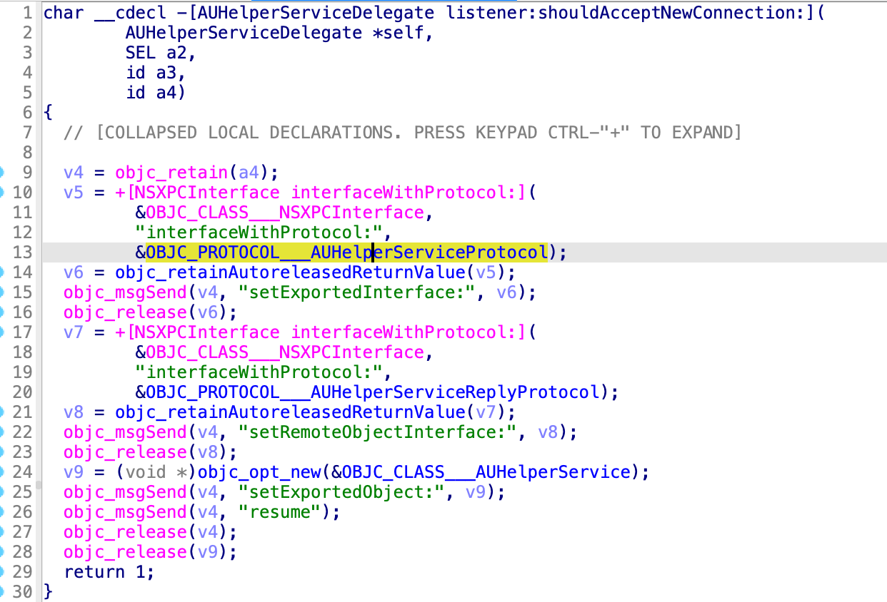
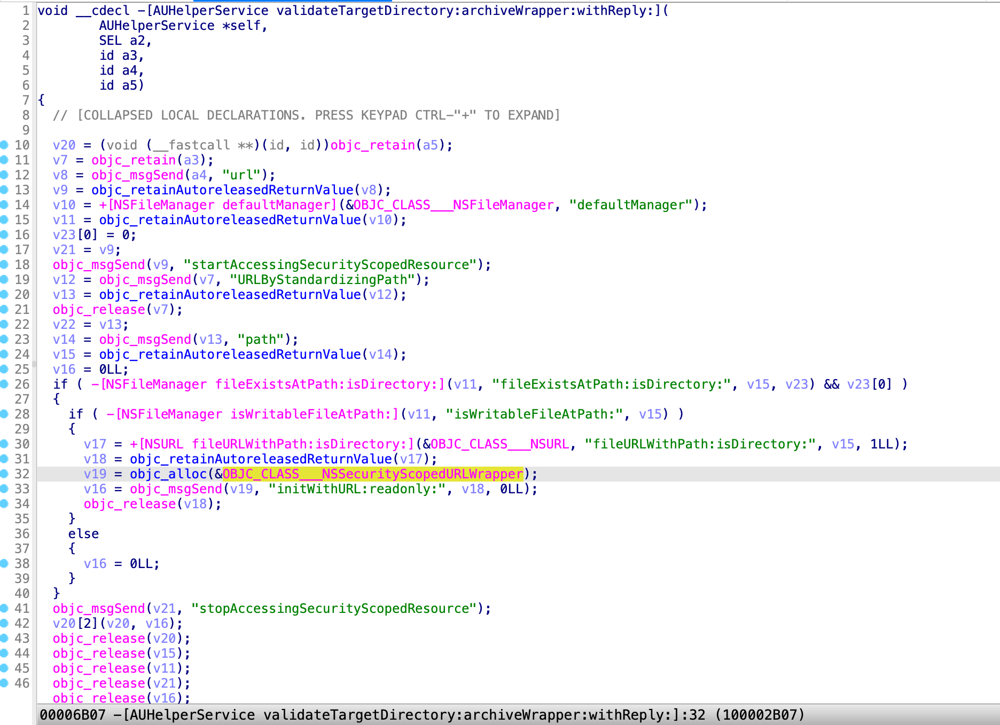
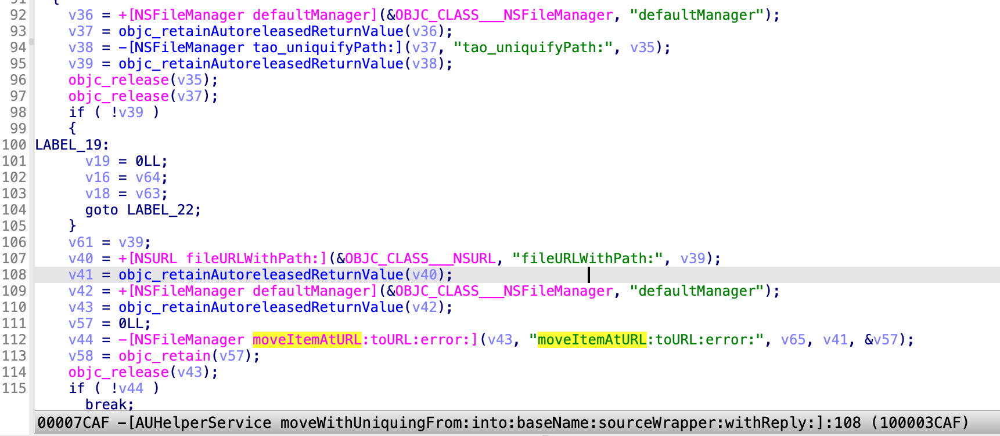
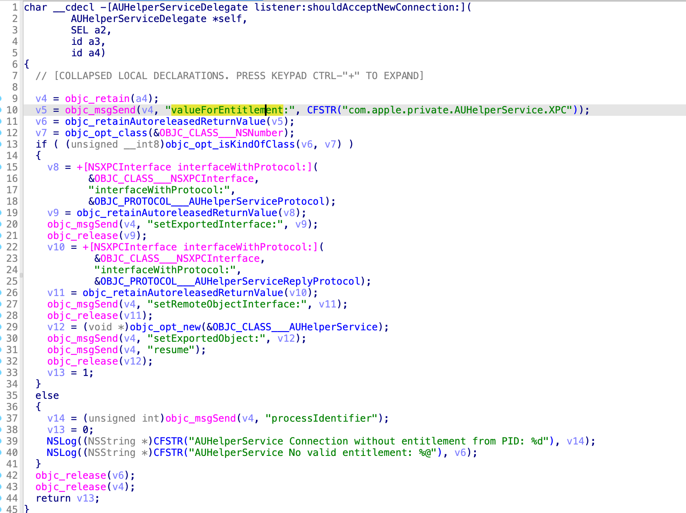

Last year, I discovered a full user TCC bypass issue in the macOS Sonoma beta version. There was a CVE number assigned at the beginning, but removed by Apple in the release of macOS 14.0. Instead, I got the credit in their [Additional Recognitions](https://support.apple.com/HT213940).

According to the Apple Security Bounty program, this report should have been rewarded with an additional 50%. Unfortunately, the truth is that I was cut off 50%.

# The Vulnerability

The vulnerability existed in the XPC service `/System/Library/CoreServices/Applications/Archive Utility.app/Contents/XPCServices/AUHelperService.xpc`.

Since the release of macOS Sonoma beta, the XPC service has got the **FDA (Full Disk Access)** entitlement:

```
	[Key] com.apple.private.tcc.allow
	[Value]
		[Array]
			[String] kTCCServiceSystemPolicyAllFiles
```

It accepts all the XPC clients by returning **YES** in the delegate method:



It provides 9 service routines for the XPC client in the protocol **AUHelperServiceProtocol**:

```
@protocol AUHelperServiceProtocol
-(void) validateTargetDirectory:(NSURL *)target archiveWrapper:(NSSecurityScopedURLWrapper *)wrapper withReply:(void (^)(NSSecurityScopedURLWrapper *))reply;
-(void) moveWithUniquingFrom:(NSURL *)from into:(NSURL *)into baseName:(NSString *)baseName sourceWrapper:(NSSecurityScopedURLWrapper *)wrapper withReply:(void (^)(NSSecurityScopedURLWrapper *))reply;
...
@end
```

Therefore, there are some different ways to exploit this issue by requesting the different service routines.

# Exploit 1

My first exploit was to request the method **validateTargetDirectory:archiveWrapper:withReply:** 



It can be exploited to get the **read & write permission** of an arbitrary path, even it is TCC-protected!

However, this exploit has a limitation: the sandbox extension can’t be issued to the user’s **TCC.db** directly. 

In order to replace the user’s TCC.db file, I developed the following exploit 2.

# Exploit 2

The second exploit is to abuse the routine **moveWithUniquingFrom:into:baseName:sourceWrapper:withReply:**



It gives me a primitive to move/replace the **TCC.db** file because of its **FDA** permission.

The exploit is public [here](https://github.com/jhftss/POC/blob/main/exploit-AUHelperService/exploit.m) for research purpose only.

# Patch in macOS 14.0

Apple patched the issue immediately before releasing the macOS Sonoma.

Now, the XPC client must have the entitlement **com.apple.private.AUHelperService.XPC**:



# Timeline

| Date       | Action                                                       |
| ---------- | ------------------------------------------------------------ |
| 2023-06-06 | Me: Initial report sent to Apple                             |
| 2023-09-27 | Me: Ask why the report was addressed without assigning a CVE |
| 2023-09-29 | Apple: **CVEs are only assigned to software vulnerabilities previously released to production and not to vulnerabilities for beta-only software.** |
| 2023-11-10 | Me: Ask for an update for the bounty review process          |
| 2023-11-10 | Apple: Still reviewing the report for the Apple Security Bounty program. |
| 2023-12-01 | Me: Ask for an update                                        |
| 2023-12-02 | Apple: Will have an update within a couple weeks.            |
| 2024-01-12 | Me: Ask for an update                                        |
| 2024-01-17 | Apple: Appreciate my patience on this report and will follow up… |
| 2024-01-26 | Apple: Award me with 23k for this report                     |
| 2024-01-26 | Me: Confused with the amount because a full tcc bypass like this usually got 30.5k. I asked for the reason |
| 2024-01-30 | Apple: The amount (23k) included the **50% beta bonus**. Also, **bounties for reports submitted in the past should not be considered precedent for future bounty awards. Apple technology is constantly changing, and so do the impacts of security bugs.** |

