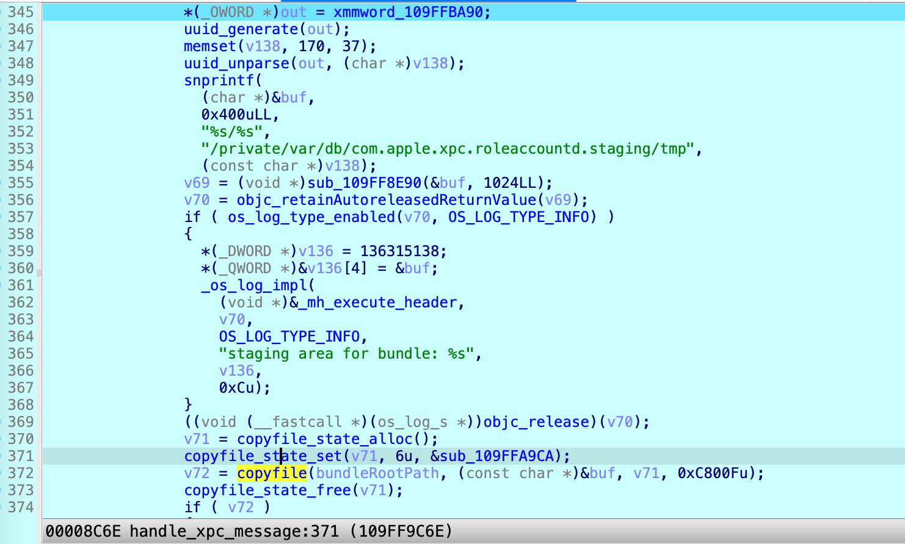

About two weeks ago, Apple published the **CVE-2023-42942** in the [security advisory](https://support.apple.com/en-gb/HT213984). It was a race condition issue existed in the system service **xpcroleaccountd**, and it could be exploited for root privilege escalation. Today, I am going to share the details.


# About the xpcroleaccountd

The system service `/usr/libexec/xpcroleaccountd` is running as root, and has the following entitlements:

```
	[Key] com.apple.private.xpc.launchd.ios-system-session
	[Value]
		[Bool] true
	[Key] com.apple.rootless.storage.RoleAccountStaging
	[Value]
		[Bool] true
	[Key] com.apple.security.exception.files.absolute-path.read-only
	[Value]
		[Array]
			[String] /private/var/preferences/com.apple.security.xpc.plist
	[Key] com.apple.security.exception.files.absolute-path.read-write
	[Value]
		[Array]
			[String] /private/var/db/com.apple.xpc.roleaccountd.staging/
			[String] /private/var/MobileSoftwareUpdate/com.apple.xpc.roleaccountd.staging/
	[Key] platform-application
	[Value]
		[Bool] true
	[Key] seatbelt-profiles
	[Value]
		[Array]
			[String] temporary-sandbox
```

Note that it has the ability to access the **SIP-protected** directory `/private/var/db/com.apple.xpc.roleaccountd.staging`.


There are some special **Apple-signed** XPC services, that define **"_RoleAccount" => "root"**  in the **Info.plist** file.

For example, `/Applications/Xcode.app/Contents/Frameworks/IDEKit.framework/Versions/A/XPCServices/com.apple.dt.Xcode.XcodeSelectXPCService.xpc/Contents/Info.plist`:

```
...
  "XPCService" => {
    "_AllowedClients" => [
      0 => " identifier = com.apple.dt.Xcode and (anchor apple or (anchor apple generic and certificate leaf[field.1.2.840.113635.100.6.1.9]) or (anchor apple generic and certificate leaf[field.1.2.840.113635.100.6.1.9.1]))"
    ]
    "_RoleAccount" => "root"
    "ServiceType" => "Application"
  }
...
```


When we try to communicate with this kind of XPC service, **xpcroleaccountd** will help copy/**stage** the XPC service bundle to an **SIP-protected** location, and then launch the XPC service bundle **with root privilege** from the trusted location securely.


Through reversing, I realized that the logic of **xpcroleaccountd** is simple:

1. If the special XPC service bundle is from the system itself and the bundle path is SIP-protected/trusted, then it replies with a success. (Launch with root privilege directly)

2. If it is not the first time to launch the special XPC service, the corresponding XPC bundle has already been copied into the SIP-protected location `/private/var/db/com.apple.xpc.roleaccountd.staging/exec/bundleID.size.blocks[-relaxed].xpc`, then it replies with a success. (Launch with root privilege from the trusted cache location)

3. Otherwise, it is the first time to launch. It will copy the special XPC bundle to a **trusted temporary location** first `/private/var/db/com.apple.xpc.roleaccountd.staging/tmp/uuid`:

   

   Next, it will check the signature of the special XPC bundle from the trusted temporary location:

   

   The special XPC service bundle must be **Apple-signed** and have the entitlement **com.apple.private.xpc.role-account**.

   If it fails to verify the signature, it replies with an error, so the XPC bundle will not be launched.

   Once it passes the verification, it moves/renames the XPC bundle from the **tmp** location to the **exec** location, and replies with a success. As a result, the special XPC service will be launched with root privilege from the trusted **exec** location.

   


# The issue & exploit

The code signature verification process seems perfect: it copies the XPC service bundle to a trusted temporary location first, and then checks the signature (with the entitlement **com.apple.private.xpc.role-account**) there. The XPC service will be launched with root privilege only if it passes the signature verification.

This stopped my **TOCTOU** attack at the beginning because I cannot modify the XPC service bundle from the SIP-protected location. 

However, I found that I could bypass it via a symbolic link!

At line 372, before it copies the special XPC bundle to the trusted temporary location, I can replace the XPC bundle source path with a symbolic link. Next, the symbolic link is copied to the trusted location successfully. As a result, it checks the signature and launchs the XPC bundle **by resolving my symbolic link**.

Here is how I exploited the issue:

1. Put the Apple-signed XPC service bundle at the location `/tmp/com.apple.dt.Xcode.XcodeSelectXPCService.xpc`.
2. Send an empty XPC message to the service bundle to trigger the issue.
3. Before **xpcroleaccountd** calls the API `copyfile`, replace `/tmp/com.apple.dt.Xcode.XcodeSelectXPCService.xpc` with a symbolic link and let the symbolic link point to the original Apple-signed XPC bundle (**a writable location**).
4. After passing the signature verification, modify the XPC bundle with a malicious payload.
5. My malicious XPC bundle will be launched with root privilege.

By the way, in order to win the race condition, the log strings could be the hints to do some actions. e.g., the log content **"staging area for bundle:"** indicates that it will call the API `copyfile` and it is the right time to replace with a symbolic link.

The exploit code is uploaded to [GitHub](https://github.com/jhftss/POC/blob/main/CVE-2023-42942/exploit.m) for research purpose only.

# Apple’s patch

The issue has been patched in **macOS 14.1**:

```
void handle_xpc_message(void *, void *msg) {
...
	v70 = copyfile_state_alloc();
    copyfile_state_set(v70, 6u, &copyfile_callback); // COPYFILE_STATE_STATUS_CB
    v71 = copyfile(from, to, v70, 0xC800Fu);
    copyfile_state_free(v70);
    if ( v71 ) {
       // "pid[%d]: copyfile(3) failed on service: %d, (errno %{errno}d)"
       goto EXIT;
    }
...
}
```

In the `copyfile_callback` function, it will check the **destination path**: 

```
int copyfile_callback(int what, int stage, copyfile_state_t state, const char *src, const char *dst, void *ctx)
{
  memset(&v11, 170, sizeof(v11));
  result = 0LL;
  if ( stage == COPYFILE_FINISH )
  {
    if ( lchown(dst, 0, 0) )
    {
      v7 = sub_100003DF5();
      v8 = (os_log_s *)objc_retainAutoreleasedReturnValue(v7);
      if ( os_log_type_enabled(v8, OS_LOG_TYPE_ERROR) )
        sub_1000067AF(v8);//"chown(2) failed during copyfile(3): %{errno}d"
    }
    else if ( lstat_INODE64(dst, &v11) )
    {
      v9 = sub_100003DF5();
      v8 = (os_log_s *)objc_retainAutoreleasedReturnValue(v9);
      if ( os_log_type_enabled(v8, OS_LOG_TYPE_ERROR) )
        sub_100006746(v8);//"lstat(2) failed during copy: %{errno}d"
    }
    else
    {
      result = 0LL;
      if ( (v11.st_mode & 0xF000) != 0xA000 )//dst is a symbolic link?
        return result;
      v10 = sub_100003DF5();
      v8 = (os_log_s *)objc_retainAutoreleasedReturnValue(v10);
      if ( os_log_type_enabled(v8, OS_LOG_TYPE_ERROR) )
        sub_100006712(v8);//"encountered symbolic link during copy"
    }
    objc_release(v8);
    return 2LL;//COPYFILE_QUIT, the entire copy is aborted at this stage.  Any filesystem objects created up to this point will remain.  copyfile() will return -1, but errno will be unmodified.
  }
  return result;
}
```

If the destination path is a symbolic link, `copyfile_callback` will return **2 (COPYFILE_QUIT)**, the entire copy will be aborted at this stage. Next, `copyfile` will return **-1**, but errno will be unmodified. Finally, **xpcroleaccountd** exits and replies with an error. 

# Timeline

| Date       | Action                                                       |
| ---------- | ------------------------------------------------------------ |
| 2023-04-13 | Me: Initial report sent to Apple                             |
| 2023-08-15 | Me: Ask for an update                                        |
| 2023-08-18 | Apple: Have reproduced this issue and are looking into ways to address it |
| 2023-11-30 | Me: Ask for an update                                        |
| 2023-12-09 | Apple: Still reviewing the report                            |
| 2024-01-12 | Me: Ask for an update                                        |
| 2024-01-13 | Apple: Have addressed it in macOS 14.1 and will publish my credit for this report in the future |
| 2024-02-16 | Apple: Publish my credit with the CVE-2023-42942             |
| 2024-03-01 | Me: Public disclosure                                        |