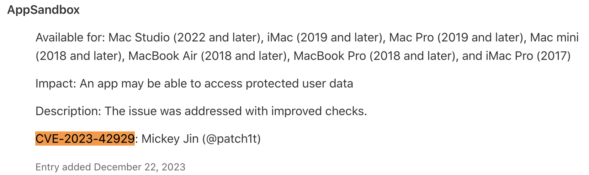
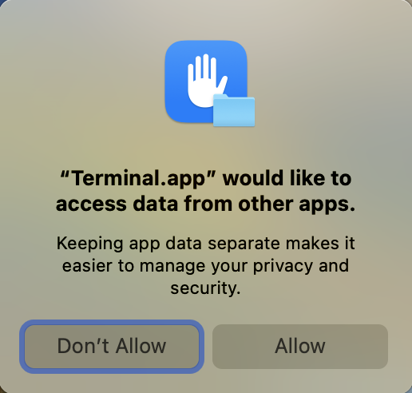
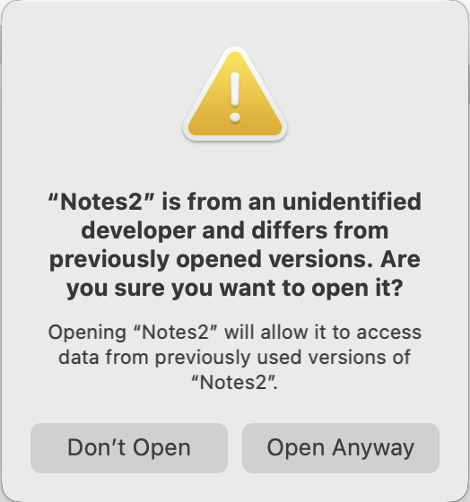

Starting with macOS **Sonoma 14.0**, Apple has introduced a new TCC category **kTCCServiceSystemPolicyAppData** to protect the **App Container Data**. This is designed to address one of my reports (aka **CVE-2023-42929**):



I will talk about why it is necessary to implement this feature by analyzing this vulnerability.

Then I discovered some new methods to bypass the new TCC protection. One of them is the **CVE-2024-27871**, which was addressed in the latest macOS 14.6 yesterday.

# Background

Prior to the release of macOS Sonoma, only a handful of Apple’s applications had their container data protected:

```
~/Library/Containers/com.apple.stocks
~/Library/Containers/com.apple.corerecents.recentsd/Data/Library/Recents
~/Library/Containers/com.apple.news
~/Library/Containers/com.apple.Notes
~/Library/Containers/com.apple.mail
~/Library/Containers/com.apple.CloudDocs.MobileDocumentsFileProvider
~/Library/Containers/com.apple.Home
~/Library/Containers/com.apple.Safari
~/Library/Containers/com.apple.Maps/Data/Maps
~/Library/Containers/com.apple.archiveutility
~/Library/Containers/com.apple.VoiceMemos
...
```

Specifically, the container path `~/Library/Containers/com.apple.Notes` for the system Notes application was not protected until the release of macOS 11.4, in order to address the **CVE-2021-30751**. The notorious malware [XCSSET](https://www.trendmicro.com/en_us/research/21/g/updated-xcsset-malware-targets-telegram--other-apps.html) was used to steal not only the system Notes.app container data, but also the **login token** from the **Telegram** application's group container path for a **replay attack**.

# The vulnerability CVE-2023-42929

The vulnerability is straightforward enough to bypass the limited container protection of a few system apps.

As you can see, the protected paths listed above are application data container paths for **certain system applications**.

So, a string of questions came into my mind:

1. Can I develop an application with the **same bundle identifier** as these system Apps? 
2. If the above answer is yes, will my fake application **share the same App Data Container with the system app**?
3. In this context, is my fake application able to read and write the files inside its own App Data Container?


To test this scenario, I created a new application from Xcode and set the bundle ID as "`com.apple.Notes`". Additionally, I modified the entitlements to allow writing to `/tmp`, a temporary directory on macOS. With these modifications in place, I attempted to copy **the protected container** data from **my own container** to `/tmp`:

```objective-c
- (void)applicationDidFinishLaunching:(NSNotification *)aNotification {
    // Steal the Notes from the path: ~/Library/Containers/com.apple.Notes/Data
    NSLog(@"My container is:%@", NSHomeDirectory());
    NSError *error = nil;
    [[NSFileManager defaultManager] copyItemAtPath:@"./Library/Notes" toPath:@"/private/tmp/Notes" error:&error];
    NSLog(@"Dumped to /tmp/Notes, error:%@\n Exit now.", error);
    exit(0);
}
```

To my surprise, it worked! 😎

# Apple’s Patch

As mentioned before, Apple introduced a new TCC category **kTCCServiceSystemPolicyAppData** to protect the **App Data Container path of the 3rd-party applications**.

For example, when I execute the command to access an app’s data container path from the Terminal: 

`ls ~/Library/Containers/com.reederapp.5.macOS/Data/` 

the system will pop up the following prompt:



Notes that for the **Ad-hoc** signed applications, their data container paths are not protected by this feature.


When I tried to launch my fake `Notes.app`, I got another alert dialog:



Therefore, my fake application is unable to **share the App Data Container with the system Notes.app** without the user clicking the "**Open Anyway**" button.

# Bypasses

I reported two new ways to bypass this new feature.


One of them is the **CVE-2024-27871**. It is a very simple method, which uses the **mount** trick:

Before the user launches an application for the first time, an attacker can create the appropriate container path for the target application and then mount a DMG file onto the container data path. Next, after the user opens the target application, the protected application container data is stored in the prepared DMG file that the attacker can access. Now, in the latest macOS 14.6, the app data container path is not mountable.


The other bypass report is a bit more complicated. Currently, it is only patched in macOS 15.0 Beta 4, so I won't talk about it right now. It's a very interesting bypass, so **stay tuned**!

# Timeline

| Date       | Action                                                       |
| ---------- | ------------------------------------------------------------ |
| 2023-01-30 | Me: Initial report sent to Apple                             |
| 2023-04-13 | Me: Ask for an update                                        |
| 2023-04-14 | Apple: Still investigating the report                        |
| 2023-11-10 | Me: Ask for an update                                        |
| 2023-11-18 | Apple: Still working on this report                          |
| 2023-12-06 | Apple: Have addressed it in macOS 14.0 and will publish my credit for this report in the future |
| 2023-12-22 | Apple: Publish my credit with the CVE-2023-42929             |
| 2024-02-07 | Apple: It qualifies for the ASB                              |

