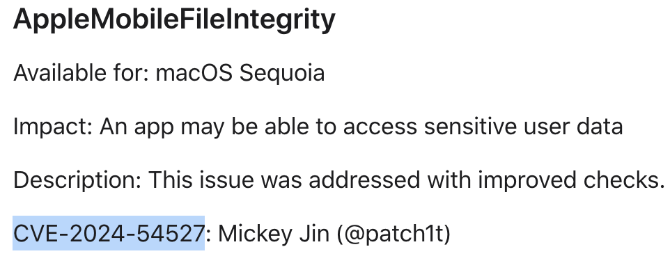
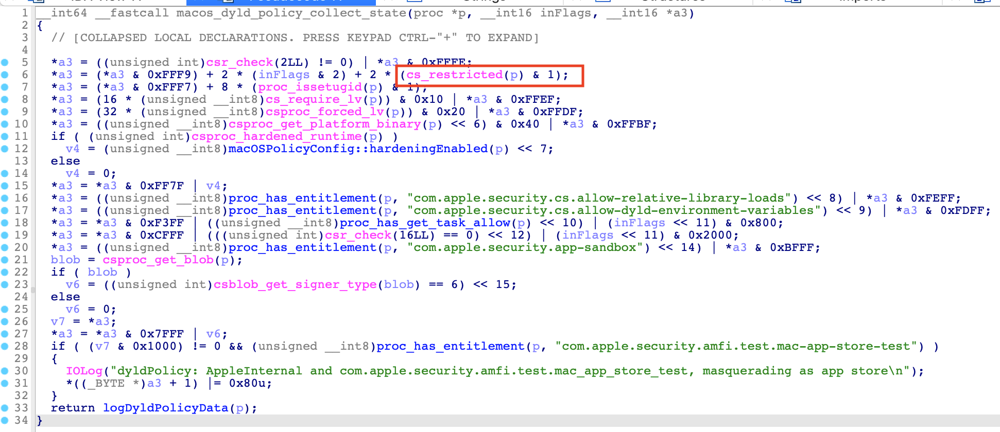

Happy New Year!

Today, I will share with you a new TCC bypass vulnerability: **CVE-2024-54527**. As a New Year's gift, I'm also going to dive into **AppleMobileFileIntegrity.kext** to correct some misconceptions in the minds of many and talk about the improvements Apple has made to it.



# The vulnerability

The vulnerability existed in the XPC service `/System/Library/Frameworks/MediaLibrary.framework/Versions/A/XPCServices/com.apple.MediaLibraryService.xpc`, which had the powerful TCC entitlements:

```
	[Key] com.apple.private.tcc.manager
	[Value]
		[Bool] true
	[Key] com.apple.private.tcc.allow
	[Value]
		[Array]
			[String] kTCCServicePhotos
```

The entitlement **“com.apple.private.tcc.manager”** grants the XPC service permission to send requests to `tccd` daemon process to modify the `TCC.db` directly!

The XPC service will accept the client connection if the XPC client is not sandboxed:


If the XPC client is sandboxed and does not have at least one of the media entitlements, then the XPC connection will be denied:


When the XPC client is not sandboxed, the XPC service will accept the connection with the protocol:

```
@protocol MLSMediaLibraryProtocol
- (void)attributesForMediaSource:(NSString *)arg1 reply:(void (^)(NSDictionary *, NSError *))arg2;
- (void)mediaObjectsForIdentifiers:(NSArray *)arg1 inSource:(NSString *)arg2 reply:(void (^)(NSData *, NSError *))arg3;
- (void)thumbnailURLForObject:(NSString *)arg1 source:(NSString *)arg2;
- (void)artworkDataForObject:(NSString *)arg1 source:(NSString *)arg2 reply:(void (^)(NSData *))arg3;
- (void)iconDataForGroup:(NSString *)arg1 source:(NSString *)arg2 reply:(void (^)(NSData *))arg3;
- (void)mediaObjectsForGroup:(NSString *)arg1 source:(NSString *)arg2 completionHandler:(void (^)(NSData *, NSError *))arg3;
- (void)rootGroupForMediaSource:(NSString *)arg1;
- (void)loadSourcesWithOptions:(NSDictionary *)arg1 completionHandler:(void (^)(NSDictionary *, NSError *))arg2;
- (void)serviceLogLevel:(void (^)(long long, NSError *))arg1;
@end
```

The issue exists in the XPC method `loadSourcesWithOptions:completionHandler:`. It tries to load the plugins from the following locations:

1. **ILUserLibraryPluginLocationPath**: `~/Library/Application Support/iLifeMediaBrowser/Plug-Ins`
2. **ILLibraryPluginLocationPath**: `/Library/Application Support/iLifeMediaBrowser/Plug-Ins`


Note that **ILUserLibraryPluginLocationPath** is not protected by SIP & TCC and it **can be modified even without root!**

On the other hand, the XPC service is neither signed with **Hardened Runtime** nor signed with **Library Validation**.

So an attacker can put a malicious plugin to the **ILUserLibraryPluginLocationPath** and get it loaded by the entitled XPC service. As a result, the attacker can enjoy the powerful entitlement **“com.apple.private.tcc.manager”** to bypass the TCC protection completely! 😈

# The exploit

In fact, all the platform binaries from the **restricted system location** are protected by **Library Validation** by default.

But this can be bypassed by copying the platform binary to another unrestricted location if the platform binary is not signed with **Library Validation** and has no special entitlements. I will talk about the details in the next section below.

Since macOS Ventura, a new security feature named [Launch Constraints](https://theevilbit.github.io/posts/amfi_launch_constraints/) has been introduced to combat this kind of exploitation. So the current solution is to copy the platform binary from the old macOS system, not from the current system. (Not hits the static trust cache)

After bypassing the **Library Validation**, an attacker can inject into the vulnerable XPC service to enjoy its TCC entitlements by loading a malicious plugin.


Note that the exploit program must have a **valid code signature** (**Ad-hoc** is okay) in order to connect to the XPC service.

Because the key **“_AllowedClients”** is set in the XPC service’s `Info.plist`:

```
  "XPCService" => {
    "_AllowedClients" => [
      0 => "always"
    ]
    "RunLoopType" => "NSRunLoop"
    "ServiceType" => "Application"
  }
```

This key is checked in the function `xpc_support_evaluate_connection` from the module `/usr/lib/xpc/support.bundle/Contents/MacOS/support`:


After signing the unsandboxed exploit program with a valid signature, an attacker can connect to the XPC service and send an XPC request to load the unsigned malicious plugin.

The exploit code has been uploaded [here](https://github.com/jhftss/POC/tree/main/CVE-2024-54527).

The demo video link:

https://youtu.be/3DkLUFmT2vY

# Dive deep into AMFI

## Dive into Library Validation

At the end of [my previous blog](https://jhftss.github.io/CVE-2022-26712-The-POC-For-SIP-Bypass-Is-Even-Tweetable/), I left a question:

```
# fail to load the bundle:
sudo /usr/libexec/configd -d -v -t /tmp/test.bundle

# load the bundle successfully:
cp /usr/libexec/configd /tmp
sudo /tmp/configd -d -v -t /tmp/test.bundle
```

Success vs Failure, what happened under the hood?

#### What happened (via kernel debugging)

When executing the command `/usr/libexec/configd`, I noticed an error log string from the `AppleMobileFileIntegrity.kext`:

```
..., reason: mapped file has no cdhash, completely unsigned? Code has to be at least ad-hoc signed.
```

The error string is from the function `library_validation`:


By using a kernel debugger and setting a breakpoint at the function `library_validation`, I got the call stack backtrace like this:

```
AppleMobileFileIntegrity`library_validation(proc*, fileglob*, unsigned long long, unsigned long long, unsigned long)+0xc7
AppleMobileFileIntegrity`_file_check_library_validation+0x58
kernel`mac_file_check_library_validation+0x8c
kernel`sys_fcntl_nocancel+0x27aa
kernel`unix_syscall64+0x204
kernel`hndl_unix_scall64+0x16
dyld`__fcntl+0xa
...
dyld`dyld4::APIs::dlopen_from(char const*, int, void*)+0x1f9
CoreFoundation`_CFBundleDlfcnLoadBundle+0x95
CoreFoundation`_CFBundleLoadExecutableAndReturnError+0x1e4
configd`0x0000000102b200c3+0x4d0
```

Then I checked the caller function `_file_check_library_validation`:


Through my debugging, I found that the function `cs_require_lv` returns **NO** when the command `/tmp/configd` is executed and **YES** when the command `/usr/libexec/configd` is executed.

The function `cs_require_lv` is implemented in the XNU kernel:


It is determined from the kernel `proc`’s `p_csflags` (**codesign flags**).

#### What happened (via the dyldPolicy log) ?

Later, I got the same conclusion from the **dyldPolicy** log:


 The function `macOSPolicyConfig::verboseDyldPolicyLogging` can be enabled by using the command:

```shell
sudo sysctl security.mac.amfi.verbose_logging=3
```

Then using the string `dyldPolicy` as a filter in the `Console.app`.

Log from the command `/tmp/configd`:


Log from the command`/usr/libexec/configd`:


#### What happened (continue debugging)

Now I know that someone sets the flag `CS_REQUIRE_LV (0x2000)` to the kernel `proc`’s member variable `p_csflags`.

So, it is who that sets the flag?

Next, I set a watchpoint (in fact, it is a hardware breakpoint) in the kernel debugger to monitor the member variable `p_csflags`.

Then I discovered the variable was changed by the function `platformHardenFlags` with the call stacks like:

```
AppleMobileFileIntegrity`platformHardenFlags
AppleMobileFileIntegrity`platformHardenFlagsIfNeeded
AppleMobileFileIntegrity`_vnode_check_signature
kernel`mac_vnode_check_signature
kernel`ubc_cs_blob_add
kernel`load_code_signature
kernel`parse_machfile 
kernel`load_machfile
...
```


It will call the function `platformHardenFlags` (at line 24), if one of these conditions is met:

- It is signed with the flag `CS_RUNTIME(0x10000)` (line 13).

- It is a platform binary (`CS_PLATFORM_BINARY`) and one of these conditions is met:

  -  **The executable path is restricted** (line 18). (This is the answer of my question) 

  - The flag `force_policy` (`hardenAllPlatformBinaries` at line 28) has been set by using the command `sysctl`.

  - The entitlements can `matchIn` one of the following **black-list** entitlements (line 61~62):

    ```
    // entitlementsThatForceHardening
    com.apple.rootless.*
    com.apple.private.security.*
    com.apple.system-task-ports
    com.apple.hid.manager.user-access-keyboard
    com.apple.hid.manager.user-access-privileged
    com.apple.private.host-exception-port-override
    // systemExtensionEntitlements
    com.apple.developer.driverkit
    com.apple.developer.driverkit.*
    com.apple.developer.endpoint-security
    com.apple.developer.endpoint-security.*
    com.apple.developer.networking.networkextension
    ```

    e.g. `cp /usr/libexec/syspolicyd /tmp ; /tmp/syspolicyd`

    

#### Summary

If I copy a platform binary (which is not signed with the flags `CS_RUNTIME|CS_REQUIRE_LV` and whose entitlements don’t match in the black-list `entitlementsThatForceHardening` and `systemExtensionEntitlements` ) to an unrestricted location and execute it there:

The function `vnode_is_restricted` will return false, `platformHardenFlags` will not be called. Therefore, the flags `CS_FORCED_LV|CS_REQUIRE_LV` will not be set. When the process tries to load (`dlopen`, `mmap`) an unsigned dylib, the function `file_check_library_validation` or ` _file_check_mmap` will skip calling the function `library_validation`. As a result, it will approve the loading/mapping of the dylib.

## Dive into DYLD_INSERT_LIBRARIES

After the disclosure of [CVE-2024-23253 & CVE-2024-40831](https://jhftss.github.io/A-New-Era-of-macOS-Sandbox-Escapes/), I received some DMs from many security researchers. They didn’t know that the **DYLD_INSERT_LIBRARIES** environment variable could work for the Apple’s platform binaries. They can’t reproduce my exploit steps because they were using the **platform binary** from the **restricted system location**.

```
# fail to inject
DYLD_INSERT_LIBRARIES=/usr/lib/libgmalloc.dylib /bin/ls

# inject successfully
cp /bin/ls /tmp/ls
DYLD_INSERT_LIBRARIES=/usr/lib/libgmalloc.dylib /tmp/ls
```

So, what happened under the hood?

Then I found some useful details from [Csaba’s blog](https://www.offsec.com/blog/amfi-syscall/). It is recommended to read his blog first, my analysis is based on his previous work.

The code of `dyld` is open source:

```
uint64_t ProcessConfig::Security::getAMFI(const Process& proc, SyscallDelegate& sys)
{
    uint32_t fpTextOffset;
    uint32_t fpSize;
    uint64_t amfiFlags = sys.amfiFlags(proc.mainExecutable->isRestricted(), proc.mainExecutable->isFairPlayEncrypted(fpTextOffset, fpSize));
    ...
}
```

Through my debugging, I found:

 `/bin/ls`: `amfiFlags=0x60`

 `/tmp/ls`: `amfiFlags=0x5f`

Next, dive into the kernel extension `AppleMobileFileIntegrity.kext`, I found the function `macos_dyld_policy_env_vars` with the call stack like:

```
AppleMobileFileIntegrity`macos_dyld_policy_env_vars
AppleMobileFileIntegrity`_check_dyld_policy_internal
AppleMobileFileIntegrity`_policy_syscall
Kernel`__mac_syscall
...
dyld`_amfi_check_dyld_policy_self
```


Just as the log string implies:

1. If it is signed with **Hardened Runtime** (`CS_RUNTIME`) and not signed with the entitlements like `get-task-allow` or `allow-env*`, dyld environment variables will be disallowed.

2. If `procIsDyldsRestricted` returns true and it is not signed with **Library Validation** (`CS_REQUIRE_LV`), dyld environment variables will be disallowed. (If one of the conditions [`CS_RESTRICT` , `restrict_segment`, `setugid`] is true, `procIsDyldsRestricted` will return true) :

   

By enabling the dyld policy log with the command `sudo sysctl security.mac.amfi.verbose_logging=3`, I found:

`/bin/ls`:


`/tmp/ls`:


So, `/bin/ls` is marked as **cs_restrict(1)** and `/tmp/ls` is marked as **cs_restrict(0)** in the function `macos_dyld_policy_collect_state`:



At line 6, the API `cs_restricted` returns the result according to the current `proc`’s member variable `p_csflags`:


Through my debugging, I found that the flag “**CS_RESTRICT (0x800)**” will be set if the current process’s executable is restricted (`vnode_is_restricted`).

In addition, the flag **CS_RESTRICT** can also be set in the following function:


In this function, it enumerates all the entitlements and match each of them with a **white-list**:

```
// softRestrictedEntitlements
com.apple.application-identifier
com.apple.security.application-groups*
// appSandboxEntitlements
com.apple.security.app-protection
com.apple.security.app-sandbox
// unrestrictedEntitlements
com.apple.private.signing-identifier
com.apple.security.*

// require CSR_ALLOW_UNRESTRICTED_FS is true (SIP-disabled)
//jit-codesigning
//com.apple.rootless.storage.cvms

// restrictionExemptEntitlements
com.apple.developer.*
keychain-access-groups
com.apple.private.dark-wake-*
com.apple.private.aps-connection-initiate
com.apple.private.icloud-account-access
com.apple.private.cloudkit.masquerade
com.apple.private.mailservice.delivery
com.apple.tcc.delegated-services
beta-reports-active
```

If one of its entitlements can’t match in the **white-list**, the flag **CS_RESTRICT** will also be set.


To sum up, we can inject into a platform binary by using the **DYLD_INSERT_LIBRARIES** environment variable if the binary meets all of the following requirements:

1. Not signed with `CS_RUNTIME`, or signed with the entitlements like `get-task-allow` or `allow-env*`.
2. Not an SUID binary.
3. Doesn’t have the restricted segment.
4. Doesn’t launch from a restricted system location.
5. Doesn’t have any special entitlements outside the white-list.


#### One more thing

Note that the entitlement **“com.apple.private.icloud-account-access”** is in the white-list. This explains why **iMovie.app** can be injected via the environment variable in the past. (**CVE-2021-30757**). The reason is not that it comes from the Mac AppStore. It is because all of its entitlements match in the white-list:

```
com.apple.application-identifier: PTN9T2S29T.com.apple.iMovieApp
com.apple.private.icloud-account-access
com.apple.developer.*
com.apple.security.*
```


# Mitigation/Improment in macOS 14.0 accidentally

About 3 months ago, Apple sent a request to me:


**Why the issue no longer occurs since macOS Sonoma 14.0?**

By reversing and debugging, I found that a new security mitigation was introduced in the `AppleMobileFileIntegrity.kext` since macOS 14.0, named “**enforceTCCEntitlementHardening**”:


At line `436`, the function `ConfigurationSettings::enforceTCCEntitlementHardening` returns **TRUE** by default:

```
static int tccEntitlementHardening = 1;
void configurationSettingsInit(void) {
//...
  if ( !csr_check(2LL) || BootedDevice )
    tccEntitlementHardening = 0;
  if ( PE_parse_boot_argn("amfi_enforce_tcc_hardening", &value, 4) )
    tccEntitlementHardening = value;
//...
}

bool __fastcall ConfigurationSettings::enforceTCCEntitlementHardening(ConfigurationSettings *this)
{
  return tccEntitlementHardening != 0;
}
```

At line `438`, it matches the current process’s entitlements with the global array `forceRuntimeAndLVEntitlements` :

```
com.apple.private.tcc.allow
com.apple.private.tcc.manager
```

At line `447`, the flag `v35=0x12000=CS_RUNTIME|CS_REQUIRE_LV` is set to the `proc`’s member variable `p_csflags`.


In conclusion, each process that has either the entitlement **“com.apple.private.tcc.allow”** or **“com.apple.private.tcc.manager”** will be **hardened with library validation at runtime forcibly**!

In this case, the service `com.apple.MediaLibraryService.xpc` has both of the TCC entitlements, so I can’t inject into this powerful XPC service again since macOS 14.0.

# Patch in macOS 15.2

Actually, the unexpected mitigation released in macOS 14.0 is enough!

Now, the latest XPC service is signed with the **“Hardened Runtime”** and uses the entitlement **“com.apple.private.amfi.version-restriction”** to combat the downgrade attack:


# Timeline

| Date       | Action                                                       |
| ---------- | ------------------------------------------------------------ |
| 2023-03-09 | Me: Initial report sent to Apple                             |
| 2023-04-07 | Apple: Unable to reproduce the issue (because the exploit program is not signed) |
| 2023-04-11 | Me: Re-sign the exploit program with ad-hoc signature        |
| …          | Ping-pong too many times…                                    |
| 2023-11-10 | Apple: Still unable to reproduce the issue, request the sysdiagnose data |
| 2023-11-10 | Me: Provide the sysdiagnose data                             |
| 2023-11-11 | Apple: Reproduce the issue successfully                      |
| 2024-01-19 | Apple: Still actively investigating this issue and have not addressed it yet |
| 2024-10-17 | Me: Ask for an update                                        |
| 2024-10-17 | Apple: No changes made yet, but the issue no longer occurs. Ask me if I can work with them together to pinpoint the source of the change. |
| 2024-10-18 | Me: Patch analysis report sent to Apple                      |
| 2024-12-11 | Apple: **CVE-2024-54527** is assigned to this report         |

