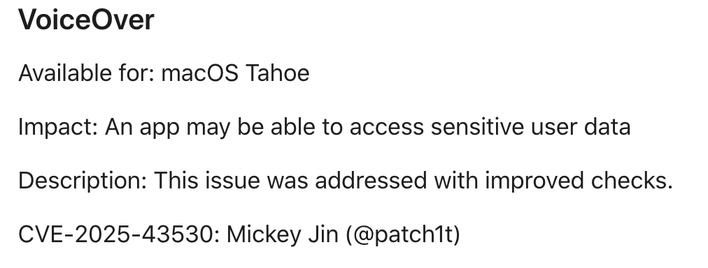
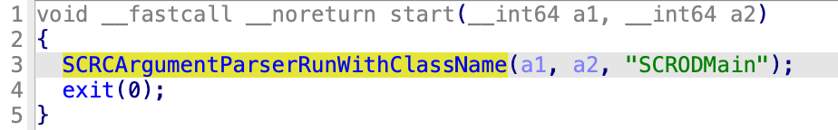

Happy New Year in advance!

Today, I will share with you a new TCC bypass vulnerability: **CVE-2025-43530**. It’s about a private API within the **ScreenReader.framework**, a module for **VoiceOver**:



# The MIG service: com.apple.scrod

The system MIG service "**com.apple.scrod**" is registered from the file `/System/Library/LaunchAgents/com.apple.scrod.plist`:

```
{
  "EnablePressuredExit" => false
  "EnableTransactions" => true
  "Label" => "com.apple.scrod"
  "LimitLoadToSessionType" => [
    0 => "Aqua"
    1 => "LoginWindow"
  ]
  "MachServices" => {
    "com.apple.scrod" => {
      "ResetAtClose" => true
    }
  }
  "ProcessType" => "App"
  "ProgramArguments" => [
    0 => "/System/Library/PrivateFrameworks/ScreenReader.framework/Frameworks/ScreenReaderOutput.framework/Resources/scrod"
  ]
}
```

Note that the executable `/System/Library/PrivateFrameworks/ScreenReader.framework/Frameworks/ScreenReaderOutput.framework/Resources/scrod` is signed with the special TCC entitlement **kTCCServiceAppleEvents**:

```
	[Key] com.apple.private.tcc.allow
	[Value]
		[Array]
			[String] kTCCServiceAppleEvents
			[String] kTCCServiceListenEvent
			[String] kTCCServiceSystemPolicyDocumentsFolder
			[String] kTCCServiceMicrophone
			[String] kTCCServiceVoiceBanking
			...
```

The main function is implemented in the framework `/System/Library/PrivateFrameworks/ScreenReaderCore.framework`:




# The Vulnerability

The implementation of one **MIG service routine**, `__SCROXGetValueForKeyWithObject`, is as follows. The client-side interface `__XGetValueForKeyWithObject` can be directly invoked by the high-level API **`-[SCROScriptClient runScriptFile:]`** (from the private `ScreenReaderOutput.framework`).

```
// The MIG service routine is implemented in "/S/L/P/ScreenReader.framework/Versions/A/Frameworks/ScreenReaderOutput.framework"
int __SCROXGetValueForKeyWithObject(...)
{
    ...
    x0_1 = _SCROUnserializeWrapper(arg4, arg5, arg6, arg7, &cf_1);
    if (!(uint32_t)x0_1)
    {
        v1 = arg13[1];
        int128_t var_90 = *(uint128_t*)arg13;
        int128_t var_80_1 = v1;
        int64_t isClientTrusted = [SCROClient isClientTrustedWithPortToken:&var_90];
        id sharedServer = [[SCROServer sharedServer] retain];
        id deletage = [[sharedServer delegate] retain];
        id obj = nullptr;
        id x0_13 = [deletage getValue:&obj forKey:arg3 withObject:cf_1 handlerType:(uint64_t)arg2 trusted:isClientTrusted];  // invokes the delegate method
...
}

// the delegate method is implemented in scrod:
-[SCRODMain getValue:forKey:withObject:handlerType:trusted:] (...) {
...
	-[SCRODScriptHandler handleGetValue:forKey:withObject:trusted:](...);
...
}

-[SCRODScriptHandler handleGetValue:forKey:withObject:trusted:] (...) {
  if ( getuid() )
  {
    if ( isTrusted ) // <-- run the specified AppleScript only when the XPC client is trusted.
    {
      if ( key == 104 )
      {
      	[self _handleRunAppleScript:object];
      	...
     	}
    }
    ...
}
```

This service routine will invoke the function `-[SCRODScriptHandler _handleRunAppleScript:]` only when the XPC client **`isTrusted`**. This is checked in the following function:

```
// implemented in "ScreenReaderOutput.framework"
bool +[SCROClient isClientTrustedWithPortToken:](Class self, SEL sel, void* token)
{
    int64_t x0_1 = j__audit_token_to_pid(&var_1070);
    id __ClientTrustDictionary_1 = __ClientTrustDictionary;
    id obj_2 = [[NSNumber numberWithInt:x0_1] retain];
    id obj_1 = [[__ClientTrustDictionary_1 objectForKey:obj_2] retain];
		if (!obj_1)
		{
		    cf = j__SecTaskCreateWithAuditToken(0, &var_1070);
        if (!cf) goto NEXT;
        CFTypeRef x0_6 = SecTaskCopyValueForEntitlement(cf, @"com.apple.private.tcc.allow", 0);
        
        if (!x0_6) goto NEXT;
        if (j__CFGetTypeID(x0_6) != j__CFArrayGetTypeID())
        {
        NEXT:
            int64_t pid = j__audit_token_to_pid(&clientPath);
            j____bzero(&clientPath, 0x1000);
            if (j__proc_pidpath(pid, &clientPath, 0x1000) <= 0)
                isTrusted = nullptr;
            else
            {
                id obj_3 = [[NSString stringWithUTF8String:&clientPath] retain];
                url = [[NSURL fileURLWithPath:obj_3] retain];
                [obj_3 release];
                
                if (isTrusted)
                {
                    +[SCROClient isClientTrustedWithPortToken:].cold.1(url, &arg2);
                    isTrusted = arg2;
                }
            }
        }
...
}

void +[SCROClient isClientTrustedWithPortToken:].cold.1(id arg1, char* arg2) {
   id x0_10 = [arg1 retain];
    id x0_11 = [[NSData dataWithBytesNoCopy:&__isURLSignedByApple.kCodeSignRequirement length:0x10 freeWhenDone:0] retain]; // "anchor apple"
    if (!x0_11)
        x22 = -0x6c;
    else
    {
        OSStatus x0_1 = j__SecRequirementCreateWithData(x0_11, 0, &var_40);
        if (x0_1)
            x22 = x0_1;
        else
        {
            x22 = j__SecStaticCodeCreateWithPath(x0_10, 0, &codeRef);
            if (!x22)
            {
                x22 = j__SecStaticCodeCheckValidity(codeRef, 4, var_40);
                if (!x22)
                {
                    x22 = j__SecCodeMapMemory(codeRef, 0);
                }
            }
        }
    }
    
    *(uint8_t*)arg2 = (char)(!x22 ? 1 : 0);
}
```

This verification logic contains at least two security issues:

1. **If the XPC client is signed by Apple (csreq string: “anchor apple”), then it will be trusted.** However, it is easy to inject into an Apple-signed executable. For example,  the command `ssh -I payload.dylib root@localhost` can be used to inject the `payload.dylib` into Apple-signed system binary `/usr/libexec/ssh-apple-pkcs11`. (This command does not need to be run with root privileges.)

2. It validates the XPC client by using the API `SecStaticCodeCreateWithPath`, instead of using the client’s **audit token**. This can be bypassed via a **TOCTOU** attack.

As a result, an attacker can execute arbitrary AppleScript files and send AppleEvents to any target process (such as `Finder`), thereby completely bypassing the TCC protection mechanism.

Please note that other MIG service routines are similarly affected by this check (**isTrusted**), which may also be exploitable:

```
__XRegisterWithServer
__XSendEvent
__XRegisterForCallback
__XGetCallbacks
__XSetValueForKey
__XGetValueForKey
__XGetValueForKeyWithObject // exploited by this report
__XPerformAction
__XPing
```


# The Exploit

The exploit code has been uploaded [here](https://github.com/jhftss/POC/tree/main/CVE-2025-43530).

The demo video link:

https://youtu.be/DjcOuZOHTeA


# Patch in macOS 26.2

Now, only processes with the entitlement "**com.apple.private.accessibility.scrod**" are trusted:

```
BOOL +[SCROClient isClientTrustedWithPortToken:](id a1, SEL a2,void *atoken)
{
  v3 = (void *)xpc_copy_entitlement_for_token("com.apple.private.accessibility.scrod", &atoken);
  v4 = v3;
  if ( !v3 || xpc_get_type(v3) != (xpc_type_t)_xpc_type_bool_ptr || (v5 = 1, !xpc_bool_get_value(v4)) )
  {
    v6 = audit_token_to_pid((audit_token_t)atoken);
    v7 = (void *)_SCROD_LOG();
    v8 = objc_retainAutoreleasedReturnValue(v7);
    if ( os_log_type_enabled(v8, OS_LOG_TYPE_DEFAULT) )
    {
      buf[0] = 67109120;
      buf[1] = v6;
      _os_log_impl(&dword_7FFD001DB000, v8, OS_LOG_TYPE_DEFAULT, "Missing Entitlement for pid: %d", (uint8_t *)buf, 8u);
    }
    objc_release(v8);
    v5 = 0;
  }
  objc_release(v4);
  return v5;
}
```

On the other hand, the entitlement is validated through the client’s **audit token** rather than the API `SecStaticCodeCreateWithPath`. Therefore, **TOCTOU** attacks will not be effective.


# Bye, 2025

Time flies, and in the blink of an eye, we have reached the end of 2025. This year has seen many developments.

I maintained my consistently high productivity in vulnerability research, submitting over 60 reports to Apple. (Since July 2020, I have received [over 300 CVE credits](https://jhftss.github.io/cvelist/) from Apple. More details of these vulnerabilities **will be disclosed gradually in the near future.**)

This year, I entered into marriage, and my wife is now pregnant. Consequently, in 2026, I will dedicate most of my time **to my family**, and my vulnerability research work will be scaled back accordingly. Therefore, my output in the coming year is likely to be limited.